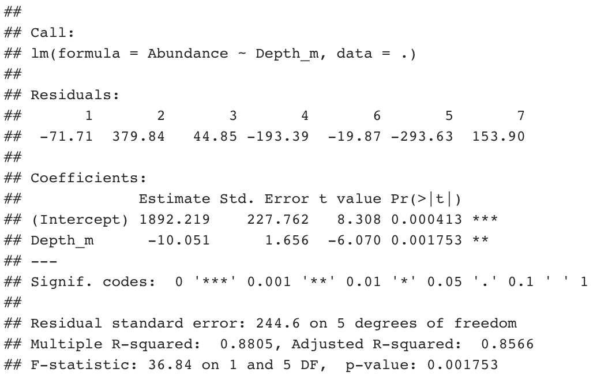

# Module 1
## Module 01 portfolio check
* Installation check
    + Completion status:
    + Comments:
* Portfolio repo setup
    + Completion status: 
    + Comments:
* RMarkdown Pretty html Challenge
    + Completion status:
    + Comments:
* Evidence worksheet_01
    + Completion status:
    + Comments:
* Evidence worksheet_02
    + Completion status:
    + Comments:
* Evidence worksheet_03
    + Completion status:
    + Comments:
* Problem Set_01
    + Completion status:
    + Comments:
* Problem Set_02
    + Completion status:
    + Comments:
* Writing assessment_01
    + Completion status:
    + Comments:
* Additional Readings
    + Completion status:
    + Comments  
    
## RMarkdown Pretty html Challenge
# Table/Links to websites
Row names | Data 1 | Data 2
--------- | ------ | ------
**Row 1**     |   ~~0~~    |    *1*
**Row 2**   |   ~~1~~    |    *0*

[Links to MICB425 github page](https://github.com/EDUCE-UBC/MICB425)

## Links to images

{width=50%}

## Code Chunks
```{r title, message=TRUE, warning=FALSE, fig.width=4}
#Create 2 lists of numbers
list1 = c(1,2,3)
list2 = c(4,5,6)

#Plot list1 vs. list2
plot(x=list1, y=list2)
```


## Evidence Worksheet_01 "Prokaryotes: The Unseen Majority"

### Learning Objectives
Describe the numerical abundance of microbial life in relation to ecology and biogeochemistry of Earth systems.

### General Questions
#### What were the main questions being asked?
* To give an estimtation of the abundance, turnover rate, carbon content and the diversity of parkoytes in different area and terristrial zone on Earth.

#### What were the primary methodological approaches used?
To estimate the total number of prokaryotes on earth, the authors investigated several habitats, including:

* Aquatic Environment:
    + Ocean: The investigator splitted the calculation into continental shelf and upper 200m and deep (>200m) oceanic water, then gathered the estimated cell density at that depth and multiply it by global estimates of sea water volume.
    + Fresh Water and saline lake: Given the average cell density in fresh water and saline water, the researcher multiplies it by the estimate volume as well.
    + Polar regions: the researcher used the estimated number of prokaryotes of Antarctic sea based on the study of Delille and Rosiers, then times it by the mean areal extent of seasonal ice. Since they assumed that both polar regions should have the same population size, the researchers times the estimate number by two.
* Soils:
    + Forest soils: The researcher used the estimation from detailed direct counts from a coniferous forest ultisol, and believed it to be an representative of forest soil in generals.
    + Other soils: The researcher used the umplibished field studies of E.A. Paul for cultivated soils
* Subsurface:
Both habitat are calculated in similar measure. The researcher creates a depth profile ranges from 0.1m to 4km, because at this depth the average temperature reaches 125ºC, which is close to the upper temperature limit for prokaryotes.
    + Terrestrial habitat below 8m: Since terrestrial subsurface prokaryoes is limited to unconsolidated sediments, which represent only 20% of the terrestrial subsurface. Two approaches are used to estimate the total number of prokaryotes:
        + Calculation are based on the average porosity of terristrial subsurface multiply by the total pore space occupied by prokaryotes.
        + The estimation can also be obtained from ground water data. Based on values from seven sites and four studies, the researcher used the total volume of ground water in the upper 4km of the earth surface times the average number of unattached cells in ground water.
    + Marine sediments below 10m: the estimated number of prokaryotes sediment are gathered from previous studies.
* Other Habitat:
    + Animals: The researcher assumed that most prokaryotes are most abundant on the skin and within the gastrointestinal tract of mammals and birds. Since the organ contents and number of animals are known, the total number of prokayotes within animal can be easily calculated. However, in comparison, the number of prokaryotes on skin are so minute that the researcher decided not to include it in the total estimation.
    + Leaves: An upper limit for the number of prokaryotes on leaves can be estimated by assuming a dense population cand a high leaf area index. However, the number showed that the maximum number of prokaryoes on leaves is unlikely to exceed the number in soil.
    + Air: The total number of prokaryotes over land is calculated from previous study.
    
To estimate the carbon content of prokaryotes on earth, the authors investigated several habitats, including soil, aquatic systems, and the subsurface:

* Soils and subsurface: The researcher assumed that the cellular carbon is one-half of its dry weight, then multuply it by the total number of prokaryotes obtained from previous study.
* Aquatic system: The researcher obtained the average cellular carbon from previous studies.

The researcher used previous studys to estimate the carbon assimilation rate at each individual habitat, then by combining the estimation of the rate of carbon consumption by prokayotes to set the upper limit of the carbon turnover rate.

#### Summarize the main results or findings.
* Number of prokaryotes in aquatic habitats is roughly $12 \times 10^{28}$ and the carbon contents is roughly 2.2 Pg of carbon/prokaryotes.
* Number of prokaryotes in soil is roughly $26 \times 10^{28}$ and the carbon contents is roughly 26 Pg of carbon/prokaryotes.
* Number of prokaryotes in oceanic subsurface sediments is roughly $355 \times 10^{28}$ and the carbon contents in this habitat is roughly 303 Pg of carbon/prokaryotes.
* Number of prokaryotes in Terrestrial subsurface sediments is roughly $22 \times 10^{28}$ to $250 \times 10^{28}$ and the carbon contents in this habitat is roughly 22 to 215 Pg of carbon/prokaryotes.
* The total number of prokayotes cells is roughly $415 \times 10^{28}$ to $640 \times 10^{28}$ and the total carbon content is roughly 353 to 546 Pg of carbon/prokaryotes.
* The total carbon of prokaryotes on earth is approximated 60-100% of the total carbon found in plants. In addition, prokayotes also contain large amount of nitrogen, phospherus, and other essential nutrients.
* The large population of prokaryotes suggests it is possible to observe frequent mutation events that are rare in labortory.
* From the study, the researcher concluded that the highest cellular productivity occured in the open ocean, which implies that most of the rare genetic events happened in the population of marine prokaryotes.
* Since prokaryotes are essemtially asexual, the primary source of genetic diversity is mutations in the genome. Given the enormous potential of prokaryotes to acquire genetic diversity, we may need to change the current taxonomy system.

#### Do new questions arise from the results?
* Since this is a paper dated back in 1998, does the number still hold? Does the finding in this paper creditable?
* After almost 20 years have passed, is it possible to use the latest technology to revise the result?
* If we reconstruct the habitat specification, would the number change?
* Does the carbon assimilation rate still holds for different habitat? Can we use this number to further understand the carbon cycle on earth?
* How can we use the diversity of prokaryotes into application, such as phylogentic analysis??
* For essentuakky asexual, haploid organisms, such as prokaryotes, with such enormous number of potential species, how do we develop another system of txonomy?

#### Were there any specific challenges or advantages in understanding the paper (e.g. did the authors provide sufficient background information to understand experimental logic, were methods explained adequately, were any specific assumptions made, were conclusions justified based on the evidence, were the figures or tables useful and easy to understand)? 
* How the data were collected or calculated was not described in detail.
* There was no error calculation, and no statistical inference was made, which suggests that the sample numbers were probably not replicable

### Reference
Whitman, W. B., et al. “Prokaryotes: The Unseen Majority.” Proceedings of the National Academy of Sciences, vol. 95, no. 12, Sept. 1998, pp. 6578–6583., doi:10.1073/pnas.95.12.6578.

## Evidence Worksheet_02 “Life and the Evolution of Earth’s Atmosphere”
### Learning objectives: 
* Comment on the emergence of microbial life and the evolution of Earth systems

### General Questions
#### Indicate the key events in the evolution of Earth systems at each approximate moment in the time series.
If times need to be adjusted or added to the timeline to fully account for the development of Earth systems, please do so.

* 4.6 billion years ago
    + The Solar System formed
* 4.4 billion years ago
    + The oldest minerals known on Earth, zircons at Western Australia.
* 4.2 billion years ago
    + Around this time, proto-earth was structed, which spun and tilted the Earth. Some of molten mantle of proto-earth were injected into outer space, which coalesced to formed the Moon.
    + The Earth started to have present day-night cycle and seasons.
* 4.0 billion years ago
    + The oldest rock, Acasta Gneiss was formed and possibly continental rocks were created at this time.
    + Perhaps water oceans existed.
* 3.8 billion years ago
    + The meteorite bombardment was heaviest until about this time, and some sufficiently large to heat the oceans to >110ºC. This gives rise to the theory that life on Earth could be the ejecta from other planets.
    + Probable that life began before this time
* 3.75 billion years ago  
* 3.5 billion years ago  
    + Geological evidenct shows that is certain that life has been present on Earth at this time.
    + In rocks there have been many claims of fossils microbial biofilms and stromatolites. Although some of these features can be interpreted equally as non-biological in origin, other possesses all the diagnostic features of biogenic structures.
    + The large-scale photosynthetic carbon fractionation by the enzyme Rubisco on a global scale.
    + Cyanobacteria evolved.
* 3.2 billion years ago
    + Volcanogenic massive sulphide deposit in Western Australia infers that microbial life was wides spread in the mid-Archaean.
* 3.0 billion years ago  
    + Abundant evidence of stromatolites at Steep Rock, Ontario and in Pongola Supergroups, South Africa
* 2.7 billion years ago  
    + Well developed stromatolites at this time are found at various places
    + Biologic lipids at Pilbara, Western Australia suggests that oxygenic photosynthesis was occuring because they found hydrocarbon biomarker, which are characteristic of cyanobacteria.
    + Steranes, dereived from chemicals characteristics of eukaryotes are also present.
* 2.3 billion years ago  
    + Cyanobacter gave rise to atmospheric O2.
    + Earth's first well-documented glaciation.
* 2.2 billion years ago  
    + Redbed existed.
    + Interpretation of paleosoils suggests oxidizing condition after this time.
* 2.1 billion years ago
* 1.3 billion years ago
    + Earth formed
* 550,000 years ago
* 200,000 years ago
    + Rise of Human

#### Describe the dominant physical and chemical characteristics of Earth systems at the following waypoints:  
* Hadean
    + Large amount of water vapour was probably present in high atmosphere on Earth, and hydrogen present in the upper atmosphere would have been lost rapidly to space.
    + After moon-forming impact, an optically thick layer of dust in the high atmosphere.
    + Perhaps water ocean existed, which were need for creating continental rock.
    
* Archean
    + Inorganic carbonate in the rocks shows a C 'heavy' enrichment that is necessary counterpart of the light carbon extracted by the extomsphere.
    + Carbon occurs in carbonaceous inclusion in apatite, which may be derived from early Archaean plankton.
    + Rubisco removed about one-fifth of carbon released from the Earth's interior.
    + Carbonate that is isotopically similar to modern carbonate, which suggests biological activity.
    + Microbial trapping, binding and precipitation produced fossil microbial biofilms and stromatolites.
    + Hydrocarbon biomarkers suggested the present of cyanobacteria.
    + Steranes suggested the present of eukaryotes.
    + In deep water, mid-ocean ridge volcanism may be more active than today, which will resulted with abundant vent fields including "black smolers" and rich hydrothermal deposits.
    
* Precambrian  
* Proterozoic 
    + The rise to oxygenic atmosphere.
    + Snowball Earth, the first documented global glaciation.
    
* Phanerozoic  
    + Warming from Snowball Earth

### Reference
Nisbet, E. G., and N. H. Sleep. “The Habitat and Nature of Early Life.” Nature, vol. 409, no. 6823, 2001, pp. 1083–1091., doi:10.1038/35059210.

Kasting, J D, and J L Siefert. “Life and the Evolution of Earth's Atmosphere.” Science, vol. 296, no. 5570, 10 May 2002, pp. 1066–1068., doi:10.1126/science.1071184.

## Evidence Worksheet_03 "The Anthropocene"

### Learning Objectives
* Evaluate human impacts on the ecology and biogeochemistry of Earth systems.

### General Questions
#### What were the main questions being asked?
* Identify and quantify the nine planetary boundaries that must not be trangressed to prevent irreversible and disastrous environmental change.  
* Find the balance between economical growth and environment sustainability.
* What are preconditions for human's industrial and other development?
* How to maintain the Earth in Holocene state?


#### What were the primary methodological approaches used?
  The researcher defined the planatary boundaries and its associated threshold to be a crtical value that if crossed, then important subsystems, such as a monsoon system could shift into a new state, often with deleterious or potentially even diasatrous consequences for human. The researcher took a conservative, risk-averse approach to quantify the plantary boundaries, and taking into account the large uncertainties that surround the true position of many thresholds.
  The researcher did not specify the method used to calculate the boundaries; however, they included the detailed analysis of calculation of the threshold in the [supplemented reading](http://www.stockholmresilience.org/download/18.1fe8f33123572b59ab800012568/pb_longversion_170909.pdf).
  
* Climate change: there are at least three reason for this purposed boundary, including:
    + The current model does not account and significantly underestimate the severity long-term reinforcing feedback processes that further warm the climate.
    + We need to ensure that the continued existance of the large polar ice sheet.
    + We have seen may evidence that some of Earth's subsystem are moving out of their stable Holoscene state, which includes rhe retreat of mountain glaciers around the world, and the accelerating rates of sea-level rise during the past 10-15 years.
* Rate of biodiversity loss: the primary reason for this purposed boundary is that biodiversity loss can have pervasive effects on how the Earth system functions, and biodiversity interacts with several other planetary boundaries. Apparent reduncy is required to maintain an ecosystem's resilience as the ecosystems that depnd on a few or single species for critical functions are vulnerable to disturbances.
* Nitrogen and phosphorus cycle: the primary reasons for this purposed boundary, includes:
    + Large amount of reactive nitrogen emission erodes the resilience of important Earth subsystems.
    + Large scale ocean anoxic events occur when critical thresholds of phosphorus inflow to the ocean are crossed, which will induce mass extinction of marine life.

#### Summarize the main results or findings. 
  For the past 10,000 years, the planet's environment has been unusally stable, which allows the human civilizations to arise, develop and thrive. However, ever since the Industrial Revolution, comes the era of Anthropocene, in which human activities has been the main driver of global environment change. Without these human activities, the Holocene is expected to continue for at least several thousands of years.
  There are nine planetary boundaries that define the safe operating space for human's development with respect to the Earth's biophysical subsystems or processes, which includes, Climate change, rate of biodiversity loss, nitrogen cycle, phosphorus cycle, stratospheric ozne depletion, globalfreshwater use, change in land use, atmospheric aerosol loading, and chemical polution. In the paper, the researcher primary focused on three areas:

* Climate change: There are two critical threshold for the climate boundary, which are that atmoshperic carbon dioxide concentration should not exceed 350 parts per million by volume and change in radiative forcing  should exceed 1 watts per metre squared.
* Rate of biodiversity loss: Ideally, a planetary boundary should capture the role of biodiversity in regulating the resilience of systems on Earth, but the current technology cannot grapse such information at an aggregate level, so the researcher proposes an weaker alternative indicator, the extinction rate. The researcher proposes that the extinction rate should be 10 per million species per year.
* Nitrogen and phosphorus cycle: The critical threshold for amount of N2 removed from the atmosphere for human use should be 35 millions of tonnes per year, and the critical threshold for quantity of P flowing into the oceans should 11 millions of tonnes per year.

#### Do new questions arise from the results?
* Although we are given some thresholds to maintain, how can we achieve these goals? What are some environment policies that should be reinforced?
* Some of the plantary boundaries have exceeded its threshold, how can we decrease these values?


#### Were there any specific challenges or advantages in understanding the paper (e.g. did the authors provide sufficient background information to understand experimental logic, were methods explained adequately, were any specific assumptions made, were conclusions justified based on the evidence, were the figures or tables useful and easy to understand)? 
  There were no specific challenges in understanding the paper; however, it would be great if the calculation for determing the threshold is included.
  
### Reference
Rockström, J Steffen, et al. “Altmetric: 654Citations: 2938More Detail Feature A Safe Operating Space for Humanity.” Nature, vol. 461, 24 Sept. 2009, pp. 472–475., doi:10.1038/461472a.

## Problem Set_01
### Learning objectives: 
* Describe the numerical abundance of microbial life in relation to the ecology and biogeochemistry of Earth systems.

### Specific Questions:
* What are the primary prokaryotic habitats on Earth and how do they vary with respect to their capacity to support life? Provide a breakdown of total cell abundance for each primary habitat from the tables provided in the text.

    The primary prokaryotic habitats include aquatic habitat, soil, oceanic and terrestrial subsurface.
    + Aquatic habitat has roughly $12 \times 10^{28}$ prokaryotes cells
    + Soil has roughly $26 \times 10^{28}$ prokaryotes cells
    + Oceanic subsurface has roughly $22 \times 10^{28}$ - $250 \times 10^{28}$ prokaryotes cells
    + Terrestrial subsurface has roughly $415 \times 10^{28}$ - $640 \times 10^{28}$ prokaryotes cells
    
* What is the estimated prokaryotic cell abundance in the upper 200 m of the ocean and what fraction of this biomass is represented by marine cyanobacterium including Prochlorococcus? What is the significance of this ratio with respect to carbon cycling in the ocean and the atmospheric composition of the Earth?  

    The estimated prokaryotic cell abundance in the upper 200 m of the ocean is $3.6 \times 10^{28}$, and about $\frac{4 \times 10^{4}}{5 \times 10^{5}} = 8$% of this biomass is represnted by marine cyanobacterium including Prochlorococcus. Since marine cyanobacterium is autotrophic, they have a higher turnover rate than marine heterotroph, which implies they may be the primary source of carbon cyling in the open ocean. Since when a prokaryotic cells decompose, it not only release the carbon content, but also release other nutrients, including nitrogen and phospherus, which can diffuse into the atmosphere. 
    
* What is the difference between an autotroph, heterotroph, and a lithotroph based on information provided in the text?

    + Autotroph is an organism that lives abundantly in the continental shelf and the upper 200m of the open ocean.
    + Heterotroph is an organism that can live above or below 200m of the open ocean; however, the population size suggests that over $\frac{8.2 \times 10^{28}}{8.2 \times 10^{28} + 3.6 \times 10^{28}} = 69$% heterotroph prefers to live below 200m.
    + Lithotroph is seldomly mentioned in this paper, which is probably because lithotroph belong to either the domain bacteria or the domain archaea.
    
* Based on information provided in the text and your knowledge of geography what is the deepest habitat capable of supporting prokaryotic life? What is the primary limiting factor at this depth?  

    The deepest habitat capable of supporting prokaryotic life is 4km marine or terrestrial sediment, and the primary limiting factor at this depth is because the average temperature at this depth reaches 125ºC, which is close to the upper temperature limit for prokaryotic life.
  
* Based on information provided in the text your knowledge of geography what is the highest habitat capable of supporting prokaryotic life? What is the primary limiting factor at this height?

    The highest habitat capable of supporting prokaryotic life would be the atmosphere, and prokaryotes has been detected at altitude as high as 57-77km; however, the airborne prokaryotes seem to have very low population size. Although it is not mentioned in the paper, the student believes that the primary limiting factor would be low temperature, sparse nutrients (they are likely to be scattered in the atmosphere), and radiation from the sun.

* Based on estimates of prokaryotic habitat limitation, what is the vertical distance of the Earth’s biosphere measured in km?

    Since prokaryotes can live as high as 59-77km and as low as 4km, the vertical distance of the Earth's biosphere would be 63-81km.

* How was annual cellular production of prokaryotes described in Table 7 column four determined? (Provide an example of the calculation)

    The annual cellular production of prokaryotes is determined by dividing the population size of a habitat(second column) by its turnover time in year (third column divided by 365, the number of days in a year). For example,
```{r, include=TRUE}
# To estimate the annual cellular production of prokaryotes in subsurface habitat:
(4.9*10^30)/((5.3*10^5)/365)
```  

* What is the relationship between carbon content, carbon assimilation efficiency and turnover rates in the upper 200m of the ocean? Why does this vary with depth in the ocean and between terrestrial and marine habitats? 

    The carbon content in the upper 200m of the open ocean is calculated by multiplying the total numer of prokaryotes cell by the average carbon content per cell. The researcher used the carbon content and the carbon assimilation efficiency to set the upper limit of turnover rate at this habitat. The relationship varies with depth and between different habitat because the species composition of the populations are different, and not all carbon content are primary consumed by prokaryotes at different site.

* How were the frequency numbers for four simultaneous mutations in shared genes determined for marine heterotrophs and marine autotrophs given an average mutation rate of 4 x 10-7 per DNA replication? (Provide an example of the calculation with units. Hint: cell and generation cancel out)  

    Given an average mutation rate of $4 \times 10^{-7}$ per DNA replication, to determine the frequency number for four simultaneous mutations in shared gene for marine heterotroph and autotroph, the student first convert the annual growth rate to hour growth rate, then divide the inversed result by the mutation rate 4 times. For example,
```{r, include=TRUE}
# To estimate the frequency numbers for four simultaneous mutations in shared genes determined for marine autotroph:
# First convert the annual growth rate of this habitat
mutation_rate <- 4*10^-7
annual_growth <- 7.1*10^29
hour_in_a_year <- 365*24
annual_growth/hour_in_a_year -> hour_growth
# Inverse the hour growth rate
1/hour_growth -> inverse_growth
# Divided by 4 times of mutation rate
inverse_growth/(mutation_rate)^4
``` 
* Given the large population size and high mutation rate of prokaryotic cells, what are the implications with respect to
genetic diversity and adaptive potential? Are point mutations the only way in which microbial genomes diversify and adapt? 

    Given the large population size and high mutation rate of prokaryotic cells, it is probable that mutation events that are rare in the laboratory could occur frequently in nature, which allows the population of prokaryotic cell to be extremely diverse. Since the population is incredibly diverse, the adaptive potential of prokaryotes should increase.

* What relationships can be inferred between prokaryotic abundance, diversity, and metabolic potential based on the information provided in the text?

    Since the total number of prokaryotes is enormous, the vast abundance of prokaryotes population implies that mutation events may occur quite frequently, which can be the major source genetic diversity because prokaryotes are asexual and haploid organism. Since the functional gene diversity and the structure of the microbial community will further influence the habitat's metabolic potential, the diverse prokayotes population suggests enormous metabolic potential.

### Reference:
Whitman, W. B., et al. “Prokaryotes: The Unseen Majority.” Proceedings of the National Academy of Sciences, vol. 95, no. 12, Sept. 1998, pp. 6578–6583., doi:10.1073/pnas.95.12.6578.

 
## Problem set_02 “Microbial Engines”
### Learning objectives: 
* Discuss the role of microbial diversity and formation of coupled metabolism in driving global biogeochemical cycles.

### Specific Questions:
* What are the primary geophysical and biogeochemical processes that create and sustain conditions for life on Earth? How do abiotic versus biotic processes vary with respect to matter and energy transformation and how are they interconnected?  
    + The techtonics and atmospheric photochemical processes are the primary geophysucal processes that allow elements and molecules to interact with each other, and chemical bonds to form and break in a cylical manner.
    + The biogeochemical processes that create and sustain conditions for life on Earth includes abotic acid/base chemistry and biologically driven redox reactions.
    + Abiotic acid/base chemistry is based on the transferred of protons without elextrons; however, the biotic process is the successive transferred of elctrons and protons from a relatively limited set of chemical elements, including H, C, N, O, and S. The two processes are interconnect as abiotic chemistry will constantly resupply the essential elements and the biotic process will use the element to create life on Earth.

* Why is Earth’s redox state considered an emergent property?
    + Earth's redox state is an emergent property because it depends on the feebacks between the evolution of microbial metabolic and geochemical processes.  

* How do reversible electron transfer reactions give rise to element and nutrient cycles at different ecological scales? What strategies do microbes use to overcome thermodynamic barriers to reversible electron flow?  
    + Forward and reverse reactions required to maintain cyles may used identical or near-identical pwthways.
    + To demonstrate that reversible electron transfer reactions give rise to element and nutrient cycles at different ecological scales, the author gave an detail example:
        + Methanogenic Archaea reduced CO~2~ and H~2~ to form methane.
        + However, if the environment lacks hydrogen, then the reverse process becomes thermodynamically favourable. In this case, Archaea closely related, extant methanogens will use co-opted methanogenic machinery to oxidized the methane.
    + Typically in one direction, the pathway is oxidative, dissimilatory and exothermic, and the reverse reaction is usally energy consuming. To overcome the energy barrier, the process is sometime catalyzed by diverse, multispecies microbial interactions.

* Using information provided in the text, describe how the nitrogen cycle partitions between different redox “niches” and microbial groups. Is there a relationship between the nitrogen cycle and climate change?
    + Before human's industrial activities, the nitrogen cycle is primary driven microbe's various oxidation and reduction reactions. With the rapidly increasing reliance on fertilizers and a variety of industrial processes including heavy use of fossil fuel, human greatly increased the amount of reactive nitrogen to the ocean and atmosphere. With the increasing emmision of various nitrogen, including NO~2~^-^, NO~3~^-^, and ammonia, induces the probability of acid rain. In addition, nitrous oxide a potent greenhouse gas, which increase the global temperature.
    + In the presence of oxygen, the NH~4~^+^ can be oxidized to nitrate in a two-stage pathway:
        + A specific group of Bacteria or Archaea will oxidize ammonia to NO~2~^-^
        + A different suite of nitrifying Bacteria will subsequently oxidize NO~2~^-^ to NO~3~^-^
    + The chemoautoroph uses the small differences in redox potential in the oxidation reactions to reduce CO~2~ to organic matter
    + In the absence of oxygen, an opportunistic mircrobes uese NO~2~^-^ and NO~3~^-^ as electron accecptors in the anaerobic oxidation of organic matter, which produce N~2~, thereby closing the N cycle.

* What is the relationship between microbial diversity and metabolic diversity and how does this relate to the discovery of new protein families from microbial community genomes?  
    + The metabolic pathways have evolved to utilize substrates that are the end products of other type of microbial metabolism. Typically, the reduction and oxidation are segrgated in different organisms.
    + Some energy transduction processes can be highly complex. For example, oxygenic photosynthesis involves nire than 100 genes to make several macromolecular complexes.
    + In the microbial world, not only individual genes but also the entire metabolic pathways central to specific biogeochenical cycles appear to be frequently horizontally transfer. The environmental selective pressures serve as the main incentive to retain important horizontally transferred genes, which in turns will induce the radiation of diverse biogeochemical reactions among different organisms.
    + The microbial community genome sequencing led to the hypothesis that the vast majority of unexplored sequence space appears to encompass two categories of gene: the carry-on genes, and a set of positively selected environment-specific gene suites tuned to very particular habitats and organisms.

* On what basis do the authors consider microbes the guardians of metabolism?  
    + Most microbes retain the core planetary gene set, so in the case of a specific operational taxonomic unit does not survive an environmental pertubation, there is a strong chance that the functional role of that unit can still be carried out by other organism.
    + The researcher believed that microbes can be viewed as vessels that ferry metabolic machines through strong environmental perturbations.
    
### Reference:
Falkowski, P. G., et al. “The Microbial Engines That Drive Earths Biogeochemical Cycles.” Science, vol. 320, no. 5879, 2008, pp. 1034–1039., doi:10.1126/science.1153213.

## Writing assessment_01
&nbsp;&nbsp;&nbsp;&nbsp;&nbsp;&nbsp;Homo sapien, which stands for wise man in Latin, originated in Africa 100,000 to 200,000 years ago and eventually spread across continents^[1]^. But it wasn’t until 12,000 years ago that modern human made the transition from hunting for food to producing food and changing the environment^[2]^. This began the era of Anthropocene, where human activities have the most impacts on climate and environment on Earth. This greatly affects the survival of other species, including other mammals and microbes, in which it was observed that families and species are going extinct at 20-65% in unit time^[3]^. However, human cannot live without microbes as they are the primary driver of the nutrient cycles and they are essential for human body’s functionality and they can be the mediator of catastrophic effect of anthropogenic activities.

&nbsp;&nbsp;&nbsp;&nbsp;&nbsp;&nbsp;Microbes are essential for human body to execute various critical physiological functions. The microbiota in human primarily refers to the symbiotic microbial cells in human gastrointestinal tracts. The gut microbiota not only extracts nutrient and harvests energy from human diet, but also aids in developing human immune system. Although the number varies between person, on average the human microbiota is composed of 10 to 100 trillion microbial cells^[4]^. Shotgun sequencing or metagenomics suggests that the diverse composition allows the microbial community to perform different functionality under different environmental conditions, such as, disease and diet^[5]^. Many of these different metabolic pathways are not encoded in human genome. For example, plant fiber and resistant starch are converted to usable energy by the microbiota in large intestine as human lacks the functional gene to perform this task. In addition to providing nutrients and energy, microbes also contribute to regulating human immune system. Evidence has showed that the gut microbiota may be the first line of defense of preventing potential foreign hostile bacteriophages to inhabit human’s body. For instance, Salmonella infection will cause a much less severe inflammatory response in the presence of E. faecium^[6]^. It is clear that microbiota is essential for human as they established symbiotic relationships by influencing varies physiological functions of human body.

&nbsp;&nbsp;&nbsp;&nbsp;&nbsp;&nbsp;Human body is primary composed of oxygen, carbon and some other essential elements; however, the recycling of these nutrients are regulated predominantly by microbes. Essential elements, such as oxygen, composed at least 65% of human body^[7]^. Human respire with oxygen through consuming atmospheric oxygen. Although terrestrial microbes have little effect on the fixation of O2, the net source of atmospheric oxygen actually comes from marine photosynthesis^[8]^. Despite of their small contribution to the composition of marine biomass, Cyanobacteria is responsible for roughly 99% of primary production. Due to their ability to live aerobically and anaerobically, it is universally believed that they are driving force of the initial rise of atmospheric O2. In addition, the cyanobacteria appear to be the main organism responsible for nitrogen fixation in the ocean as well. Various part of nitrogen cycle requires different prokaryotes species to work in harmony to convert the substrate in cascading fashion^[9]^. It is clear that without microbes to recycle nutrients, human will not be able to survival on Earth.

&nbsp;&nbsp;&nbsp;&nbsp;&nbsp;&nbsp;By regulating geochemical processes of the biosphere, marine microbes directly influence the gas exchange between ocean surface and atmosphere; therefore, the biotic feedback of marine prokaryotes can be one of the important mediator in stopping human from facing catastrophic and irreversible climate change. Due to human’s reckless industrial activities, Earth is now facing the tipping point of biogeochemical balances. Human intervention has changed the global elements’ efflux, for instance, atmospheric CO~2~ concentration nowadays is around 100ppmv higher than the concentration before industrial revolution^[10]^. The current atmospheric carbon dioxide concentration will lead to rising global temperature, which will threaten the continued existence of the large polar ice sheets^[11]^. The ocean can act as the reservoir for CO~2~ and absorb the heat produced by the greenhouse effect. With large number of marine microbes, the ocean theoretically is capable of fixing the increasing atmospheric CO~2~ concentration which decreases greenhouse effects. On the other hand, researchers have observed that in response to human’s immense usage of fertilizer, various marine habitats have become hypoxic to balanced out the increasing nitrogen influx. In this case, Earth requires the microorganism to drive the natural feedbacks to produce new steady state as N~2~O has 300 times more warming potential than CO~2~^[12]^. Therefore, with current anthropogenic activities, human requires the microbial communities to help regulating and buffering the alarming increased in greenhouse gas influx.

&nbsp;&nbsp;&nbsp;&nbsp;&nbsp;&nbsp;In conclusion, human cannot live without the microbial community on Earth. The microbes are responsible of regulating essential elements that composed human as well as maintaining physiological stability of human body. On top of that, human needs microbes as a buffer to prevent climate change from destroying the optimal habitual environment for human. Although anthropogenic activities have caused biosphere to be in dangerous state, it is not too late for human to make a change and start developing strategies to protect the life as it now.

### Reference
1.	Wilford, John Noble. “Not About Eve: The Authors Argue That Homo Sapiens Did nor Evolve in Just One Place.” New York Times, 2 Feb. 1997.
2.	“Homo Sapiens.” The Smithsonian Institution's Human Origins Program, 29 June 2017, humanorigins.si.edu/evidence/human-fossils/species/homo-sapiens.
3.	Pievani, Telmo. “The Sixth Mass Extinction: Anthropocene and the Human Impact on Biodiversity.” Rendiconti Lincei, vol. 25, no. 1, 2013, pp. 85–93., doi:10.1007/s12210-013-0258-9.
4.	Ursell, Luke K, et al. “Defining the Human Microbiome.” Nutrition Reviews, vol. 70, 2012, doi:10.1111/j.1753-4887.2012.00493.x.
5.	Lozupone, Catherine A., et al. “Diversity, Stability and Resilience of the Human Gut Microbiota.” Nature, vol. 489, no. 7415, 2012, pp. 220–230., doi:10.1038/nature11550.
6.	Dwivedi, Mitesh, et al. “Alteration of Immune-Mechanisms by Human Microbiota and Development and Prevention of Human Diseases.” Journal of Immunology Research, vol. 2017, 2017, pp. 1–2., doi:10.1155/2017/6985256.
7.	“ Human Anatomy and Physiology.” OpenStax CNX, cnx.org/contents/FPtK1zmh@6.27:fEI3C8Ot@6/Preface.
8.	Kasting, J D, and J L Siefert. “Life and the Evolution of Earth's Atmosphere.” Science, vol. 296, no. 5570, 10 May 2002, pp. 1066–1068., doi:10.1126/science.1071184.
9.	Falkowski, P. G., et al. “The Microbial Engines That Drive Earths Biogeochemical Cycles.” Science, vol. 320, no. 5879, 2008, pp. 1034–1039., doi:10.1126/science.1153213.
10.	Falkowski, P. “The Global Carbon Cycle: A Test of Our Knowledge of Earth as a System.” Science, vol. 290, no. 5490, 2000, pp. 291–296., doi:10.1126/science.290.5490.291.
11.	Rockström, J Steffen, et al. “Altmetric: 654Citations: 2938More Detail Feature A Safe Operating Space for Humanity.” Nature, vol. 461, 24 Sept. 2009, pp. 472–475., doi:10.1038/461472a.
12.	Canfield, Donald E., et al. “The Evolution and Future of Earth’s Nitrogen Cycle.” Science, vol. 330, no. 6001, July 2010, pp. 192–196., doi:10.1126/science.1186120.

# Module 2
##Module 2 Portfolio Check
* Evidence worksheet_04
    + Completion status:
    + Comments:
* Problem Set_03
    + Completion status:
    + Comments:
* Additional Readings
    + Completion status:
    + Comments:

## Evidence Worksheet_04 for "Bacterial Rhodopsin Gene Expression"

### Learning Objectives
* Discuss the relationship between microbial community structure and metabolic diversity

* Evaluate common methods for studying the diversity of microbial communities

* Recognize basic design elements in metagenomic workflows


### General Questions
#### What were the main questions being asked?
* Describe the various specific functions and physiological roles of diverse marine microbial PRs
* Characterize the PR photosystem structure and function

#### What were the primary methodological approaches used?
* Fosmid Library:
    + Used previus described HOT-10m fosmid library that contains DNA collected from 10 m below the surface at ALOHA station of the Hawaii Ocean Time series.
* Screening For PR Expression:
    + By using a Q-PixII robot to prepare the HOT_10m clones on a Performa II filter, in which the filter was used to facilitate the visual detection of color against the white background.
* In Vitro Transposition and Full Fosmid Sequencing:
    + Fosmid clones to be characterized were submitted to random in vitro transpostition by using the EZ-Tn5 kan-2 insertion kit.
    + Colour phenotype of individual Tn5-insertion clones was analyzed on LB plates.
    + DNA sequencing off the Tn5 ends was performed by KAN-2 FP-1 and KAN-2 RP-1 primers, a BigDye version 3.1 cycle sequencing kit, ABI Prism 3700 DNA analyzer
    + DNA sequence was assembled by using Sequencher version 4.5 annotated with FGENESB and Artemis version 6.
* Carotenoid Extraction:
    + All extraction steps were performed in darkness or low light:
        + The desired clones were diluted and inbuated overnight
        + Cells were harvest through centrifugation and rinsing with salt solution.
        + Cells were centrifuged again then the pelleted was filtered through ashed silica gel. The end product was concentrated by evaporation under dry N~2~.
* HPLC Analysis:
    + Adapted Barua and Olson's reverse phade method to perform chromatographic separation and analysis of carotenoid.
    Carotenoid were identified by comparing absorbance spectra dn retention times with authentic standards.
* Proton-Pumping Experiment:
    + Clones ere streaked on 15-cm LB agar plates then resuspended in 20ml of salt solution, rinsed twice, and adjusted to an A~600~ of 0.5-0.7.
    + The cell suspension was placed in an RPC-100 photosynthetic chamber, and a 160-watt halogen lamp was placed 4 cm from the chamber as light source.
* ATP Measurement:
    + ATP was measured by using a luciferase-based assay.
    + ATP standard curve was used to calculate the concentration of ATP in the samples.

#### Summarize the main results or findings. 
* Out of 12,280 clones of HOT_10m fosmid library, three oranges colonies were identified as potential PR-expressing clones.
    + All three showed no pigmentation in the absence of the high-copy number inducer; however, they displayed orange phynoyupt in the absence of L-retinal when induced high copy number.
      + HF10_19P19 clones revealed the presence of a PR gene near the fosmid vector junction.
      + Two clones, HF10_25F10 and HF10_19P19 were analyzed further for PR photosysten gene expression and function.
          + Both clones exhibited highest identity to other PR-containing BAC clones from Alphaproteobacteria from the Mediterranean and Red Seas.
          + HF10_10P19 PR-infrred protein sequence was most similar to a homologue from another environmental BAC, MedeBAC66A03, whereas HF10_25F10 was most similar to another BAC clones, RED17H08.
          + Both PR genes encoded proteins with a glutamine residue at postion 105, which is a trait for blue light-absorbing PRs.
          + Adjacent to the PR gene in both clones was a predicted six gene operon encoding putative enzymes involved in B-carotene and retinal biosynthesis. The siz genes include crtE, crtI, crtB, crtY, blh, and idi.
          + Apart from the PR and putative B-carotene and retinal biosynthesis operson, no other gens were shared between the two PR-containing fosmid.
      + HF10_10P19 cells carrying the intact vector were organce when grown in the presence of arabinose, consistent with the expression of a blue-adapted retinal-PR complex.
      + The HPLC analysis also revealed the presence of retinal in cell extractsm demonstratin gthat clone HF10_10P19 contained all gene required for retinal biosynthesis.
      + Identical pigmentation phenotypes were observed with insertions in the corresponding genes of the other PR photosystem clone, HF10_25F10.
      + Both fosmid independently expressed a functional PR with light-activated proton-translocating activity.
      + H^+^-ATP synthase is indeed responsible for the light-activated ATP increases we observed in PR^+^ cells.

#### Do new questions arise from the results?
* I did not find any new questions from this paper.


#### Were there any specific challenges or advantages in understanding the paper (e.g. did the authors provide sufficient background information to understand experimental logic, were methods explained adequately, were any specific assumptions made, were conclusions justified based on the evidence, were the figures or tables useful and easy to understand)? 
* The researcher expected the reader to have detail understanding of specific PR photosystem's gene as well as methods of scientific experiment.

### Reference:
Martinez, A., et al. “Proteorhodopsin Photosystem Gene Expression Enables Photophosphorylation in a Heterologous Host.” Proceedings of the National Academy of Sciences, vol. 104, no. 13, 2007, pp. 5590–5595., doi:10.1073/pnas.0611470104.


## Problem set_03 “Metagenomics: Genomic Analysis of Microbial Communities”
#### Learning objectives: 
* Specific emphasis should be placed on the process used to find the answer. Be as comprehensive as possible e.g. provide URLs for web sources, literature citations, etc.  
*(Reminders for how to format links, etc in RMarkdown are in the RMarkdown Cheat Sheets)*

#### Specific Questions:
* How many prokaryotic divisions have been described and how many have no cultured representatives (microbial dark matter)?
    + Prokaryotes can be classified into two domains: Bacteria and Archaea. According to Solden et. al in [The bright side of microbial dark matter: lessons learned from the uncultivated majority](https://www.sciencedirect.com/science/article/pii/S1369527416300558), there is at least 89 bacterial phyla and 20 archael phyla that are recognized by small subunit ribosomal RNA databases.
    + Microbiologist refers to phyla that is composed fo exclusively of uncultured representatives as microbial dark matter. In the article, [Mining the microbial dark matter](https://www.nature.com/news/mining-the-microbial-dark-matter-1.17774), Lok stated that about 85-99% of prokaryotes cannot yet be grown in the lab.

* How many metagenome sequencing projects are currently available in the public domain and what types of environments are they sourced from?
    + According to Mitchel et al. in [EBI Metagenomics in 2017: enriching the analysis of microbial communities, from sequence reads to assemblies](https://academic.oup.com/nar/article/46/D1/D726/4561650), EBI are currently hosting over 100,000 publicpublicly available datasets that are sampled from a wide range of environments, ranging from insect digestive tracts to hydrothermal vents.
    + Another commonly used platform [MG-RAST](http://www.mg-rast.org/) has processed over 324,325 datasets and the owner are free to decide whether to share the dataset for public download. The types of environments that the data sourced from were not specified.
    + [Integrated Microbial Genomes (IMG) system ](https://img.jgi.doe.gov/cgi-bin/m/main.cgi) hosted 11651 samples. They are sampled from terrestrial, aquatic and air environments.
    
* What types of on-line resources are available for warehousing and/or analyzing environmental sequence information (provide names, URLS and applications)?  
    + According to Huson et al. in [Introduction to the Analysis of Environmental Sequences: Metagenomics with MEGAN](https://link.springer.com/protocol/10.1007%2F978-1-61779-585-5_17), we can use the MetaGenome Anaylyzer program (MEGAN) to analyze the taxonomic and functional content of a single dataset.
    + According to [Web Resources for Metagenomics Studies](https://www.sciencedirect.com/science/article/pii/S1672022915001424), some common software tools for environmental metagenomic includes:
        + [MG-RAST](https://metagenomics.anl.gov/)
        + [IMG/M](http://img.jgi.doe.gov/m)
        + [METAREP](http://jcvi.org/metarep/)
        + [CoMet](http://comet.gobics.de/)
        + [METAGENassist](http://www.metagenassist.ca/METAGENassist/)
        + [MetaABC](http://metaabc.iis.sinica.edu.tw/)
        + [MyTaxa](http://enve-omics.ce.gatech.edu/mytaxa/)
        + [metaMicrobesOnline](http://meta.microbesonline.org/)
        + [EBI Metagenomics](https://www.ebi.ac.uk/metagenomics/)
        + [CAMERA](http://camera.calit2.net/)
        + [METAVIR](http://metavir-meb.univ-bpclermont.fr/)
        + [VIROME](http://virome.dbi.udel.edu/)
    + Some of the built in annotation pipelines includes SEED subsystem, COG, KO, NOG, eggNOG, M5RNA, KEGG, TrEMBL, SEED, PATRIC, SwissProt, GenBank, RefSeq, KOG, KEGG, Pfam, TIGRfam, TIGR, MetaCyc, GO.

* What is the difference between phylogenetic and functional gene anchors and how can they be used in metagenome analysis?   
    + According to Krause et. al in [Phylogenetic classification of short environmental DNA fragments](https://www.ncbi.nlm.nih.gov/pmc/articles/PMC2367736/), phylogenetic anchor is 6S rRNA, 18S rRNA or other slowly evolving marker genes that can be used to predict the taxonomic origins of environmental genomic fragments and [Jones et. al](https://www.ncbi.nlm.nih.gov/pmc/articles/PMC2533232/) stated that functional gene anchor is the functional equivalent of phylogenetic anchors.


* What is metagenomic sequence binning? What types of algorithmic approaches are used to produce sequence bins? What are some risks and opportunities associated with using sequence bins for metabolic reconstruction of uncultivated microorganisms?  
    + According to Sedlar et. al in [Bioinformatics strategies for taxonomy independent binning and visualization of sequences in shotgun metagenomics
Author links open overlay panel](https://www.sciencedirect.com/science/article/pii/S2001037016300678), since the output of metagonimc sequencing is a mixture of short DNA fragments, or contigs, the process of clustering and assigning contigs into operational taxonomic units is called binning.
    + According to Leung et al. in [A robust and accurate binning algorithm for metagenomic sequences with arbitrary species abundance ratio](https://academic.oup.com/bioinformatics/article/27/11/1489/219339), there are two type of traditional binning algorithm:
        + Similarity based: Similarity-based method aligns individual DNA fragment to a known reference genome then each fragment is assigned to the taxonomic class of the similar reference genome. However, since this method required a known reference genome and given that <1% of microbes have been cultured and sequence, the accuracy of this method is usally limited.
        + Composition based: composition-based method clusters individual DNA fragment in a supervised or semi-supervised manner using generic features such as genome structure or composition. Like in similarity-based method, the accuracy of the result is also limited because of the low availability and reliabitlity of the taxonomic markers.
        
* Is there an alternative to metagenomic shotgun sequencing that can be used to access the metabolic potential of uncultivated microorganisms? What are some risks and opportunities associated with this alternative?
    + According to Poretsky et al. in [Strengths and Limitations of 16S rRNA Gene Amplicon Sequencing in Revealing Temporal Microbial Community Dynamics](https://www.ncbi.nlm.nih.gov/pmc/articles/PMC3979728/), an alternative to metagenomic shotgun sequencing could be 16S Amplicon Sequencing. According to Ranjan et al. in [Analysis of the microbiome: Advantages of whole genome shotgun versus 16S amplicon sequencing](https://www.ncbi.nlm.nih.gov/pmc/articles/PMC4830092/), the advantage of this sequencing method is that it is cost-effective, downstream data analysis has well established pipleines and there are many archieved data available to use as reference genome. However, the downside of this method is that it can only effectively classify fragments at phyla or genera level, whereas whole genome shotgun approaches can easily reaches species level.

### Reference:
Solden, Lindsey, et al. “The Bright Side of Microbial Dark Matter: Lessons Learned from the Uncultivated Majority.” Current Opinion in Microbiology, vol. 31, 2016, pp. 217–226., doi:10.1016/j.mib.2016.04.020.

“Mining the Microbial Dark Matter.” Nature News, Nature Publishing Group, www.nature.com/news/mining-the-microbial-dark-matter-1.17774.

Mitchell, Alex L, et al. “EBI Metagenomics in 2017: Enriching the Analysis of Microbial Communities, from Sequence Reads to Assemblies.” Nucleic Acids Research, vol. 46, no. D1, 2017, doi:10.1093/nar/gkx967.

Huson, Daniel H., and Suparna Mitra. “Introduction to the Analysis of Environmental Sequences: Metagenomics with MEGAN.” Methods in Molecular Biology Evolutionary Genomics, 31 Jan. 2012, pp. 415–429., doi:10.1007/978-1-61779-585-5_17.

“MG-RAST.” MG-RAST, www.mg-rast.org/.

“JGI IMG Home.” DOE Joint Genome Institute - IMG, img.jgi.doe.gov/cgi-bin/m/main.cgi.

Dudhagara, Pravin, et al. “Web Resources for Metagenomics Studies.” Genomics, Proteomics & Bioinformatics, vol. 13, no. 5, Oct. 2015, pp. 296–303., doi:10.1016/j.gpb.2015.10.003.

Krause, Lutz, et al. “Phylogenetic Classification of Short Environmental DNA Fragments.” Nucleic Acids Research, vol. 36, no. 7, 2008, pp. 2230–2239., doi:10.1093/nar/gkn038.

Jones, B. V., et al. “Functional and Comparative Metagenomic Analysis of Bile Salt Hydrolase Activity in the Human Gut Microbiome.” Proceedings of the National Academy of Sciences, vol. 105, no. 36, 2008, pp. 13580–13585., doi:10.1073/pnas.0804437105.

Sedlar, Karel, et al. “Bioinformatics Strategies for Taxonomy Independent Binning and Visualization of Sequences in Shotgun Metagenomics.” Computational and Structural Biotechnology Journal, vol. 15, 2017, pp. 48–55., doi:10.1016/j.csbj.2016.11.005.

Leung, H. C. M., et al. “A Robust and Accurate Binning Algorithm for Metagenomic Sequences with Arbitrary Species Abundance Ratio.” Bioinformatics, vol. 27, no. 11, 2011, pp. 1489–1495., doi:10.1093/bioinformatics/btr186.

Poretsky, Rachel, et al. “Strengths and Limitations of 16S RRNA Gene Amplicon Sequencing in Revealing Temporal Microbial Community Dynamics.” PLoS ONE, vol. 9, no. 4, Aug. 2014, doi:10.1371/journal.pone.0093827.

Ranjan, Ravi, et al. “Analysis of the Microbiome: Advantages of Whole Genome Shotgun versus 16S Amplicon Sequencing.” Biochemical and Biophysical Research Communications, vol. 469, no. 4, 2016, pp. 967–977., doi:10.1016/j.bbrc.2015.12.083.

# Module 3
##Module 3 Portfolio Check
* Evidence worksheet_05
    + Completion status:
    + Comments:
* Problem set_04
    + Completion status:
    + Comments:
* Writing Assessment_03
    + Completion status:
    + Comments:
* Additional Readings
    + Completion status:
    + Comments:

## Evidence Worksheet_05 for "Extensive mosaic structure"

### Part 1: Learning Objectives
* Evaluate the concept of microbial species based on environmental surveys and cultivation studies.
*	Explain the relationship between microdiversity, genomic diversity and metabolic potential
*	Comment on the forces mediating divergence and cohesion in natural microbial communities

### General Questions
#### What were the main questions being asked?
* Is the difference in the genome sequence the cause of pathogenicity in difference strain of E. coli?
* Three-way genome comparison of the CFT073, enterohemorrphagic E. cli EDL933, and laboratory strain MG1655 revealed that pathogen genomes are as different from each other as each pathogen is from the benign strain.
* Comparison of 3 different strains of E. coli (2 uropathogenic, 1 non-pathogenic)
* Compare genetic similarity/OUT similarity between pathogenic and non-pathogenic strains
* Determine conserved pathogenicity associated/PAIs
*	How lateral gene transfer contributes to the emergence of new uropathogenic E.coli strains

#### What were the primary methodological approaches used?
*	Data are collected on Applied Biosystems ABI377 and 3700 automated sequencers.
*	The genome sequence of difference strains are assembled by SEQMANII, and they used sequencing of opposite ends of linking clones, and several PCR-Based techniques and primer walking.
*	The genome sequence of different strains are annotated in the multiuser, web-based annotation environment called MAGPIE, which defined and assigned automatic annotation for all ORFs, which then were checked individually and corrected.
*	Predicted proteins were search against the nonredundant database by using BLAST.
*	The assembly of DNA sequences from a shotgun library of CFT073 DNA fragments, combined with PCR strategies and primer walking experiments for finishing, resulted in a circular, 5 million-bp chromosomal sequence with seven times coverage.
* Distinctive codon usage is considered to be a hallmark of lateral gene transfer.

#### Summarize the main results or findings. 
* The CFT073 genome is circular.
*	Although virulence plasmids are common to many E. coli isolates, they are not usually associated with uropathogenic strains, and non were found in CFT073.
*	There are five cryptic prophage genomes in the CFT073 chromosome, none with sufficient genetic information to produce viable phage.
*	70% of the ORF previously identified as unique to either MG1655 or EDL933 are replaced with new genes specific to the uropathogenic isolate. The distrupted ORF resulted in detection of only 62 pesudogenes.
*	Distinctive codon usage test reveals the CFT073 has 52 of 61 codons in island ORFs had frequency distributions significantly different from those in backbones with 95% confidence values.
*	The CFT073 specific islands contain 2004 genes, of each only 204 also occur among the EDL9330 specific genes. Two-third of these island genes shared by EDL933 and CFT073 have unknown functions or associated with phage or insertion sequence elements. The remaining encode putative iron-uptake systems, a complex set of potential fatty acid biosynthetic enzymes, several adhesins, phosphotransferase system and ATP-binding cassette-type transport systems.
*	Many island locations are at the same relative backbone position in the two pathogens although the island contents are unrelated
*	13 CFT073 and 10 EDL933 islands are closely associated with known tRNA genes.
*	The differences in disease potential between enterophemorphaggic and ropathogenic E. coli are reflected specifically in the absence of genes in CFT073 for type III secretion system and phage- and plasmid- encoded virulence genes common to E. coli O157:H7 isolates. In CFT073, the strain-specific regions contain genes that encode specific fibrial adhesins, secreted autoransporters and phase switch recombinases.
*	The ability to inhabit the different niches during an ascending urinary tract infection and cause particular pathologies at each site resides largely in the island gens specific to uropathogenic E. coli. The CFT073 genome sequence reveal many possible factors that may contribute to colonization of the urinary tract tissues and the disease:
    +	Surface structure known as fimbriae or pili mediate specificity for and attachment to host cells, an essential event for host colonization.
    + They found that in CFT073, these proteins are highly divergent from those in MG1655 and EDL933, with amino acid sequence identities ranging from 53% to 81%, suggesting that the selective pressure on the expression of this pilus has varied among E. coli lineages.
    + Presumably, the variable sequences of the shared operons allows for the specificity of each adhesion to its individual target tissue.

*	Through long history of evolution, the ancestral backbone genes that define E. coli have undergone slow accumulation of vertically acquired sequence changes, but there are numerous newly introduced genes via independent horizontal gene-transfer events at many discrete site.
*	The condon usage analysis supports that there are a set of backbone E. coli genes that have a shared codon bias that is not seen in the genes unique in each of the three genomes. This result in a mosaic genome structure in which newly acquired genes in each of the E. coli types are placed into a framework made of genes that distinguished E. coli from its closer relatives such S. enterica.
*	Each type of E. coli possess combinations of island genes that confer its characteristic lifestyle or disease-causing traits, for example, the uropathogenic strains of E. coli, the island acquisition resulted in the ability to infect the urinary tract and bloodstream and evade host defense without compromising the ability to harmlessly colonize the intestine.
*	Extraintestinal E. coli may be oligoclonal despite the apparent linkage relationships of a handful or virulent genes, and suggests that the ropathogenic E. coli may be as diverse as the intestinal strains.
*	The sheer amount of unique DNA in each E. coli strain that can be explained by the frequent gain and loss of accessory genes suggests that careful reconsideration is due for defining species by a few phenotypic traits and low-resolution mapping.

#### Do new questions arise from the results?
*	The CFT073 and EDL933 genome sequences enable us to design far more discriminating tools for diagnosis of particular E. coli pathotypes that cause such a wide range of intestinal and extraintestinal disease.
*	Do the pathogenity of E. coli can be inferred from the island gene?
*	Comparing three genome, what is the similarity of backbone gene between three genome? How similar is the backbone?
*	How can species be defined to account for frequent gain and loss of accessory gene -> cannot simply define species by phenotypic analysis and low resolution mapping gene?

#### Were there any specific challenges or advantages in understanding the paper (e.g. did the authors provide sufficient background information to understand experimental logic, were methods explained adequately, were any specific assumptions made, were conclusions justified based on the evidence, were the figures or tables useful and easy to understand)? 
*	The author assumed the reader to have detail understanding of strains of E. coli
*	The figures and finding requires the reader to have prior understanding of certain genes

### Part 2: Learning objectives: 
*	Comment on the creative tension between gene loss, duplication and acquisition as it relates to microbial genome evolution
*	Identify common molecular signatures used to infer genomic identity and cohesion
*	Differentiate between mobile elements and different modes of gene transfer

Based on your reading and discussion notes, explain the meaning and content of the following figure derived from the comparative genomic analysis of three E. coli genomes by Welch et al. Remember that CFT073 is a uropathogenic strain and that EDL933 is an enterohemorrhagic strain. Explain how this study relates to your understanding of ecotype diversity. Provide a definition of ecotype in the context of the human body. Explain why certain subsets of genes in CFT073 provide adaptive traits under your ecological model and speculate on their mode of vertical descent or gene transfer.


* This is figure to demonstrate that CFT073 and EDL933 are different at specific area of genetic information but they are extremely similar strains. Different subset of genes may allow them to obtain different cellular structure, such as, a firmer pili that enhance bacteria’s ability to infect more area. These genetic differences are most likely to be obtained more horizontal gene transfer, because we have seen these genetic islands appeared in difference species or organisms.
*	This study relates to ecotype diversity because it shows that even though the core gene backbone is the same or similar among different strains of E. coli, there are some small genetic island that allows different strain to inhabit different area and gain different ability, such as virulence. 
*	An ecotype of human body may be our skin colour. Depending on the region that you inhabit, you skin colour may alter to better adapt for the UV index.

### Reference
Welch, R. A., et al. “Extensive Mosaic Structure Revealed by the Complete Genome Sequence of Uropathogenic Escherichia Coli.” Proceedings of the National Academy of Sciences, vol. 99, no. 26, May 2002, pp. 17020–17024., doi:10.1073/pnas.252529799.

## Problem set_04 “Fine-scale phylogenetic architecture”
### Learning objectives: 

* Gain experience estimating diversity within a hypothetical microbial community


### Outline:

In class Day 1:

1. Define and describe species within your group's "microbial" community.
2. Count and record individuals within your defined species groups.
3. Remix all species together to reform the original community.
4. Each person in your group takes a random sample of the community (*i.e.* devide up the candy).

Assignment:

5. Individually, complete a collection curve for your sample.
6. Calculate alpha-diversity based on your original total community and your individual sample.

In class Day 2:

7. Compare diversity between groups.

#### Part 1: Description and enumeration
Obtain a collection of "microbial" cells from "seawater". The cells were concentrated from different depth intervals by a marine microbiologist travelling along the Line-P transect in the northeast subarctic Pacific Ocean off the coast of Vancouver Island British Columbia. 

Sort out and identify different microbial "species" based on shared properties or traits. Record your data in this Rmarkdown using the example data as a guide.

Once you have defined your binning criteria, separate the cells using the sampling bags provided. These operational taxonomic units (OTUs) will be considered separate "species". This problem set is based on content available at [What is Biodiversity](http://cnx.org/content/m12179/latest/).

For example, load in the packages you will use.
```{r message=FALSE}
#To make tables
library(kableExtra)
library(knitr)
#To manipulate and plot data
library(tidyverse)

```

Then load in the data. You should use a similar format to record your community data.
```{r}
example_data1 = data.frame(
  number = c(1,2,3),
  name = c("lion", "tiger", "bear"),
  characteristics = c("brown cat", "striped cat", "not a cat"),
  occurences = c(2, 4, 1)
)
candy_data = data.frame(
  number = c(1,2,3,4,5,6,7,8,9,10,11,12,13,14,15,16,17,18,19,20,21,22,23,24,25,26,27,28,29,30,31,32),
  candy = c("m&m green","m&m red","m&m blue","m&m yellow","m&m brown","
m&m orange", "skittle brown", "skittle red", "skittle green", "skittle orange", "skittle yellow","gummi bear red","gummi bear pink","gummi bear green","gummi bear orange","gummi bear yellow","gummi bear white","m&i pink" , "m&i green" , "m&i yellow" , "m&i orange" , "m&i red" , "worms red" , "balls yellow" , "balls green" , "balls purple", "balls orange","balls red","Hershie kiss","lego pink","lego yellow","lego blue"),
  occurences = c(28,28,60,44,30,63,39,33,42,35,23,15,16,18,15,19,16,39,36,27,32,40,14,4,5,3,5,7,16,7,5,4)
)

```

Finally, use these data to create a table.
```{r}
example_data1 %>% 
  kable("html") %>%
  kable_styling(bootstrap_options = "striped", font_size = 10, full_width = F)

candy_data %>% 
  kable("html") %>%
  kable_styling(bootstrap_options = "striped", font_size = 10, full_width = F)
```
	
For your community:

* Construct a table listing each species, its distinguishing characteristics, the name you have given it, and the number of occurrences of the species in the collection.
* Ask yourself if your collection of microbial cells from seawater represents the actual diversity of microorganisms inhabiting waters along the Line-P transect. Were the majority of different species sampled or were many missed?
 
#### Part 2: Collector's curve
To help answer the questions raised in Part 1, you will conduct a simple but informative analysis that is a standard practice in biodiversity surveys. This analysis involves constructing a collector's curve that plots the cumulative number of species observed along the y-axis and the cumulative number of individuals classified along the x-axis. This curve is an increasing function with a slope that will decrease as more individuals are classified and as fewer species remain to be identified. If sampling stops while the curve is still rapidly increasing then this indicates that sampling is incomplete and many species remain undetected. Alternatively, if the slope of the curve reaches zero (flattens out), sampling is likely more than adequate.

To construct the curve for your samples, choose a cell within the collection at random. This will be your first data point, such that X = 1 and Y = 1. Next, move consistently in any direction to a new cell and record whether it is different from the first. In this step X = 2, but Y may remain 1 or change to 2 if the individual represents a new species. Repeat this process until you have proceeded through all cells in your collection.

For example, we load in these data.
```{r}
example_data2 = data.frame(
  x = c(1,2,3,4,5,6,7,8,9,10),
  y = c(1,2,3,4,4,5,5,5,6,6)
)
collected = data.frame(
  x = c(1,2,3,4,5,6,7,8,9,10,11,12,13,14,15,16,17,18,19,20,21,22,23,24,25,26,27,28,29,30,31,32,33,34,35,36,37,38,39,40,41,42,43,44,45,46,47,48,49,50,51,52,53,54,55,56,57,58,59,60,61,62,63,64,65,66,67,68,69,70,71,72,73,74,75,76,77,78,79,80,81,82,83,84,85,86,87,88,89,90,91,92,93,94,95,96,97,98,99,100,101,102,103,104,105,106,107,108,109,110,111,112,113,114,115,116,117,118,119,120,121,122,123,124,125,126,127,128,129,130,131,132,133,134,135,136,137,138,139,140,141,142,143,144,145,146,147,148,149,150,151,152),
  y = c(1,2,2,3,4,5,6,6,7,7,8,8,9,9,9,9,9,10,10,11,11,12,12,13,14,14,14,15,16,16,16,16,16,16,16,16,16,16,16,16,17,17,18,18,18,18,18,18,18,19,19,19,19,19,19,19,19,19,19,19,19,19,19,19,19,19,20,20,20,20,20,20,20,20,20,20,20,20,20,
20,20,20,20,20,21,21,21,22,22,22,22,22,22,22,22,22,22,22,22,22,22,22,22,22,22,22,22,22,22,22,22,22,22,22,22,22,22,22,22,22,22,22,22,22,22,22,22,22,22,22,22,22,22,22,22,22,22,22,22,22,22,22,22,22,22,22,22,22,22,22,22,22)
)


```

And then create a plot. We will use a scatterplot (geom_point) to plot the raw data and then add a smoother to see the overall trend of the data.
```{r}
ggplot(example_data2, aes(x=x, y=y)) +
  geom_point() +
  geom_smooth() +
  labs(x="Cumulative number of individuals classified", y="Cumulative number of species observed")
ggplot(collected, aes(x=x, y=y)) +
  geom_point() +
  geom_smooth() +
  labs(x="Cumulative number of individuals classified", y="Cumulative number of species observed")
```

For your sample:

* Create a collector's curve for your sample (not the entire original community).
* Does the curve flatten out? If so, after how many individual cells have been collected?

The curve did flatten out after 100 cells have been collected.
* What can you conclude from the shape of your collector's curve as to your depth of sampling?

The collector curver increased in a radial function, and it gets harder to find a new species as number of sample collected.

#### Part 3: Diversity estimates (alpha diversity)
Using the table from Part 1, calculate species diversity using the following indices or metrics.

##### Diversity: Simpson Reciprocal Index

$\frac{1}{D}$ where $D = \sum p_i^2$

$p_i$ = the fractional abundance of the $i^{th}$ species

For example, using the example data 1 with 3 species with 2, 4, and 1 individuals each, D =

```{r}
species1 = 2/(2+4+1)
species2 = 4/(2+4+1)
species3 = 1/(2+4+1)

1 / (species1^2 + species2^2 + species3^2)
##SAMPLE
sample_candy_data = data.frame(
  number = c(1,2,3,4,5,6,7,8,9,10,11,12,13,14,15,16,17,18,19,20,21,22,23,24,25,26,27,28,29,30,31,32),
  candy = c("m&m green","m&m red","m&m blue","m&m yellow","m&m brown","
m&m orange", "skittle brown", "skittle red", "skittle green", "skittle orange", "skittle yellow","gummi bear red","gummi bear pink","gummi bear green","gummi bear orange","gummi bear yellow","gummi bear white","m&i pink" , "m&i green" , "m&i yellow" , "m&i orange" , "m&i red" , "worms red" , "balls yellow" , "balls green" , "balls purple", "balls orange","balls red","Hershie kiss","lego pink","lego yellow","lego blue"),
  occurences = c(5,7,14,8,9,9,10,7,13,7,3,2,3,3,6,5,5,5,3,7,6,10,0,0,1,0,0,0,4,1,1,0)
)
m_m_green =	5/154
m_m_red = 7/154
m_m_blue =	14/154
m_m_yellow = 8/154
m_m_brown =	9/154
m_m_orange = 9/154
skittle_brown =	10/154
skittle_red	= 7/154
skittle_green	= 13/154
skittle_orange	= 7/154
skittle_yellow	= 3/154
gummi_bear_red	= 2/154
gummi_bear_pink	= 3/154
gummi_bear_green	= 3/154
gummi_bear_orange	= 6/154
gummi_bear_yellow	= 5/154
gummi_bear_white = 5/154
m_i_pink =	5/154
m_i_green =	3/154
m_i_yellow =	7/154
m_i_orange =	6/154
m_i_red	= 10/154
worms_red	= 0/154
balls_yellow = 0/154
balls_green	= 1/154
balls_purple =	0/154
balls_orange	= 0/154
balls_red	= 0/154
chocolate_kiss =	4/154
lego_pink	= 1/154
lego_yellow	= 1/154
lego_blue =	0/154

sample_simpson=1 / (m_m_green^2 + m_m_red^2 + m_m_blue^2 + m_m_yellow^2 + m_m_brown^2 + m_m_orange^2 + skittle_brown^2 + skittle_red^2	+ skittle_green^2 +skittle_orange^2 + skittle_yellow^2  + gummi_bear_red^2 + gummi_bear_pink^2 + gummi_bear_green^2 + gummi_bear_orange^2 + gummi_bear_yellow^2 + gummi_bear_white^2 + m_i_pink^2 + m_i_green^2 + m_i_yellow^2 + m_i_orange^2 + m_i_red^2 + worms_red^2 + balls_yellow^2 + balls_green^2 + balls_purple^2 + balls_orange^2 + balls_red^2 + chocolate_kiss^2 + lego_pink^2 + lego_yellow^2 + lego_blue^2)

##Original
m_m_green =	28/768
m_m_red = 28/768
m_m_blue =	60/768
m_m_yellow = 44/768
m_m_brown =	30/768
m_m_orange =	63/768
skittle_brown =	39/768
skittle_red	= 33/768
skittle_green	= 42/768
skittle_orange	= 35/768
skittle_yellow	= 23/768
gummi_bear_red	= 15/768
gummi_bear_pink	= 16/768
gummi_bear_green	= 18/768
gummi_bear_orange	= 15/768
gummi_bear_yellow	= 19/768
gummi_bear_white =16/768
m_i_pink =	39/768
m_i_green =	36/768
m_i_yellow =	27/768
m_i_orange =	32/768
m_i_red	= 40/768
worms_red	= 14/768
balls_yellow = 4/768
balls_green	= 5/768
balls_purple =	3/768
balls_orange	= 5/768
balls_red	= 7/768
chocolate_kiss =	16/768
lego_pink	= 7/768
lego_yellow	= 5/768
lego_blue =	4/768


ori_simpson=1 / (m_m_green^2 + m_m_red^2 + m_m_blue^2 + m_m_yellow^2 + m_m_brown^2 + m_m_orange^2 + skittle_brown^2 + skittle_red^2	+ skittle_green^2 +skittle_orange^2 + skittle_yellow^2  + gummi_bear_red^2 + gummi_bear_pink^2 + gummi_bear_green^2 + gummi_bear_orange^2 + gummi_bear_yellow^2 + gummi_bear_white^2 + m_i_pink^2 + m_i_green^2 + m_i_yellow^2 + m_i_orange^2 + m_i_red^2 + worms_red^2 + balls_yellow^2 + balls_green^2 + balls_purple^2 + balls_orange^2 + balls_red^2 + chocolate_kiss^2 + lego_pink^2 + lego_yellow^2 + lego_blue^2)

```

The higher the value is, the greater the diversity. The maximum value is the number of species in the sample, which occurs when all species contain an equal number of individuals. Because the index reflects the number of species present (richness) and the relative proportions of each species with a community (evenness), this metric is a diveristy metric. Consider that a community can have the same number of species (equal richness) but manifest a skewed distribution in the proportion of each species (unequal evenness), which would result in different diveristy values.

* What is the Simpson Reciprocal Index for your sample?

19.4712643678161
* What is the Simpson Reciprocal Index for your original total community?

22.1871802588023

##### Richness: Chao1 richness estimator
Another way to calculate diversity is to estimate the number of species that are present in a sample based on the empirical data to give an upper boundary of the richness of a sample. Here, we use the Chao1 richness estimator. 

$S_{chao1} = S_{obs} + \frac{a^2}{2b})$

$S_{obs}$ = total number of species observed
a = species observed once
b = species observed twice or more

So for our previous example community of 3 species with 2, 4, and 1 individuals each, $S_{chao1}$ =

```{r}
3 + 1^2/(2*2)
##Sample
S_obs = 26
a = 3
b = 23
sample_chao1 = S_obs+a^2/(2*b)
##Original
S_obs = 32
a = 0
b = 32
ori_chao1 = S_obs+a^2/(2*b)
```

* What is the chao1 estimate for your sample?

26.195652173913
* What is the chao1 estimate for your original total community?

32

#### Part 4: Alpha-diversity functions in R
We've been doing the above calculations by hand, which is a very good exercise to aid in understanding the math behind these estimates. Not surprisingly, these same calculations can be done with R functions. Since we just have a species table, we will use the `vegan` package. You will need to install this package if you have not done so previously. 

```{r message=FALSE}
library(vegan)
```

First, we must remove the unnecesary data columns and transpose the data so that `vegan` reads it as a species table with species as columns and rows as samples (of which you only have 1).
```{r}
example_data1_diversity = 
  example_data1 %>% 
  select(name, occurences) %>% 
  spread(name, occurences)

example_data1_diversity

candy_data_diversity = 
  candy_data %>% 
  select(candy, occurences) %>% 
  spread(candy, occurences)

candy_data_diversity


sample_candy_data_diversity = 
  sample_candy_data %>% 
  select(candy, occurences) %>% 
  spread(candy, occurences)

sample_candy_data_diversity
```

Then we can calculate the Simpson Reciprocal Index using the `diversity` function.
```{r}
diversity(example_data1_diversity, index="invsimpson")
diversity(candy_data_diversity, index="invsimpson")
diversity(sample_candy_data_diversity, index="invsimpson")
```

And we can calculate the Chao1 richness estimator (and others by default) with the the `specpool` function for extrapolated species richness. This function rounds to the nearest whole number so the value will be slightly different that what you've calculated above.
```{r}
specpool(example_data1_diversity)
specpool(candy_data_diversity)
specpool(sample_candy_data_diversity)
```

In Project 1, you will also see functions for calculating alpha-diversity in the `phyloseq` package since we will be working with data in that form.

For your sample:

* What are the Simpson Reciprocal Indices for your sample and community using the R function?

22.18718 and 19.47126
* What are the chao1 estimates for your sample and community using the R function?

26 and 32
    + Verify that these values match your previous calculations.
      
      Yes, this matched the previous calculation.

#### Part 5: Concluding activity
If you are stuck on some of these final questions, reading the [Kunin et al. 2010](https://www.ncbi.nlm.nih.gov/pubmed/19725865) and [Lundin et al. 2012](https://www.ncbi.nlm.nih.gov/pubmed/23760801) papers may provide helpful insights. 

* How does the measure of diversity depend on the definition of species in your samples?

  Depending on how specific we define the species diversity, the diversity will increase or decrease.

* Can you think of alternative ways to cluster or bin your data that might change the observed number of species?
   
   If we don't seperate the candy by colour, the observed number of species will decrease.
   
* How might different sequencing technologies influence observed diversity in a sample?

  The different sequencing technologies will have different measure to define OTU; therefore, it will identify different number of species which in turn will infuence the observed diversity in a sample.

##Writing assessment_03
&nbsp;&nbsp;&nbsp;&nbsp;&nbsp;&nbsp;In the famous work of Charles Darwin, “On the Origin of Species,” Darwin stated that species is a constructing unit that would not exist in the absence of human principle of classification^[1]^. However, biologist and conservationists need to establish a universally agreed system to circumscribe living beings for them to exchange idea. Since organisms are constantly evolving, the modern days biologist replaced Linnaean typological view of species by the concept of a reproductive community, where two organisms belong to the same species if they can produce fertile offspring through mutual lateral gene exchange by sexual contact. This definition clearly is not applicable to prokaryotes as they reproduce asexually through binary fission. Therefore, microbiologist adapts the theoretical value suggests by Wayne et al. that a species is where organisms share at least 70% or higher DNA similarity^[2]^. This definition is pragmatic and universally applicable within the prokaryotes community, but it fails to establish a nested taxonomic level of eukaryotic species. Under this definition, all of the primates are essentially the same species^[3]^. Thus, the question remains: how can scientists come up with a stringent definition for microbial species? There are various issues and challenges that need to be resolved, including the technical difficulty of comparing the genomic information, but most importantly is to address confounding issue of horizontal gene transfer.

&nbsp;&nbsp;&nbsp;&nbsp;&nbsp;&nbsp;Wayne et al suggests that microbial species is a collection of strains that shared at least one diagnostic phenotypic traits and their purified DNA molecules need to be at least 70% or above similar to one another; however, there are many technological difficulties in recognizing diagnostic traits and in conducting the pairwise DNA-DNA similarity experiments. The 70% or higher becomes a “gold standard” for identifying a microbial species, which it allows a small subset of isolates to objectively represent a single species^[4]^. In addition, the traditional DNA-DNA hybridization (DDH) technique is too time-consuming and complex that it was impossible to build a large database based on DDH results. Therefore, in recent years, scientists use 16S rRNA phylogeny to circumscribe microbial species. However, since 16S rRNA gene is highly conservative, this approach is unable to show enough resolution as it neglects the strain diversity with a species^[5]^.  Recent studies has suggests that species can have identical or nearly identical 16S rRNA marker sequence but traditional DDH method does not classify them to be the same species^[6]^. In addition, 16S rRNA putative marker analysis is directed towards analyzing community composition of environmental samples against known database, which means that this approach is not capable of identify novel species that have unique phylogenetic marker^[4]^. Therefore, scientist is still struggling to identify method that can perform efficient pair-wise DDH and acknowledge the fast-changing genomic sequence of prokaryotes.

&nbsp;&nbsp;&nbsp;&nbsp;&nbsp;&nbsp;One of the prominent reason that makes circumscribing microbial species is the rapid change in genomic material of organisms, and this is primarily due to horizontal gene transfer in prokaryotes and archaea. In most cases, the source and the rate of horizontal gene transfer are highly related to the organism’s lifestyle. Horizontal gene transfer events can be acquisition of new genes or paralogs of existing gene or xenologous gene displacement of ortholog from another lineage^[7]^. These events make classification of organisms highly challenging because microbe’s genome can contain numerous other microbes’ genes, which makes strains of the same species highly variable. For example, Welch et al. ran a three-way genome comparison on three different strains of E. coli, and discovered that only 39.2% of their nonredundant set of proteins are common to all strains^[8]^. In another study performed by Bogdanova et al., they discovered that mercury reductases gene are found among multiple phylogenetically distant gene, which suggests that horizontal gene transfer events occurred between these strains^[9]^. This suggests that acquisition of foreign gene through horizontal gene transfer can allow the recipient organism to become better adapted to its environment. For instance, CFT073 strain of E. coli acquired 12 distinct and putative fimbriae, which enables it to infect urinary tract; however, the two other strains of E. coli can only inhabit in gastrointestinal tract^[8]^. Therefore, the horizontal gene transfer among different lineages appear to be highly influenced by habitat and ecology as they are likely to increase fitness of the recipient organism. In conclusion, this suggests that rapid speciation due to high frequency of horizontal gene transfer is inevitable.

&nbsp;&nbsp;&nbsp;&nbsp;&nbsp;&nbsp;Recent studies suggest the massive amount of horizontal gene transfer is highly related to the positive selection pressure on the environmental niche, which allows many essential metabolic pathways to be retained throughout evolutionary time and allows rapid ongoing development of new pathways. It is estimated that between 1.6 to 32.6% of the genes in each microbial genome have been acquired through horizontal gene transfer, and the transfer can occur not only within the domain but also across the domains^[10]^. A recent study by Wagner and De la Chaux analyzed the evolution of 2091 insertion sequences in 428 completely sequenced prokaryotic genomes and discovered that there were only 30 cases of presumed transfer event, in which 23 events seemed to be ancient and only 7 were recent^[11]^. This suggests that organisms can have high frequency of horizontal gene transfer event, but it is observed that majority of the gene that are acquired through horizontal gene transfer may be lost over time as the novel ability may come with extra fitness cost or may disrupt the essential metabolism genes. Many have speculated that horizontal gene transfer was the first mechanism to preserve early metabolic pathway^[12]^. The communal evolution in the Archaeon era were based on the distribution of gene that are responsible catabolic and anabolic processes in the global gene pool. ∂-proteobacteria, Gram-positive bacteria and Archaea encode for dissimilatory sulfite reductases, which reflects the lateral propagation of sulfate respiration among various domains and niches^[12]^. In summary, horizontal gene transfer allows organism to acquiring new gene for better fitness, which also enables important metabolic pathways to be preserve across organisms in different domain.

&nbsp;&nbsp;&nbsp;&nbsp;&nbsp;&nbsp;As stated above, taxonomy is for scientist to differentiate and circumscribe living beings; however, it is not necessary for human to develop such classification of microbial species. With or without species definition, current technologies already enable scientists to extract useful information from microbes’ genomic information. For example, even if the researchers cannot establish CFT073 to a be novel species or a strain of E. coli, the researchers have identified its mean of infection, which allows the researcher to develop targeted treatment to remove it from human body. Therefore, the classification of a microbe can be highly irrelevant of its potential scientific use, which suggests that it may not worthwhile to develop a new taxonomic system to classify a microbial species.

&nbsp;&nbsp;&nbsp;&nbsp;&nbsp;&nbsp;Horizontal gene transfer and other technical challenges make the circumscription of microbial species highly infeasible. Horizontal gene transfer event not only preserve important metabolic pathway, but also allows the organism to be highly adaptable to changes in environment. Due to horizontal gene transfer event, many organisms are evolving at rapid speed, which makes classification of microbial species extremely challenging. Therefore, the student believes that it may not be necessary to develop new means to define microbial species. 

###Reference
1.	Kunz, Werner. Do Species Exist? Principles of Taxonomic Classification. Wiley-Blackwell, 2012.
2.	Richter, M., and R. Rossello-Mora. “Shifting the Genomic Gold Standard for the Prokaryotic Species Definition.” Proceedings of the National Academy of Sciences, vol. 106, no. 45, 2009, pp. 19126–19131., doi:10.1073/pnas.0906412106.
3.	Konstantinidis, K. T., and J. M. Tiedje. “Genomic Insights That Advance the Species Definition for Prokaryotes.” Proceedings of the National Academy of Sciences, vol. 102, no. 7, Aug. 2005, pp. 2567–2572., doi:10.1073/pnas.0409727102.
4.	Rosselló-Mora, Ramon, and Rudolf Amann. “The Species Concept for Prokaryotes.” FEMS Microbiology Reviews, vol. 25, no. 1, 2001, pp. 39–67., doi:10.1111/j.1574-6976.2001.tb00571.x.
5.	Rosselló-Móra, Ramon, and Rudolf Amann. “Past and Future Species Definitions for Bacteria and Archaea.” Systematic and Applied Microbiology, vol. 38, no. 4, 2015, pp. 209–216., doi:10.1016/j.syapm.2015.02.001.
6.	Fox, G. E., et al. “How Close Is Close: 16S RRNA Sequence Identity May Not Be Sufficient To Guarantee Species Identity.” International Journal of Systematic Bacteriology, vol. 42, no. 1, Jan. 1992, pp. 166–170., doi:10.1099/00207713-42-1-166.
7.	Koonin, Eugene V., et al. “Horizontal Gene Transfer in Prokaryotes: Quantification and Classification.” Annual Review of Microbiology, vol. 55, no. 1, 2001, pp. 709–742., doi:10.1146/annurev.micro.55.1.709.
8.	Welch, R. A., et al. “Extensive Mosaic Structure Revealed by the Complete Genome Sequence of Uropathogenic Escherichia Coli.” Proceedings of the National Academy of Sciences, vol. 99, no. 26, May 2002, pp. 17020–17024., doi:10.1073/pnas.252529799.
9.	Bogdanova, E.s., et al. “The Diversity of Mercury Reductases among Mercury-Resistant Bacteria.” FEBS Letters, vol. 234, no. 2, 1988, pp. 280–282., doi:10.1016/0014-5793(88)80098-x.
10.	Boto, L. “Horizontal Gene Transfer in Evolution: Facts and Challenges.” Proceedings of the Royal Society B: Biological Sciences, vol. 277, no. 1683, 2009, pp. 819–827., doi:10.1098/rspb.2009.1679.
11.	Wagner, Andreas, and Nicole De La Chaux. “Distant Horizontal Gene Transfer Is Rare for Multiple Families of Prokaryotic Insertion Sequences.” Molecular Genetics and Genomics, vol. 280, no. 5, 2008, pp. 397–408., doi:10.1007/s00438-008-0373-y.
12.	Falkowski, P. G., et al. “The Microbial Engines That Drive Earths Biogeochemical Cycles.” Science, vol. 320, no. 5879, 2008, pp. 1034–1039., doi:10.1126/science.1153213.

## Project 1: "Depth and oxygen-dependent distribution of the family Oceanospirillaceae in the Saanich Inlet"
author: "by Paulina Beskrovnaya (38929148), Zack Dang (22481148), Jenny He (25889149), Julia Pierce (24366429), Nai Hsuan Shao (35980135), CK Wong"

### Abstract
Saanich Inlet, a saltwater fjord, offers a unique opportunity to study changes in microbial communities throughout the water column due to the pronounced redox gradient resulting from the restricted water flow and influx of nutrients. Sampling at multiple depths throughout the inlet, biomass is collected and the V4-V5 region of the 16s rRNA is sequenced and processed using both mothur and QIIME2. Overall community structure and structure of  the family Oceanospirillaceae are then studied with changing depth and oxygen concentration. Analysis using mothur-processed data and QIIME2-processed data reveal that the abundance of  Oceanospirillaceae changes significantly with depth and oxygen concentration. More than half of the assigned OTUs for Oceanospirillaceae were significant, compared to only four significant ASVs.  Answers to the assigned questions generally displayed overlapping similarities using both pipelines with minor differences in the taxa assignments and calculation of statistical values (Chao1 and Shannon Diversity Index) across the depths. 

### Introduction 
Saanich Inlet is a saltwater fjord located off the coast of Vancouver Island. It is characterized by restricted inflow of water due to the shallow sill at the boundary with the Salish Sea, as well as the seasonal patterns of oxygen depletion, and the associated fluctuations in dissolved NO~3~^-^ and H~2~S with depth (1, 2). Nutrient input in the Saanich Inlet is largely dependent on the tidal cycles, which allow for water mixing, leading to subsequent increases in primary productivity. With limited movement of water outside the enclosed basin, organic matter generated in the euphotic zones of the inlet is quickly aerobically respired as it sinks to the bottom. This leads to the ultimate depletion of dissolved oxygen and establishment of Oxygen Minimum Zones (OMZs) prevalent in deepwater regions throughout most of the year, with the exception of late summer and fall seasons when the fjord becomes slightly oxic (3, 4). 

Due to the differences in dissolved O~2~ concentrations and the high redox potential of O~2~, the fjord experiences a whole variety of microbial metabolisms from depths of 0-250 m, with populations preferentially utilizing the strongest electron acceptor readily available at any given depth (3). This phenomenon leads to a range of oxic to dysoxic to anoxic to sulfidic environments within the basin, making the Saanich Inlet a perfect model system for studies focusing on microbially-mediated biogeochemical cycles, as well as microbial ecosystems, without the need to sample from the ocean.

In the age of high-throughput processing of environmental samples, it becomes necessary to classify community members based on a single common molecular marker, such as the 16S rRNA gene of bacteria and archaea. Downstream processing and analysis, however, offers a number of alternatives for reconstructing sample communities with an appropriate degree of representativeness. As such, individual sequences can be categorized into Operational Taxonomic Units (OTUs) or Amplicon Sequence Variants (ASVs), depending on the underlying principle. OTU-clustering involves grouping together of individual reads with a predetermined sequence similarity threshold – usually, around 97-99% – where a single OTU observation may be treated as a single event of species observation (5). Grouping of OTUs can also occur in two ways: in closed-referencing, reads that are sufficiently similar to a reference sequence collection are assigned to the corresponding taxon; while in de novo clustering sequence reads are grouped to a taxon based on the pairwise similarity (5, 6). ASVs, on the other hand, are produced through high-resolution identification down to a single nucleotide, allowing for discrimination between closely related organisms, as even slightly dissimilar sequences are considered to have come from different species rather than resulted from processing errors. Sequence reads are then grouped de novo, independent of an arbitrarily set threshold value (5). Previous studies indicate that both ASVs and OTUs can provide meaningful insight into microbial community composition with respect to ecological roles of individual members, although ASV-based analysis has the potential for greater identification sensitivity and, thus, effectiveness in inference of associated ecological patterns (5, 7, 8). In this project, we will continue to explore the capacity of OTUs and ASVs in environmental sampling analysis by comparing diversity and distribution of selected taxa across the oxygen gradient in the Saanich Inlet using both methods.

This study will focus on diversity and distribution trends of a single family within the Gammaproteobacteria clade called Oceanospirillaceae, which comprises over a dozen genera of aquatic bacteria. Oceanospirillaceae are widely distributed in marine environments and often inhabit regions of high salinity in the water column (7, 8). Cells typically possess rod or helix-shaped morphology, and their motility is supported by polar flagella (7). Majority of genera within the family are either aerobic or microaerophilic, strictly relying on oxygen-mediated respiratory processes for metabolism (8). Oceanospirillaceae are chemooranotrophs, and some members of the family are capable of degrading complex aromatic and branched hydrocarbons, including petroleum, and utilizing them as sole carbon and energy sources. They are also not known to utilize nitrate respiration (8). 

While examination of whole classes or phyla can provide robust data on abundance and diversity, we chose to narrow down the scope of our study to a single, relatively specialized family to allow for inference of ecological patterns.

In this project, we aim to analyze and compare distribution and diversity patterns of Oceanospirillaceae across the oxygen gradient of Saanich Inlet water column, using both OTU and ASV-based methods. With this, we also intend to assess the effectiveness of these methods with respect to reconstructing original community from individual sequence reads by comparing the outcomes of analyses.


### Methods
Water was regularly collected from Saanich inlet at seven depths: 10m, 100m, 120m, 135m, 150m, 165m, and 200m. Samples were analyzed for geochemical data, including oxygen, and used to extract genomic DNA. To perform DNA extractions, biomass was collected by filtering water through a 0.22μm Sterivex filter. The 16s rRNA was then sequenced at the variable 4 through 5 region (V4-V5). To generate the data, the Illumina MiSeq platform offering 2x300 base-pair technology was used. The sequences were then processed in both mothur and QIIME2, using as many similar parameters in the processing as possible to ensure consistent analysis (9). One taxon was selected for in-depth analysis, which is the family Oceanospirillaceae. It was ensured the selected taxon was present in over three samples and contained over five OTUs.

For analysis, plots were constructed and statistical methods were performed using the programming environment RStudio. The 3.4.3 version of R and the RStudio version 1.1.383 was utilized, as well as the three libraries “tidyverse”, “phyloseq”, and “magrittr”. Plots were constructed to visualize the change in diversity vs. depth, as well as oxygen concentration, changes in geochemical concentrations across depth, domain and genus abundance across depth, and changes in Oceanospirillaceae with depth and oxygen. For statistical analysis, linear models of abundance vs. depth and oxygen concentration were constructed for each OTU contained in Oceanospirillaceae. Resulting p-values were used to determine the significance of the change in abundance.

### Results     
An analysis of the sample data using both pipelines revealed nuanced changes in the microbial community as a result of variations in depth and oxygen concentration. Levels of dissolved oxygen decrease with depth, and this has an impact on species diversity. Analysis with the mothur pipeline found that the Shannon Diversity Index (SDI), which is indicative of the species diversity within the sample community, decreases with depth, as shown in Figure 1A and 1B. Analysis with mothur shows that the highest level of species diversity occurred at a depth of 100m, and the lowest level of diversity was found at 150m, with SDI values of 4.27 and 2.35, respectively. The SDI value actually increases slightly after its minimum at 150m to a value of 2.46 at 200m, though this difference is insignificant. Further, the trendline indicates a slightly higher level of species diversity at a depth of 50m than at 100m, although the high levels of uncertainty between 50m to 75m, denoted by the large grey area, render any interpolation for that depth inconclusive, as illustrated in Figure 1A. The largest changes in the SDI occurred between the depths of 100m to 150m, which corresponds to dissolved oxygen levels tapering off from 38 μM at 100m to nearly 0 μM at 150m and beyond. 

Analysis with QIIME2 revealed a similar trend in the SDI, albeit with several differences. Unlike the values obtained by mothur, the SDI values given by QIIME2 decrease sequentially, from a maximum SDI of 5.04 to a minimum SDI of 2.97, as illustrated in Figure 1B.  The key difference is at depth 200m in which the lowest SDI occurs, though with mothur analysis the lowest SDI is observed at depth 165m. The change in oxygen concentrations between the depths of 100m to 150m and the corresponding change in the SDI at these depths implies that oxygen levels have an impact on the microbial community. 

Across all seven depths, the bacteria domain has predominant abundance, followed by archaea, as shown in Figure 2. The mothur-processed data displayed three genera of family Oceanospirillacaea across the sampled depths: Balneatrix, Oleispira, and Pseudohongiella. As for the QIIME2 processed data, two different genera, Marinobacterium and Pseudospirillum were observed in addition to Balneatrix and Oleispira. According to Figure 4A and 4B, family Oceanospirillaceae was most abundant at a depth of 10m and least abundant at a depth of 200m. The general trend presented for Oceanospirillaceae is a gradual decline in abundance with increasing water depth. One exception is at a depth of 165m, where the abundance peaked above its neighbouring depths of 150m and 200m. With regards to the specific genus abundance, the highest was observed for Pseudohongiella, followed by Balneatrix, in the mothur processed data, as shown in Figure 3A. Conversely, in the QIIME processed data the highest genus abundance was observed for Pseudospirillum, followed by Balneatrix, as shown Figure 3B.

```{r setup, include=FALSE}
knitr::opts_chunk$set(echo = TRUE, fig.width=10, fig.height=10)
library(repr)
library(knitr)
library(tidyverse)
library(cowplot)
library(phyloseq)
library(magrittr)
library(dplyr)
library(ggsn)
library(sf)
```

```{r, include=FALSE}
load("proj1/mothur_phyloseq.RData")
set.seed(4832)
m.norm.mothur = rarefy_even_depth(mothur, sample.size=100000)
m.perc.mothur = transform_sample_counts(m.norm.mothur, function(x) 100 * x/sum(x))
```
```{r, include=FALSE}
m.alpha.mothur = estimate_richness(m.norm.mothur, measures = c("Chao1", "Shannon"))
m.meta.alpha.mothur = full_join(rownames_to_column(m.alpha.mothur), rownames_to_column(data.frame(m.perc.mothur@sam_data)), by = "rowname")
```
**1A.**
```{r, eval=TRUE, echo=FALSE}
m.meta.alpha.mothur
```
```{r, include=FALSE}
load("proj1/qiime2_phyloseq.RData")
set.seed(4832)
m.norm.qiime = rarefy_even_depth(qiime2, sample.size=100000)
m.perc.qiime = transform_sample_counts(m.norm.qiime, function(x) 100 * x/sum(x))
```
```{r, include=FALSE}
# Calculation
m.alpha.qiime = estimate_richness(m.norm.qiime, measures = c("Chao1", "Shannon"))
m.meta.alpha.qiime = full_join(rownames_to_column(m.alpha.qiime), rownames_to_column(data.frame(m.perc.qiime@sam_data)), by = "rowname")
```
**1B.**
```{r, eval=TRUE, echo=FALSE}
m.meta.alpha.qiime
```
```{r, include=FALSE}
plot1C = m.meta.alpha.mothur %>% 
    arrange(Depth_m) %>%
  
ggplot(aes(x=Depth_m, y=Shannon)) +
  geom_point(aes(x=Depth_m, y=Shannon)) +
  theme_grey() +
  geom_smooth(method='auto', aes(x=as.numeric(Depth_m), y=Shannon)) +
  labs(y="Shannon's diversity index", x="Depth (m)")

plot1D = m.meta.alpha.mothur %>% 
    arrange(O2_uM) %>%
  
  ggplot(aes(x=O2_uM, y=Shannon)) +
  geom_point(aes(x=O2_uM, y=Shannon)) +
  theme_grey() +
  geom_smooth(method='auto', aes(x=as.numeric(O2_uM), y=Shannon)) +
  labs(y="Shannon's diversity index", x="Oxygen (uM)")

plot1E = m.meta.alpha.qiime %>% 
  
ggplot(aes(x=Depth_m, y=Shannon)) +
  geom_point(aes(x=Depth_m, y=Shannon)) +
  theme_grey() +
  geom_smooth(method='auto', aes(x=as.numeric(Depth_m), y=Shannon)) +
  labs(y="Shannon's diversity index", x="Depth (m)")

plot1F = m.meta.alpha.qiime %>% 

  ggplot(aes(x=O2_uM, y=Shannon)) +
  geom_point(aes(x=O2_uM, y=Shannon)) +
  theme_grey() +
  geom_smooth(method='auto', aes(x=as.numeric(O2_uM), y=Shannon)) +
  labs(y="Shannon's diversity index", x="Oxygen (uM)")
```
```{r, eval=TRUE, echo=FALSE, message=FALSE, warning=FALSE, fig.width = 10, fig.height = 5}
plot_grid(plot1C, plot1D, labels=c("1C.", "1D."))
plot_grid(plot1E, plot1F, labels=c("1E.", "1F."))
```
**1G.**  
```{r, eval=TRUE, echo=FALSE, fig.width = 5, fig.height = 5}
#metadata = data.frame(mothur@sam_data)
m.meta.alpha.qiime %>% 
  arrange(Depth_m) %>% 

ggplot(aes(x = O2_uM, y = Depth_m)) +
  geom_point() +
  geom_path(aes(group = 1)) +
  scale_y_reverse(lim=c(200,10)) +
  theme_grey() +
  #options(repr.plot.width=5, repr.plot.height=3) +
  labs(y = "Depth (m)", x = "Oxygen (uM)")
```  

**Figure 1.** Chao1, Shannon Diversity Index, and five nutrient concentrations (uM) across seven depths analyzed using mothur (**A**) and QIIME2 (**B**).  Alpha diversity plots across seven depths (**C**) and oxygen concentration (**D**) using mothur. Alpha diversity plots across seven depths (**E**) and oxygen concentration (**F**) generated using QIIME2. (**G**) All measured nutrient concentrations (uM) across seven depths. 

```{r, include=FALSE}
plot2A = m.perc.mothur %>% 
plot_bar(fill="Domain") + 
  geom_bar(aes(fill=Domain), stat="identity") +
  labs(fill='Domain') +
  theme(plot.title = element_text(size=35, hjust=.5,vjust=.5,face="plain"),
        strip.text = element_text(size=12),
        axis.title.x = element_text(size=18),
        axis.title.y = element_text(size=18),
        axis.text.x = element_text(colour="grey20",size=12,angle=45,hjust=1,vjust=1),
        axis.text.y = element_text(colour="grey20",size=12),
        legend.text = element_text(size=12),
        legend.box.background = element_rect(),
        legend.box.margin = margin(6, 6, 6, 6),
        legend.position = "right")

plot2B = m.perc.qiime %>% 
plot_bar(fill="Domain") + 
  geom_bar(aes(fill=Domain), stat="identity") +
  labs(fill='Domain') +
  theme(plot.title = element_text(size=35, hjust=.5,vjust=.5,face="plain"),
        strip.text = element_text(size=12),
        axis.title.x = element_text(size=18),
        axis.title.y = element_text(size=18),
        axis.text.x = element_text(colour="grey20",size=12,angle=45,hjust=1,vjust=1),
        axis.text.y = element_text(colour="grey20",size=12),
        legend.text = element_text(size=12),
        legend.box.background = element_rect(),
        legend.box.margin = margin(6, 6, 6, 6),
        legend.position = "right")
```

```{r, eval=TRUE, echo=FALSE, fig.width = 10, fig.height = 5}
plot_grid(plot2A, plot2B, labels=c("2A.", "2B."), rel_widths=c(47.5/100, 52.5/100))
```

**Figure 2.** (**A**) The analysis of the abundance of domain taxa across depths using mothur (**B**)  The analysis of the abundance of domain taxa across depths using QIIME2.         

```{r, include=FALSE}
plot3A = m.perc.mothur %>% 
  subset_taxa(Family=="Oceanospirillaceae") %>% 
plot_bar(fill="Genus") + 
  geom_bar(aes(fill=Genus), stat="identity") +
  labs(fill="Genus") +
  theme(plot.title = element_text(size=17.5, hjust=.5,vjust=.5,face="plain"),
        axis.title.x = element_text(size=12.5),
        axis.title.y = element_text(size=12.5),
        axis.text.x = element_text(colour="grey20",size=7.5,angle=45,hjust=1,vjust=1),
        axis.text.y = element_text(colour="grey20",size=7.5),
        legend.text = element_text(size=6),
        legend.box.background = element_rect(),
        legend.box.margin = margin(6, 6, 6, 6),
        legend.position = "bottom")

plot3B = m.perc.qiime %>% 
  subset_taxa(Family=="D_4__Oceanospirillaceae") %>% 
  plot_bar(fill="Genus") + 
  geom_bar(aes(fill=Genus), stat="identity") +
  labs(fill="Genus") +
  theme(plot.title = element_text(size=17.5, hjust=.5,vjust=.5,face="plain"),
        axis.title.x = element_text(size=12.5),
        axis.title.y = element_text(size=12.5),
        axis.text.x = element_text(colour="grey20",size=7.5,angle=45,hjust=1,vjust=1),
        axis.text.y = element_text(colour="grey20",size=7.5),
        legend.text = element_text(size=6),
        legend.box.background = element_rect(),
        legend.box.margin = margin(6, 6, 6, 6),
        legend.position = "bottom")
```

```{r, eval=TRUE, echo=FALSE, message=FALSE, warning=FALSE, fig.width = 11, fig.height = 10}
plot_grid(plot3A, plot3B, labels=c("3A.", "3B."))
```

**Figure 3.** (**A**) The analysis of the abundance genus of family Oceanospirillacaea using mothur. (**B**) The analysis of the abundance of genus of family Oceanospirillacaea using QIIME2. 


Regardless of the clustering methods, the genus Balneatrix, which is the only genus of  Oceanospirillacaea that is not halophilic (1), tends to inhabit at lower depth. From the primary data, the student observes an increasing trend of salinity, which indicates that the environment becomes more inhospitable for Balneatrix as depth increases.


**Table 1.** Oxygen concentration, salinity, and water density across Saanich inlet depths  

**Depth**       | **OxygenSBE_V** | **Salinity_PSU** | **Density_q**
----------------|-----------------|------------------|--------------
Saanich, 10m    | 4.954           | 28.121           | 21.098
Saanich, 100m   | 0.872           | 30.872           | 23.933
Saanich, 120m   | 0.742           | 31.007           | 24.026
Saanich, 135m   | 0.469           | 31.088           | 24.076
Saanich, 150m   | 0.089           | 31.164           | 24.118
Saanich, 165m   | 0.069           | 31.197           | 24.138
Saanich, 200m   | 0.063           | 31.248           | 24.167

From Figure 3A and 3B, QIIME2 analysis provided one more genus than mothur. There is no previous literature that recommends the optimal targeted variable regions of 16S rRNA in distinguishing the members of Oceanospirillacaea family, so this could be a reason that classifications based on these two methods are not consistent with one another.

QIIME2 derives the biological sequences of the sample even before the introduction of amplification and sequencing errors, which allows this method to distinguish sequences that differ by as little as one nucleotide (10). QIIME2 provides higher resolution in classification of species, which may be the reason that QIIME2 was able to identify genus Marinobacterium, which mothur did not detect at all.

#### **Does your taxon of interest *significantly* differ in abundance with depth and/or oxygen concentration?**

In both the mothur and QIIME2 data analyses, the calculated p-values for abundance vs. depth are 0.001753 and 0.002838, respectively. As for abundance vs. oxygen concentration, the calculated p-values are 0.01401 and 0.02645, respectively. In Figure 4A and 4B, the linear models of the abundance of Oceanospirillacaea across depth display a strong negative correlation within a narrow 95% confidence interval. In Figure 5A and 5B, the linear models of the abundance of Oceanospirillacaea across oxygen concentration display a strong positive correlation within a narrow 95% confidence interval.  All of the p-values from the linear model analysis are less than 0.05, therefore Oceanospirillacaea differs significantly in abundance with depth and oxygen concentration. 

```{r, include=FALSE}
plot4A = m.perc.mothur %>% 
  subset_taxa(Family=="Oceanospirillaceae") %>% 
  psmelt() %>% 
  group_by(Sample) %>% 
  summarize(Abundance_sum=sum(Abundance), Depth_m=mean(Depth_m)) %>% 
  
ggplot() +
  geom_point(aes(x=Depth_m, y=Abundance_sum)) +
  theme_grey() +
  labs(x = "Depth (m)", y = "Abundance (sum)") +
  geom_smooth(method='lm', aes(x=as.numeric(Depth_m), y=Abundance_sum))

plot4B = m.perc.qiime %>% 
  subset_taxa(Family=="D_4__Oceanospirillaceae") %>% 
  psmelt() %>% 
  group_by(Sample) %>% 
  summarize(Abundance_sum=sum(Abundance), Depth_m=mean(Depth_m)) %>% 
  
ggplot() +
  geom_point(aes(x=Depth_m, y=Abundance_sum)) +
  theme_grey() +
  labs(x = "Depth (m)", y = "Abundance (sum)") +
  geom_smooth(method='lm', aes(x=as.numeric(Depth_m), y=Abundance_sum)) 
```
```{r, eval=TRUE, echo=FALSE, message=FALSE, warning=FALSE, fig.width = 10, fig.height = 5}
plot_grid(plot4A, plot4B, labels=c("4A.", "4B."))
```
{width=49.7%} {width=49.7%}

```{r, include=FALSE}
m.norm.mothur %>% 
  subset_taxa(Family=="Oceanospirillaceae") %>% 
  tax_glom(taxrank = 'Family') %>%
  psmelt() %>%

  lm(Abundance ~ Depth_m, .) %>% 
  summary()

m.norm.qiime %>% 
  subset_taxa(Family=="D_4__Oceanospirillaceae") %>% 
  tax_glom(taxrank = 'Family') %>%
  psmelt() %>%

  lm(Abundance ~ Depth_m, .) %>% 
  summary()
```

**Figure 4.** Linear regression model of the abundance of Oceanospirillaceae across depth using mothur analysis (**A**) and QIIME2 analysis (**B**), with  correspondingstatistical analysis of the abundance of Oceanospirillaceae across depth below. 


```{r, include=FALSE}
plot5A = m.perc.mothur %>% 
  subset_taxa(Family=="Oceanospirillaceae") %>% 
  psmelt() %>% 
  group_by(Sample) %>% 
  summarize(Abundance_sum=sum(Abundance), O2_uM=mean(O2_uM)) %>% 
  
ggplot() +
  geom_point(aes(x=O2_uM, y=Abundance_sum)) +
  theme_grey() +
  labs(x = "Oxygen (uM)", y = "Abundance (sum)") +
  geom_smooth(method='lm', aes(x=as.numeric(O2_uM), y=Abundance_sum))

plot5B = m.perc.qiime %>% 
  subset_taxa(Family=="D_4__Oceanospirillaceae") %>% 
  psmelt() %>% 
  group_by(Sample) %>% 
  summarize(Abundance_sum=sum(Abundance), O2_uM=mean(O2_uM)) %>% 
  
ggplot() +
  geom_point(aes(x=O2_uM, y=Abundance_sum)) +
  theme_grey() +
  labs(x = "Oxygen (uM)", y = "Abundance (sum)") +
  geom_smooth(method='lm', aes(x=as.numeric(O2_uM), y=Abundance_sum))
```

```{r, eval=TRUE, echo=FALSE, message=FALSE, warning=FALSE, fig.width = 10, fig.height = 5}
plot_grid(plot5A, plot5B, labels=c("5A.", "5B."))
```

{width=49.7%} {width=49.7%}
```{r, include=FALSE}
m.norm.mothur %>% 
  subset_taxa(Family=="Oceanospirillaceae") %>% 
  tax_glom(taxrank = 'Family') %>%
  psmelt() %>%

  lm(Abundance ~ O2_uM, .) %>% 
  summary()

m.norm.qiime %>% 
  subset_taxa(Family=="D_4__Oceanospirillaceae") %>% 
  tax_glom(taxrank = 'Family') %>%
  psmelt() %>%

  lm(Abundance ~ O2_uM, .) %>% 
  summary()
```

**Figure 5.** Linear regression model of the abundance of Oceanospirillaceae across oxygen concentration using mothur analysis (**A**) and QIIME2 analysis (**B**), with corresponding statistical analysis of the abundance of Oceanospirillaceae across oxygen concentration below. 

#### **Within your taxon, what is the richness (number of OTUs/ASVs)?**

Across all samples, there are 25 OTUs within family Oceanospirillaceae according to the mothur analysis as illustrated in Table 2.  For the QIIME2 analysis, there are 28 ASVs within family Oceanospirillaceae as shown in Table 2.

**Table 2.** The richness of Oceanospirillaceae across depths determined using mothur and QIIME2  

**Depth**       | **Number of taxa found, mothur** | **Number of taxa found, QIIME**
----------------|----------------------------------|--------------------------------
Saanich, 10m    | 16                               | 6
Saanich, 100m   | 12                               | 16
Saanich, 120m   | 7                                | 16
Saanich, 135m   | 6                                | 10
Saanich, 150m   | 5                                | 10
Saanich, 165m   | 6                                | 11
Saanich, 200m   | 9                                | 6
Overall richness| 25                               | 28 


#### **Do the abundances of OTUs/ASVs within your taxon of interest change *significantly* with depth and/or oxygen concentration?**

Across the 25 OTUs identified within family Oceanospirillaceae using mothur, the abundance of 12 of the 25 OTUs change significantly with both depth and oxygen concentration. The significant OTUs within family Oceanospirillaceae across depth are OTU0065, OTU0327, OTU0511, OTU0675, OTU0952, OTU0979, OTU1077, OTU1349, OTU1516, OTU1685, OTU1992, and OTU3677. The general trend for the linear model of each of these OTU is a strong negative correlation that falls within a narrow 95% confidence interval as shown in Figure 6A. The p-values for each of the significant OTUs are also calculated to be less than 0.05, with all calculated p-values in Table 3. The same OTUs were significant with respect to oxygen concentration from the analysis of the p-values and the linear models in Figure 6C.

**Table 3.** p-values from linear models of abundance vs. depth and oxygen using mothur-produced data

**mothur OTU** | **Depth** | **Oxygen**
---------------|-----------|-----------
#OTU0065       | 0.01105   | 0.00003483
#OTU0084       | 0.1132    | 0.3495
#OTU0090       | 0.9653    | 0.5526
#OTU0104       | 0.7401    | 0.7596
#OTU0117       | 0.5847    | 0.954
#OTU0327       | 0.01511   | 0.0000997
#OTU0418       | 0.7895    | 0.7514
#OTU0511       | 0.01018   | 0.00003922
#OTU0675       | 0.02419   | 0.0002626
#OTU0857       | 0.2077    | 0.5905
#OTU0952       | 0.0164    | 0.0001264
#OTU0979       | 0.0164    | 0.0001264
#OTU1077       | 0.0164    | 0.0001264
#OTU1349       | 0.0164    | 0.0001264
#OTU1516       | 0.0164    | 0.0001264
#OTU1678       | 0.3893    | 0.5987
#OTU1685       | 0.0164    | 0.0001264
#OTU1730       | 0.4401    | 0.6055
#OTU1992       | 0.0164    | 0.0001264
#OTU2430       | 0.6864    | 0.9432
#OTU3469       | 0.6864    | 0.9432
#OTU3676       | 0.2077    | 0.5905
#OTU3677       | 0.0164    | 0.0164
#OTU3678       | 0.6864    | 0.9432
#OTU3783       | 0.2077    | 0.5905

As for the 28 ASVs that were identified using QIIME2, the abundance of 4 of the 28 Oceanospirillaceae ASVs change significantly with both depth and oxygen concentration. The four ASVs that change significantly with depth are ASV131, ASV213, ASV810, and ASV1414. According to Figure 7A, the general trend shown by each of the four ASVs is a strong positive correlation that falls within a narrow 95% confidence interval. Their respective p-values are also calculated to be less than 0.05, with all calculated p-values in Table 4. The ASVs that change significantly with respect to oxygen concentration are ASV131, ASV213, and ASV810. General trends shown are consistent with that of mothur data analysis according to the p-values and the linear models in Figure 7C. 

**Table 4.** p-values from linear models of abundance vs. depth and oxygen using QIIME-produced data

**QIIME ASV** | **Depth** | **Oxygen**
--------------|-----------|-----------
#Asv107       | 0.5322    | 0.5905
#Asv120       | 0.8776    | 0.5924
#Asv131       | 0.0164    | 0.0001264
#Asv213       | 0.01002   | 0.00003552
#Asv243       | 0.8       | 0.6734
#Asv417       | 0.9291    | 0.8889
#Asv476       | 0.2077    | 0.5905
#Asv668       | 0.2077    | 0.5905
#Asv810       | 0.007237  | 0.0000101
#Asv1050      | 0.9291    | 0.8889
#Asv1152      | 0.707     | 0.8377
#Asv1283      | 0.6896    | 0.7813
#Asv1352      | 0.7976    | 0.6851
#Asv1414      | 0.01526   | 0.09034
#Asv1430      | 0.2077    | 0.5905
#Asv1486      | 0.6641    | 0.8984
#Asv1490      | 0.8502    | 0.799
#Asv1570      | 0.6988    | 0.7065
#Asv1593      | 0.9291    | 0.8889
#Asv1797      | 0.2077    | 0.5905
#Asv1977      | 0.2077    | 0.5905
#Asv2036      | 0.885     | 0.7762
#Asv2097      | 0.8012    | 0.6649
#Asv2125      | 0.6864    | 0.9432
#Asv2215      | 0.6864    | 0.9432
#Asv2281      | 0.7822    | 0.3544
#Asv2297      | 0.8776    | 0.7041
#Asv2341      | 0.2077    | 0.5905

**6A.**
```{r, eval=TRUE, echo=FALSE}
m.perc.mothur %>% 
  subset_taxa(Family=="Oceanospirillaceae") %>% 
  psmelt() %>% 
  
ggplot() +
  geom_point(aes(x=Depth_m, y=Abundance)) +
  theme_grey() +
  labs(x = "Depth (m)") +
  geom_smooth(method='lm', aes(x=Depth_m, y=Abundance)) +
  facet_wrap(~OTU, scales="free_y")
```
**6B.**
```{r, eval=TRUE, echo=FALSE, fig.width = 10, fig.height = 10}
m.perc.mothur %>% 
  subset_taxa(Family=="Oceanospirillaceae") %>%
  psmelt() %>% 
  
ggplot() +
  geom_point(aes(x=Sample, y=OTU, size=Abundance, color=O2_uM)) + 
  scale_size_continuous(range = c(0,5)) +
  theme_grey() +
  theme(plot.title = element_text(size=15, hjust=.5,vjust=.5,face="plain"),
        axis.text.x = element_text(colour="grey20",size=10,angle=45,hjust=.5,vjust=.5,face="plain"),
        legend.box.background = element_rect(),
        legend.box.margin = margin(6, 6, 6, 6),
        legend.position = "right")
```
**6C.**
```{r, eval=TRUE, echo=FALSE}
m.perc.mothur %>% 
  subset_taxa(Family=="Oceanospirillaceae") %>% 
  psmelt() %>% 
  
ggplot() +
  geom_point(aes(x=O2_uM, y=Abundance)) +
  theme_grey() +
  labs(x = "Oxygen (uM)") +
  geom_smooth(method='lm', aes(x=O2_uM, y=Abundance)) +
  facet_wrap(~OTU, scales="free_y")
```
```{r, eval=TRUE, echo=FALSE, fig.width = 10, fig.height = 10}
#**6D**
#m.perc.mothur %>% 
#  subset_taxa(Family=="Oceanospirillaceae") %>%
  #psmelt() %>% 
  
#ggplot() +
 # geom_point(aes(x=O2_uM, y=OTU, size=Abundance, color=OTU)) + 
  #scale_size_continuous(range = c(0,5)) +
   # theme(plot.title = element_text(size=15, hjust=.5,vjust=.5,face="plain"),
    #    axis.text.x = element_text(colour="grey20",size=10,angle=0,hjust=.5,vjust=.5,face="plain"),
     #   legend.box.background = element_rect(),
      #  legend.box.margin = margin(6, 6, 6, 6),
       # legend.position = "right")
```

**Figure 6.** Analysis of the abundance of OTUs within family Oceanospirillaceae across depth and oxygen concentration using mothur. Linear models are represented in (**A**) and (**C**) and abundance plot is represented in (**B**). 

**7A.**
```{r, eval=TRUE, echo=FALSE}
m.perc.qiime %>% 
  subset_taxa(Family=="D_4__Oceanospirillaceae") %>% 
  psmelt() %>% 
  
ggplot() +
  geom_point(aes(x=Depth_m, y=Abundance)) +
  theme_grey() +
  labs(x = "Depth (m)") +
  geom_smooth(method='lm', aes(x=Depth_m, y=Abundance)) +
  facet_wrap(~OTU, scales="free_y")
```
**7B.**
```{r, eval=TRUE, echo=FALSE, fig.width = 10, fig.height = 10}
m.perc.qiime %>% 
  subset_taxa(Family=="D_4__Oceanospirillaceae") %>%
  psmelt() %>% 
  
ggplot() +
  geom_point(aes(x=Sample, y=OTU, size=Abundance, color=O2_uM)) + 
  scale_size_continuous(range = c(0,5)) +
  theme_grey() +
  theme(plot.title = element_text(size=15, hjust=.5,vjust=.5,face="plain"),
        axis.text.x = element_text(colour="grey20",size=10,angle=45,hjust=.5,vjust=.5,face="plain"),
        legend.box.background = element_rect(),
        legend.box.margin = margin(6, 6, 6, 6),
        legend.position = "right")
```
**7C.**
```{r, eval=TRUE, echo=FALSE}
m.perc.qiime %>% 
  subset_taxa(Family=="D_4__Oceanospirillaceae") %>% 
  psmelt() %>% 
  
ggplot() +
  geom_point(aes(x=O2_uM, y=Abundance)) +
  theme_grey() +
  labs(x = "Oxygen (uM)") +
  geom_smooth(method='lm', aes(x=O2_uM, y=Abundance)) +
  facet_wrap(~OTU, scales="free_y")
```

```{r, eval=TRUE, echo=FALSE, fig.width = 10, fig.height = 10}
#**7D**
#m.perc.qiime %>% 
#  subset_taxa(Family=="D_4__Oceanospirillaceae") %>%
#  psmelt() %>% 
  
#ggplot() +
 # geom_point(aes(x=O2_uM, y=OTU, size=Abundance, color=OTU)) + 
#  scale_size_continuous(range = c(0,5)) +
  #  theme(plot.title = element_text(size=15, hjust=.5,vjust=.5,face="plain"),
   #     axis.text.x = element_text(colour="grey20",size=10,angle=0,hjust=.5,vjust=.5,face="plain"),
    #    legend.box.background = element_rect(),
     #   legend.box.margin = margin(6, 6, 6, 6),
      #  legend.position = "right")
```

**Figure 7.** Analysis of the abundance of ASVs within family Oceanospirillaceae across depth and oxygen concentration using QIIME. Linear models are represented in (**A**) and (**C**) and abundance plot is represented in (**B**) . 

#### **Are the answers to the above the same using mothur and QIIME2 processed data?**

In deducing the significance of the abundance of Oceanospirillaceae across depths and oxygen concentration, both mothur and QIIME2-processed data confirmed that Oceanospirillaceae indeed differs significantly across depths and oxygen concentration. The abundance of the OTUs and ASVs of Oceanospirillaceae were also found to be significant from analysis using each respective pipeline. Although both mothur and QIIME2 provide generally same answers to the assigned questions, differences were also observed across certain analyses. For example, in Figure 1A and 1B, the Chao1 and Shannon Diversity Index values are greater in value in the QIIME2-processed data, compared to the mothur processed data. Another prominent difference lies in the number of significant OTUs and ASVs that were assigned by each pipeline. According to Table 2, QIIME2 outputted 3 more taxa asssignments to Oceanospirillaceae than mothur. Also, in Figure 3A and 3B, there is an increase in genus diversity observed by QIIME2-processed data. Interestingly, the number of significant OTUs amounted to 12 out of 25, compared to only 4 out of 28 significant ASVs.  

### Discussion

#### **If you found significant differences for your taxon across depth/oxygen, why might these be occurring (*hint* think about the accompanying geochemical data we have)?**

Using both the mothur and QIIME2 pipelines, we observed an large decrease in the abundance of Oceanospirillaceae genera in relation to depth (Fig 3A, 3B). As the oxygen concentration versus depth graph in Fig 1G indicates, oxygen concentrations decrease linearly with increasing depth to 0μM at 150m, where it remains at 0μM for further depths. This does not reflect the exponential decrease in abundance observed in Fig 3A, 3B, suggesting that Oceanospirillaceae, being obligate aerobes, may be highly sensitive to even minute changes in oxygen concentration. We identified 4 ASVs with QIIME2 that were significantly negatively correlated with depth, Asv213,  Asv131, ASV1414 and Asv810 (Fig 7A). Also, approximately half of the OTUs analyzed were found to be significantly negatively correlated with depth (Fig 6A). Importantly, Oceanospirillaceae are known to be limited in their use of available terminal electron acceptors, being able to use only oxygen [6]. Oceanospirillaceae are also not able to fix nitrogen. Therefore, it is unlikely that the observed decrease in abundance is influenced by the increasing/decreasing concentrations of molecules such as NO~2~^-^, NO~3~^-^, NH~4~^+^, H~2~S, PO~4~^3-^ and others. 

There is an obvious limitation with the data in that sample information is missing from depths in between 10m and 100m. This leaves a wide margin of statistical uncertainty when attempting to determine the alpha diversity of Oceanospirillaceae against oxygen concentration or depth, which explains the large grey areas in Fig 1C-1E. Nevertheless, we observed little abundance disparity between the readings at depth 10m and 100m, so we hypothesize that Oceanospirillaceae abundance is fairly consistent within that range, with OTUs and ASVs. Contradictory to this, however, Figure 1G shows a clear drop in oxygen concentration by more than 60% at the 50m mark. Although this decrease in oxygen concentration may not have an effect on overall abundance, there is a distinct shift in genera-specific abundance. At 10m, Pseudospirillum constitute over 90% of the population, while at depths of 100m, 120m and 135m, the abundance is divided equally between Pseudospirillum and Balneatrix. It is likely that the Balneatrix genus is less sensitive to drastic changes in oxygen concentration, although without functional analysis of sequence data, this remains unknown.

Interestingly, despite Oceanospirillaceae being strictly aerobic, both mothur and QIIME2 detected low levels of abundance at anoxic depths: 150m, 165m and 200m. Given that Saanich Inlet is a seasonally anoxic fjord, there are seasonal fluctuations in oxygen levels across all depths, where even at 200m, oxygen concentrations can range from 15μM to less than 3μM [1]. It is possible that although Figure 1G shows negligible oxygen concentrations at depths below 150m, small periodic fluxes of dissolved oxygen allow for the survival of small Oceanospirillaceae populations, although this is unlikely given the time of year. Further, since 16S rRNA-based analyses do not discriminate between the living and the dead organisms in the environmental sample, some of the abundances at greater depths could be attributed to metabolically inactive cells and dead organic matter that sank down from the near-surface waters.

#### **What are the implications of potential differences in pipelines for microbial ecology research and discovery?**

With respect to the comparison between mothur and QIIME2 abundance detection, our data reflects findings in previous literature. QIIME2, with its use of a de-noising algorithm prior to sequence clustering and resulting higher sensitivity to single nucleotide differences produced 4 distinct genera: Balneatrix, Oleispira, Pseudospirillum and Marinobacterium, while Mothur only detected 3 genera: Balneatrix, Oleispira and Pseudohongiella (Fig 3A, 3B). Given the different methods in which each pipeline clusters sequence data, this variation is expected. We also observed greater diversity at the genus level with QIIME2 than with mothur. The greater resolution at this taxonomic level provided by QIIME2 highlights its potential to be used to distinguish between genetically similar bacteria. For this reason, QIIME2 could be used, with a higher degree of sensitivity, to categorize, sort and process information from large data sets, such as primary sequence data from newly sampled environments. The weakness of both pipelines, however, is that the fixed definition of bacterial “species” is largely undefined and highly subjective. This, combined with the exceedingly high degree of 16S RNA similarity at the genus level between bacteria, makes it difficult to make taxonomic conclusions from the data. Notably, both pipelines showed similar levels of abundance, indicating that either pipeline can be used to reliably determine bacterial abundance in environmental samples.

In discussing the differences between statistically significant OTUs or ASVs versus depth, we acknowledge that unless accurate functional information is obtained from the sequence data, the genus classification of Oceanospirillaceae remains uncertain. In addition to this, little is known about the proteomics of Oceanospirillaceae and their species genotypes have been largely unexplored, making it more difficult to make conclusions based on diversity and richness. However, our results indicate that QIIME2 might be more effective at determining richness, given that the Chao1 richness estimation from QIIME2 reflect the shift in genus abundance at each depth, indicating an increase in ASV richness with the increased abundance of Balneatrix at lower depths (Table 2). Although mothur detects the shift in genera abundance, it fails to detect the likely change in richness as seen in Table 2. We predict that this increase in ASVs at depths between 100m and 165m may be due to subtle nucleotide changes that correspond to homologs of metabolic genes in Balneatrix that enable them to inhabit these slightly less oxygenated depths and to influence enzyme adaptability in different environmental conditions.

It is crucial to note that the data used is severely limited and in need of sampling from depths between 10m and 100m. With a greater amount of varied sampling data, there may be greater confidence in using mothur for detailed characterization of samples at the genus level. Overall, although the analyses from both pipelines was effective, we believe that it is not fully representative of the actual environment and further tests are needed to more accurately characterize Oceanospirillaceae in Saanich Inlet. We conclude that QIIME2, with its greater sensitivity and ability to detect minute differences in specific metabolic genes of interest, makes it an effective tool in predicting abundance, diversity and richness in biogeochemically fluctuating environments, particularly when working with limited sequence data. Mothur, with its flexibility and precision, due to its use of reference sequences during alignment and cleaning would allow for more robust sample characterization, although with less coverage. Despite the variation between the pipelines in terms of diversity, genus abundance and richness, analysis of Saanich Inlet sample data using both mothur and QIIME2 lead us to conclude that there is an inverse relationship between overall abundance of Oceanospirillaceae and dissolved oxygen concentration. 

### References
1. Torres-Beltrán M, Hawley A, Capelle D, Zaikova E, Walsh D, Mueller A, Scofield M, Payne C, Pakhomova L, Kheirandish S, Finke J, Bhatia M, Shevchuk O, Gies E, Fairley D, Michiels C, Suttle C, Whitney F, Crowe S, Tortell P, Hallam S. 2017. A compendium of geochemical information from the Saanich Inlet water column. Sci Data **4**:170159.

2. Belley R, Snelgrove P, Archambault P, Juniper S. 2016. Environmental Drivers of Benthic Flux Variation and Ecosystem Functioning in Salish Sea and Northeast Pacific Sediments. PLoS One **11**(3):e0151110.

3. Grundle DS. 2007. MSc thesis. University of Victoria, Victoria, BC. 

4. Manning C, Hamme R, Bourbonnais A. 2010. Impact of deep-water renewal events on fixed nitrogen loss from seasonally-anoxic Saanich Inlet. Mar Chem **122**(1-4):1-10.

5. Callahal BJ, McMurdie PJ, Holmes SP. 2017. Exact sequence variants should replace operational taxonomic units in marker-gene data analysis. ISME J **11**:2639–2643.

6. He Y, Caporaso J, Jiang X, Sheng H, Huse S, Rideout J, Edgar R, Kopylova E, Walters W, Knight R, Zhou H. 2015. Stability of operational taxonomic units: an important but neglected property for analyzing microbial diversity. Microbiome **3**(1):20.

7. Garrity G, Bell J, Lilburn T. 2007. FAMILY I. OCEANOSPIRILLACEAE. In Brenner, D, Krieg, N, Stanley, J (ed.), Bergey's Manual® of Systematic Bacteriology: Volume 2: The Proteobacteria, Part B: The Gammaproteobacteria. Springer Science & Business Media, New York.

8. Satomi M, Fujii T. 2014. The Family Oceanospirillaceae. In Rosenberg, E, DeLong, E, Lory, S, Stackebrandt, E, Thompson, F (ed.), The Prokaryotes, 4th ed. Springer, Berlin.

9. Dill-MacFarland K. 2018. MICB425 Project 1: *mothur vs. QIIME2 Microbiome Data Analysis*. Project 1 instructions for course MICB425. University of British Columbia, Vancouver, BC.

10. Callahan, B, McMurdie, P, Holmes, S P. 2017. Exact sequence variants should replace operational taxonomic units in marker-gene data analysis. ISME J **11**:2639-2643.

# Module 4: "Depth and nitrous oxide-dependent distribution of the denitrification gene nosZ throughout the Saanich Inlet"
 
author: "by Paulina Beskrovnaya (38929148), Zack Dang (22481148), Jenny He (25889149), Julia Pierce (24366429), Nai Hsuan Shao (35980135), CK Wong"

### Abstract
The saltwater fjord Saanich Inlet has a pronounced redox gradient resulting from the restricted water flow and influx of nutrients, offering a unique opportunity to study changes in microbial communities throughout the water column. Sampling at multiple depths throughout the inlet, biomass is collected and final genomes constructed using Illumina and MetaPathways. Focusing on the denitrification pathway and the gene nosZ, community structure was then studied with changing depth and nitrous oxide (N~2~O) concentration. The abundance of nosZ is found below 100m, abundance increasing with depth and decreasing N~2~O concentration. The overall pattern of nosZ expression illustrated the need for distributed metabolic pathways, particularly in variable environments like the annually oxic/anoxic Saanich Inlet.

### Introduction 
Saanich Inlet is a seasonally anoxic saltwater fjord located between the Malahat highlands and the Saanich peninsula on Vancouver Island, British Columbia. For most of the year, the fjord remains anoxic below 150m (1). However, during the late summer and early fall months, oxygenated water from the Haro Strait and Satellite Channel spill over into the deep water of Saanich Inlet, resulting in a temporary rise in dissolved oxygen concentration. With oxygen concentration being a defining factor in the microbial metabolic diversity, a wide range of diverse and niche metabolic systems have evolved within the fjord. Along with oxygen, many essential nutrient species concentrations also vary significantly with depth. These molecules include N~2~O, NO~3~^-^, SiO~2~, H~2~S, NH~4~^+^, CH~4~ and PO~4~^3-^. Spatial and temporal variation in metabolic enzymes occur as a result of microbes adapt to use the strongest available electron acceptor at each depth. Saanich Inlet has, thus, become an important environment to study microbial metabolism in oxygen minimum zones (OMZ) and biogeochemical cycling in aquatic habitats.

One of the most influential components of microbial biogeochemical engine is the nitrogen cycle. Many intermediates of the nitrogen are substrates used in microbial respiration, mostly as terminal electron acceptors. Atmospheric nitrogen gas is first oxidized into nitrate (NO~3~^-^) by nitrogen fixing organisms, converting it into organic nitrogen, which is then used and stored in organismal reservoirs in molecules such as amino acids and nitrogenous bases. Eventually, this organic nitrogen must be returned to the atmosphere as gaseous N~2~. This is achieved by the denitrification process, in which nitrate and/or nitrite are sequentially reduced by a series of nitrate reductases to form N~2~ (2). Nitrate is first reduced into nitrite (NO~2~^-^) by the enzymes NarG and NapA. Nitrite is then reduced into nitric oxide (NO) by NirK and NirS, which is subsequently reduced into nitrous oxide (N~2~O) by the NorB and NorC proteins. Finally, the nitrate reductase NosZ reduces nitrous oxide into gaseous N~2~, releasing it into the atmosphere and completing the nitrogen cycle. Notably, this process rarely occurs within a single species, but rather by different groups of organisms that catalyze specific reactions within the denitrification process. Each step in the denitrification process represents a group of microbes utilizing the appropriate nitrogen species as part of their metabolism, as these nitrogen-containing molecules are sequentially reduced. As such, denitrification genes are used as molecular markers to study non-culturable organisms in both soil and marine environmental samples (3). This project will focus on the final step of the process, the conversion of nitrous oxide to N~2~ by NosZ.

NosZ, a nitrous oxide reductase, is a modular homodimeric multicopper enzyme, first purified from gram-negative denitrifiers (4). A study by Scala & Kerkhof (1999) (5) compared 49 nosZ genes collected from Pacific and Atlantic continental shelf sediments and concluded that all 49 variants contained a highly conserved copper-binding catalytic domain. In soil, the enzyme can be found in several genera including Bradyrhizobium, Brucella, Dechloromonas, Flavobacterium, Pseudomonas, Ralstonia, and Sinorhizobium (6). However, it was found that within many of these soil genera, the bacteria possessed denitrification gene clusters but lacked nosZ (4). These bacteria thus emit nitrous oxide in denitrifying conditions. This suggests that the organisms that express nosZ are a niche group that are solely responsible for the final denitrification step. Nitrous oxide is a potent greenhouse gas that is ~300% more potent than CO~2~ in terms of global warming potential (4). Therefore, with such a specific group of organisms being responsible for the catalysis of nitrous oxide reduction into N~2~, it is essential to develop our understanding of the nosZ gene and its distribution within the anoxic environmental metagenome.

The aim of this study is to identify the distribution of nosZ across different depths and between which microbial taxa. A prior study indicates that nosZ is fairly prominent in soil samples below 18.3m, with an abundance of 5-17% relative to total 16S gene copy numbers below this depth (7). We will use metagenomic and metatranscriptomic data to assess the abundance of nosZ expression in both DNA and RNA. With this information, we hope to compare expression patterns between different taxonomic groups and describe the roles of these organisms in the nitrogen cycle. We also seek to establish any correlations between N2O concentration across depth and nosZ expression. 

### Methods
Water was regularly collected from Saanich inlet at seven depths: 10m, 100m, 120m, 135m, 150m, 165m, and 200m. Samples were used to extract genomic DNA and RNA by collecting biomass by filtering water through a 0.22μm Sterivex filter. To construct shotgun Illumina libraries, genomic DNA and cDNA, generated from the reverse transcription of RNA, were used. The Illumina HiSeq platform was then used to produce sequencing data, which were then quality controlled by the Joint Genome Institute. To construct and process final metagenomes, MetaPathways version 2.5 at UBC was used (8).

The final data were used to reconstruct the nitrogen cycle across the redox gradients in Saanich Inlet. To focus the analysis, one gene associated with denitrification, nosZ, was selected as the functional gene of interest. The analysis was done with Tree-based Sensitive and Accurate Protein Profiler (TreeSAPP), **version (X)**, using the following commands:

 - time treesapp.py -T 8 --verbose --delete \ -t D0601 -i   
 - bucket/MetaG_assemblies/SI072_LV_10m_DNA.scaffolds.fasta --rpkm -r  
 - bucket/MetaG_reads/SI072_LV_10m.anqdp.fastq -o treesapp_out_dir_10m
 - rm treesapp_out_dir_10m/RPKM_output/*.sam
 
These commands were used to run TreeSAPP on a server provided by Google Cloud, to provide commentary during runtime, to delete intermediary files, and to save files of interest in a separate location. Final phylogenetic trees were constructed using the data produced by TreeSAPP via Interactive Tree of Life (iTOL) version 4 (9). The final report and additional analyses were carried out using the programming environment RStudio, version 3.4.3 and the three libraries “tidyverse”, “phyloseq”, and “magrittr”. Linear models were constructed using abundance vs. depth and abundance vs. N~2~O concentration.

### Results 
  
**100m**  
    
**120m**  
   
**135m**  
   
**150m**  
 

**165m**  
  
**200m**  
   

**Figure 1.** Phylogenetic trees showing DNA expression of nosZ; red bars represent FPKM, and pink dots represnt phylogenetic placements

### **How does the DNA abundance of your gene of interest differ with depth?**

At a depth of 10m, the gene of interest, nosZ, is not observed. At 100m, the DNA abundance of nosZ predominates the class Flavobacteriia, specifically with species Maribacter_sp._HTCC2170 being responsible for the overall highest DNA abundance at this depth. Unclassified group SAR324, contains the second most abundant nosZ DNA, followed by group SUP05 of class Gammaproteobacteria at 100m. Interestingly, at 120m the relative DNA abundance of nosZ is found to be identical to the abundance observed at 100m. At depths 135m and 150m, unclassified group SHBH1141 has an average seven-fold increase in nosZ, while unclassified group GAMMA also has a 5-fold increase at 135m, and a 12-fold increase at 150m. On the other hand, unclassified group SAR324 has a much lower DNA abundance at 135 and 150m compared to surface depths, and unclassified group EPSILON also displays a gradual decrease in nosZ DNA abundance with an increase in depth. Another interesting observation is at 150m, where nosZ DNA is present in equally low quantities across all of the clades under the class Betaproteobaceria, Gammaproteobacteria, and Alphaproteobacteria. The highest nosZ DNA across all depths belongs to the unclassified group SHBH1141 at 200m.

According to Table 1, which illustrates all of the p-values for the different genus across depth, the only genus of significance is the unclassified genus with a p-value of 0.0002365. Also, the overall statistical analysis of the different genus across depth has a significant p-value of 0.0005024. The general trend for the DNA abundance of nosZ at the different depths is that it remains constant from 100m to 200m, gradually peaks at 150m,  drops by nearly half at 165m, and then increases to a maximum again at 200m. 
gradually peaks at 150m,  drops by nearly half at 165m, and then increases to a maximum again at 200m. 

```{r, include=FALSE}
#load("~/Documents/MICB425_portfolio/mothur_phyloseq.RData")
load("proj2/mothur_phyloseq.RData")
metadata = data.frame(mothur@sam_data)

nosZ.RNA.10m = read_tsv("Module_04/treesapp_out_dir_10m_MetaT/final_outputs/marker_contig_map.tsv") %>% 
  select(Tax.RNA.10 = Confident_Taxonomy, Abund.RNA.10 = Abundance, Query)

nosZ.RNA.100m = read_tsv("Module_04/treesapp_out_dir_100m_MetaT/final_outputs/marker_contig_map.tsv") %>% 
  select(Tax.RNA.100 = Confident_Taxonomy, Abund.RNA.100 = Abundance, Query)

nosZ.RNA.120m = read_tsv("Module_04/treesapp_out_dir_120m_MetaT/final_outputs/marker_contig_map.tsv") %>% 
    select(Tax.RNA.120 = Confident_Taxonomy, Abund.RNA.120 = Abundance, Query)

nosZ.RNA.135m = read_tsv("Module_04/treesapp_out_dir_135m_MetaT/final_outputs/marker_contig_map.tsv") %>% 
    select(Tax.RNA.135 = Confident_Taxonomy, Abund.RNA.135 = Abundance, Query)
    
nosZ.RNA.150m = read_tsv("Module_04/treesapp_out_dir_150m_MetaT/final_outputs/marker_contig_map.tsv") %>% 
    select(Tax.RNA.150 = Confident_Taxonomy, Abund.RNA.150 = Abundance, Query)

nosZ.RNA.165m = read_tsv("Module_04/treesapp_out_dir_165m_MetaT/final_outputs/marker_contig_map.tsv") %>% 
    select(Tax.RNA.165 = Confident_Taxonomy, Abund.RNA.165 = Abundance, Query)

nosZ.RNA.200m = read_tsv("Module_04/treesapp_out_dir_200m_MetaT/final_outputs/marker_contig_map.tsv") %>% 
    select(Tax.RNA.200 = Confident_Taxonomy, Abund.RNA.200 = Abundance, Query)
  
  
    
nosZ.DNA.10m = read_tsv("Module_04/treesapp_out_dir_10m/final_outputs/marker_contig_map.tsv") %>% 
  select(Tax.DNA.10 = Confident_Taxonomy, Abund.DNA.10 = Abundance, Query)

nosZ.DNA.100m = read_tsv("Module_04/treesapp_out_dir_100m/final_outputs/marker_contig_map.tsv") %>% 
  select(Tax.DNA.100 = Confident_Taxonomy, Abund.DNA.100 = Abundance, Query)

nosZ.DNA.120m = read_tsv("Module_04/treesapp_out_dir_120m/final_outputs/marker_contig_map.tsv") %>% 
    select(Tax.DNA.120 = Confident_Taxonomy, Abund.DNA.120 = Abundance, Query)

nosZ.DNA.135m = read_tsv("Module_04/treesapp_out_dir_135m/final_outputs/marker_contig_map.tsv") %>% 
    select(Tax.DNA.135 = Confident_Taxonomy, Abund.DNA.135 = Abundance, Query)
    
nosZ.DNA.150m = read_tsv("Module_04/treesapp_out_dir_150m/final_outputs/marker_contig_map.tsv") %>% 
    select(Tax.DNA.150 = Confident_Taxonomy, Abund.DNA.150 = Abundance, Query)

nosZ.DNA.165m = read_tsv("Module_04/treesapp_out_dir_165m/final_outputs/marker_contig_map.tsv") %>% 
    select(Tax.DNA.165 = Confident_Taxonomy, Abund.DNA.165 = Abundance, Query)

nosZ.DNA.200m = read_tsv("Module_04/treesapp_out_dir_200m/final_outputs/marker_contig_map.tsv") %>% 
    select(Tax.DNA.200 = Confident_Taxonomy, Abund.DNA.200 = Abundance, Query)


nosZ.all = nosZ.RNA.10m %>% 
  full_join(nosZ.RNA.100m, by = "Query") %>%
  full_join(nosZ.RNA.120m, by = "Query") %>%
  full_join(nosZ.RNA.135m, by = "Query") %>%
  full_join(nosZ.RNA.150m, by = "Query") %>%
  full_join(nosZ.RNA.165m, by = "Query") %>%
  full_join(nosZ.RNA.200m, by = "Query") %>%
  full_join(nosZ.DNA.10m, by = "Query") %>%
  full_join(nosZ.DNA.100m, by = "Query") %>%
  full_join(nosZ.DNA.120m, by = "Query") %>%
  full_join(nosZ.DNA.135m, by = "Query") %>%
  full_join(nosZ.DNA.150m, by = "Query") %>%
  full_join(nosZ.DNA.165m, by = "Query") %>%
  full_join(nosZ.DNA.200m, by = "Query") %>%

  mutate(Taxonomy = ifelse(!is.na(Tax.RNA.10), Tax.RNA.10,
                    ifelse(!is.na(Tax.RNA.100), Tax.RNA.100,
                    ifelse(!is.na(Tax.RNA.120), Tax.RNA.120,
                    ifelse(!is.na(Tax.RNA.135), Tax.RNA.135,
                    ifelse(!is.na(Tax.RNA.150), Tax.RNA.150,
                    ifelse(!is.na(Tax.RNA.165), Tax.RNA.165,
                    ifelse(!is.na(Tax.RNA.200), Tax.RNA.200,
                    ifelse(!is.na(Tax.DNA.10), Tax.DNA.10,
                    ifelse(!is.na(Tax.DNA.100), Tax.DNA.100,
                    ifelse(!is.na(Tax.DNA.120), Tax.DNA.120,
                    ifelse(!is.na(Tax.DNA.135), Tax.DNA.135,
                    ifelse(!is.na(Tax.DNA.150), Tax.DNA.150,
                    ifelse(!is.na(Tax.DNA.165), Tax.DNA.165,
                    ifelse(!is.na(Tax.DNA.200), Tax.DNA.200,
                           "unclassified"))))))))))))))) %>% 

  select(-starts_with("Tax.")) %>% 
  gather("Key", "Abundance", starts_with("Abund")) %>% 
  separate(Key, c("Key","Type","Depth_m"), by = ".") %>% 
  select(Depth_m, Type, Abundance, Taxonomy, Query) %>% 
  mutate(Depth_m = as.numeric(Depth_m)) %>%
  mutate(Abundance = as.numeric(Abundance)) %>%
  separate(Taxonomy, into = c("Domain", "Phylum", "Class", "Order", "Family", "Genus", "Species"), sep="; ")
  
  nosZ.all["N2O_nM"] = nosZ.all["Depth_m"]

number_rows = nrow(nosZ.all)
 i = 1
 
 for(i in 1:number_rows){
  if (nosZ.all[i,"N2O_nM"] == 10){
    nosZ.all[i,"N2O_nM"] = 0.849
  }
 }
 
 i = 1
 
 for(i in 1:number_rows){
  if (nosZ.all[i,"N2O_nM"] == 100){
    nosZ.all[i,"N2O_nM"] = 18.087
  }
 }
 
i = 1
 
 for(i in 1:number_rows){
  if (nosZ.all[i,"N2O_nM"] == 120){
    nosZ.all[i,"N2O_nM"] = 16.304
  }
 } 
 
i = 1
 
 for(i in 1:number_rows){
  if (nosZ.all[i,"N2O_nM"] == 135){
    nosZ.all[i,"N2O_nM"] = 12.909
  }
 }
 
 i = 1
 
 for(i in 1:number_rows){
  if (nosZ.all[i,"N2O_nM"] == 150){
    nosZ.all[i,"N2O_nM"] = 11.815
  }
 }
 
 i = 1
 
 for(i in 1:number_rows){
  if (nosZ.all[i,"N2O_nM"] == 165){
    nosZ.all[i,"N2O_nM"] = 6.310
  }
 }
 
 i = 1
 
 for(i in 1:number_rows){
  if (nosZ.all[i,"N2O_nM"] == 200){
    nosZ.all[i,"N2O_nM"] = 0.000
  }
 }

nosZ.all
```

```{r plot02, eval=TRUE, echo=FALSE, message=FALSE, warning=FALSE, fig.width=6, fig.height=4}
nosZ.all %>% 
  mutate(Genus = ifelse(is.na(Genus), "unclassified", Genus)) %>% 

ggplot(aes(x = Type, y = Depth_m)) +
  geom_point(aes(size = Abundance)) +
  scale_y_reverse(lim=c(200,10)) +
  theme_classic()
```

**Figure 2.** Abundance of the nosZ gene (DNA vs. RNA) at different depths
       
### **How does the RNA abundance of your gene of interest differ with depth? Is this similar to the DNA levels?**
Similar to the DNA abundance of nosZ at 10m, there is also no nosZ RNA observed at 10m. At depths of 100m and 200m, the RNA abundance of nosZ is relatively low. Moving towards depths greater than 120m, there is a high RNA abundance of nosZ. At 100m, SUP05 of Gammaproteobacteria is responsible for the highest RNA abundance of nosZ, which differs from Maribacter_sp._HTCC2170 of Flavobacteriia being responsible for the highest DNA abundance. Also, there is also an observed difference in the RNA abundance of nosZ at 100m and 120m, with 120m being higher [Attach tree]. The individual clade of class Betaproteobacteria, Gammaproteobacteria, and Alphaproteobacteria possessed nosZ at 150m only, albeit at very low quantities as well. The abundance plot for DNA and RNA across depths reveals that there is a higher RNA abundance of nosZ than DNA at all depths greater than 120m [Figure _]. Implications for this is that the nosZ gene is expressed very frequently at deeper depths, especially with it being the last step of the nitrogen cycle and enzymes in the previous steps of the pathway may be depleted of substrates at the depths that nosZ functions at. 

**100m**  
    
**120m**  
   
**135m**  
   
**150m**  
 
**165m**  
  
**200m**  
 

**Figure 3.** Phylogenetic trees showing RNA expression of nosZ; red bars represent FPKM, and pink dots represnt phylogenetic placements

### **What taxa are responsible for your gene of interest? Are they the same with depth? With DNA versus RNA?**

According to the TreeSAP DNA analysis, the taxa found to be responsible for nosZ across depths 100m to 200m are unclassified SHBH1141, ZA3312c, Bac22, Rhodothermus_marinus_DSM_4252, GAMMA, class Flavobacteriia (Maribacter_sp._HTCC2170), and class Gammaproteobacteria ( SUP05). Other taxa responsible for nosZ DNA at some depths only include class Ignavibacteria, Gemmatimonadetes, Aquaficae, Archaeglobi, Thermoprotei, Epsilonproteobacteria, Deltaproteobacteria, Betaproteobacteria, Alphaproteobacteria, Cytophagia, Baceroidia, Saprospiria, Sphingobacteriia, and unclassified Ferroglobus_pacidus_DSM10642 and SAR324. With respect to the TreeSAP RNA analysis, the same taxas responsible for DNA were observed to be responsible for nosZ RNA across depths of 100m to 200m. One minor exception is that the uncultured strain Bac22, which contained nosZ DNA across all analyzed depths, lacked nosZ RNA at depths 100m and 200m.


```{r, eval=TRUE, echo=FALSE, message=FALSE, warning=FALSE, fig.width=10, fig.height=6}
nosZ.all %>% 
  mutate(Genus = ifelse(is.na(Genus), "unclassified", Genus)) %>%
  #filter(Type=="RNA") %>%

ggplot() +
  geom_point(aes(x=Depth_m, y=Abundance)) +
  geom_smooth(method='lm', aes(x=Depth_m, y=Abundance)) +
  theme_grey() +
  labs(x = "Depth (m)") +
  facet_wrap(~Genus, scales="free_y")

#nosZ.all %>% 
 # mutate(Genus = ifelse(is.na(Genus), "unclassified", Genus)) %>%
  #filter(Type=="DNA") %>%

#ggplot() +
 # geom_point(aes(x=Depth_m, y=Abundance)) +
  #geom_smooth(method='lm', aes(x=Depth_m, y=Abundance)) +
  #theme_grey() +
  #labs(x = "Depth (m)") +
  #facet_wrap(~Genus, scales="free_y")
```
  **Figure 4.** Abundance of Genera expressing nosZ (RNA and DNA) across depth
  
**Table 1.** p-values from linear models of abundance vs. depth

Genus |	p-value (depth) 
------|-----------------
Cellulophaga |	0.9862 
DSM |	0.4262 
Geobacillus |	- 
Ignavibacterium |	- 
Leptospira |	- 
Maribacter |	0.6306 
Pseudovibrio |	0.6306 
Pryobaculum |	0.6306 
Rhodanobacter |	0.6306 
Robiginitalea |	0.3823
unclassified |	0.0002365
*Overall* |	*0.0005024* 


### **How does the abundance of your gene of interest relate to nitrogen species in Saanich?**

Due to the lack of DNA and RNA data between the range of 0-100m, we cannot come to any conclusions about the relationship between expression of nosZ and N2O concentration within this range. At depths below 100m, N2O concentration is weakly negatively correlated with nosZ expression in terms of RNA. The overall increase in RNA expression of nosZ, as seen in Figure X, is only evident amongst unclassified prokaryotic genera. There appears to be no correlation between nosZ DNA abundance and N2O concentration at depths below 100m. Overall DNA abundance of nosZ is relatively constant between the depths of 100-200m despite decreasing N2O concentrations. As seen in Figure X, there is no discernable pattern in nosZ DNA abundance with increasing depth. However, nosZ DNA abundance is negatively correlated with N2O concentration in certain groups such as in SAR324 and EPSILON and Maribacter, while in other groups such as GAMMA and Bac22 there is a weak positive correlation. Between the various genera possessing nosZ, there appears to be an overall balancing effect on total DNA abundance from 100-200m. 

```{r, eval=TRUE, echo=FALSE, message=FALSE, warning=FALSE, fig.width=10, fig.height=6}
nosZ.all %>% 
  
ggplot() +
  geom_point(aes(x=N2O_nM, y=Abundance)) +
  geom_smooth(method='lm', aes(x=N2O_nM, y=Abundance)) +
  theme_grey() +
  labs(x = "N2O (nM)") +
  facet_wrap(~Genus, scales="free_y")
```
**Figure 5.** Abundance of Genera expressing nosZ (RNA and DNA) across N~2~O concentration

**Table 2.** p-values from linear models of abundance vs.  nitrous oxide concentration

Genus |	p-value (N~2~O)
------|----------------
Cellulophaga |	0.9122
DSM |	0.4262 
Geobacillus |	-
Ignavibacterium |	- 
Leptospira |	- 
Maribacter |	0.6724
Pseudovibrio |	0.6724
Pryobaculum |	0.6724
Rhodanobacter |	0.6724
Robiginitalea |	0.3823
unclassified |	0.0002699
*Overall* |	*0.0006377*

{width=80%}
**Figure 6.** Nitrous oxide (N~2~O) vs depth and abundance of DNA and RNA expressing nosZ for each Genus vs depth

### Discussion

#### **Frame your gene of interest’s results within a broader discussion of denitrification and propose evolutionary, environmental, etc. reasoning for distributed metabolism as seen in the nitrogen cycle**

As observed in our results, the abundance of nosZ is spread across depths below 100m, with a relatively constant overall DNA abundance and increasing RNA abundance. The increased expression reflects the importance of nosZ at the final conversion step in denitrification whereby N~2~O is reduced to N~2~. Overall, RNA abundance is generally higher than DNA abundance, indicating an active expression of nosZ particularly in deeper regions of the water column. This increased expression at lower depths also corresponds to the decreasing concentration of N~2~O below 100m. This makes logical sense, as with more nitrous oxide reductase expression, more N~2~O would be consumed and reduced to N~2~, resulting in lower N~2~O concentrations.
 
Interestingly, there are opposing trends in DNA abundance between some Genera. Some genera become more abundant with depth, while others decrease with depth. This results in the overall balancing of DNA abundance across all depths showing nosZ expression. These opposing trends could suggest a shift in the nitrous oxide reduction function between the different organisms. With increasing depth, the concentration of many molecules and enzymatic substrates changes, leading to a different geochemical makeup. Some taxa are adapted to specific depths and the corresponding concentration of available compounds, and are thus more suited to perform nitrous oxide reduction at these specific depths, outcompeting those taxa that are not as well adapted. For example, the classes Betaproteobacteria, Gammaproteobacteria, and Alphaproteobacteria are only observed to have the nosZ gene at 150m, albeit at very low quantities (Figure 1 and 3, 150m Tree). The widespread distribution of metabolic enzymes has evolved to specialize within a range of depth due to the ease of horizontal gene transfer and also due to the fact that many enzyme orthologs evolved over time to maximize efficiency given a specific habitat and redox conditions (10).
 
This ability of bacteria to capitalize on niche conditions leads to the evolution of the collective habitat (ie. the Saanich Inlet water column) into an optimized production line of substrate. This phenomenon is seen in the overall denitrification pathway in Saanich Inlet. The functions involved in this production line, are distributed on an enzymatic level and also on an organismal level. This distribution scheme is a natural, and particularly a microbial, adaptation that ensures the systems in place are evolutionarily robust. Distributing these functions amongst many different taxa causes a buffering effect in the event of changing conditions. Even if some groups fail, the metabolic function will be conserved in others and the overall pathway will not be disrupted. This microbial resilience is particularly necessary for, and evolved for the purpose of, survival during events like the annual oxic/anoxic shifts of Saanich Inlet.
 
This metabolic distribution is also necessary with the variation of redox conditions throughout the water column. In deeper, increasingly anoxic environment, there are fewer strong terminal electron acceptors available due to consumption higher in the water column. Those microorganisms living deep in the water column must survive on what is available, and increase their chance of survival by sharing specialized functions among the community through horizontal gene transfer. Overall, the environmental and nutritional pressures brought about by the shifting chemical makeup of the Saanich Inlet water column has led to the diversification and distribution of these key denitrification enzymes.
 
Further elucidation of the need for distributed metabolism would require the analyses detailed in the paper to be performed throughout the seasons. This would allow the determination of the patterns of expression throughout the year, particularly between the oxic and anoxic months deep within the water column. Analyses could be used to determine any changes in the expression of denitrification genes as well as overall changes in the bacterial taxa abundance, and results could answer the question of whether less well-adapted populations die out with more specialized populations dominating during specific times of year. 
 
**Future directions**
The use of nosZ gene abundance and expression can serve as an important indicator of N~2~O emission and mitigation potentials due to the harmful effects of N~2~O. Research conducted by Sanford et al. has revealed discrepancies between nosZ expression and N~2~O emissions (11). However, further analysis has revealed the presence of uncharacterized or atypical nosZ genes that express a functional NosZ fully capable of reducing N~2~O (11). This introduces new links to the nitrogen cycle because the uncharacterized nosZ genes demonstrate that the reduction of N~2~O is not solely exclusive to denitrifying bacteria. An understanding of both denitrifier and non-denitrifiers can improve the accuracy of methods used to assess N~2~O emission and to create more practical N~2~O emission models.

### References
1.	Pierce J, He J, Dang Z, Shao V, Beskrovnaya P, Wong CK. 2018. Mothur and QIIME2 analysis of 16S rRNA of Oceanospirillaceae isolated from Saanich Inlet. MICB425. Term 2. Project 1. Team 7.

2.	Tiedje JM. 1988. Ecology of denitrification and dissimilatory nitrate reduction to ammonium, p. 179-243. In A. J. B. Zehnder (ed.), Biology of anaerobic microorganisms. in press. John Wiley & Sons, New York, N.Y. 

3.	Rich JJ, Heichen RS,Bottomley PJ, Cromack K, Myrold DD. 2003. Community composition and functioning of denitrifying bacteria from adjacent meadow and forest soils. Appl. Environ. Microbiol. **69**:5974-5982. 

4.	Henry S, Bru D, Stres B, Hallet S, Philippot L. 2006. Quantitative Detection of the nosZ Gene, Encoding Nitrous Oxide Reductase, and Comparison of the Abundances of 16S rRNA, narG, nirK, and nosZ Genes in Soils. Applied and Environmental Microbiology. **72**(8):5181–5189. 

5.	Scala DJ, Kerkhof LJ.1999. Diversity of Nitrous Oxide Reductase (nosZ) Genes in Continental Shelf Sediments. Applied and Environmental Microbiology. **65**(4):1681–1687. 

6.	Horn MA, Drake HL, Schramm A. 2006. Nitrous Oxide Reductase Genes (nosZ) of Denitrifying Microbial Populations in Soil and the Earthworm Gut Are Phylogenetically Similar. Applied and Environmental Microbiology, **72**(2):1019–1026. 

7.	Lin X, Kennedy D, Peacock A, Mckinley J, Resch CT, Fredrickson J, Konopka A. 2011. Distribution of Microbial Biomass and Potential for Anaerobic Respiration in Hanford Site 300 Area Subsurface Sediment. Applied and Environmental Microbiology. **78**(3):759-767. 

8. Dill-MacFarland K, Hallam S. 2018. MICB425 Project 2: Charting the distributed nitrogen cycle. Project 2 instructions for course MICB425. University of British Columbia, Vancouver, BC.

9. Letunic I and Bork P. 2016. Nucleic Acids. Interactive Tree Of Life (iTOL) v3: an online tool for the display and annotation of phylogenetic and other trees. Nucleic Acids Res doi: 10.1093/nar/gkr201

10. Paul G. Falkowski, Tom Fenchel, Edward F. Delong. 2008. The Microbial Engines That Drive Earth's Biogeochemical Cycles. Science. 320:1034-1039. doi: 10.1126/science.1153213. 

11. Sanford RA, Wagner DD, Wu QZ, Chee-Sanford JC, Thomas SH, Cruz-Garcia C, Rodriguez G, Massol-Deya A, Krishnani KK, Ritalahti KM, Nissen S, Konstantinidis KT, and Loffler FE. 2012. Unexpected nondenitrifier nitrous oxide reductase gene diversity and abundance in soils, P. Natl. Acad.Sci. 109:19709–19714.

