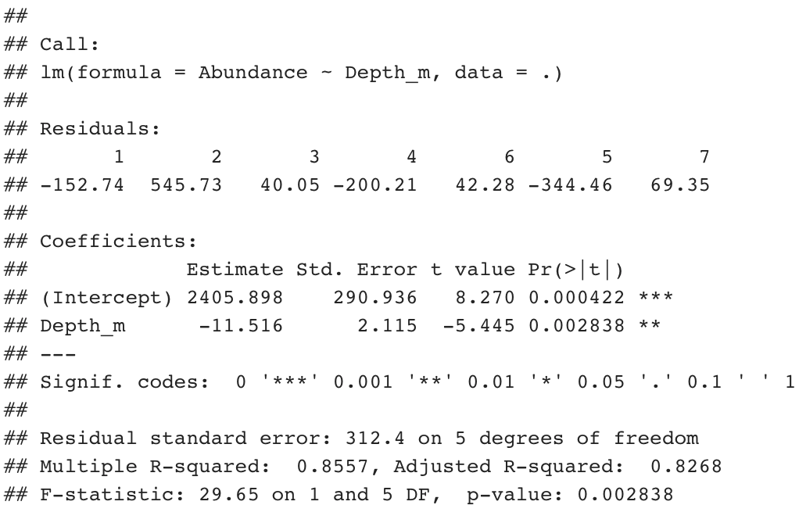
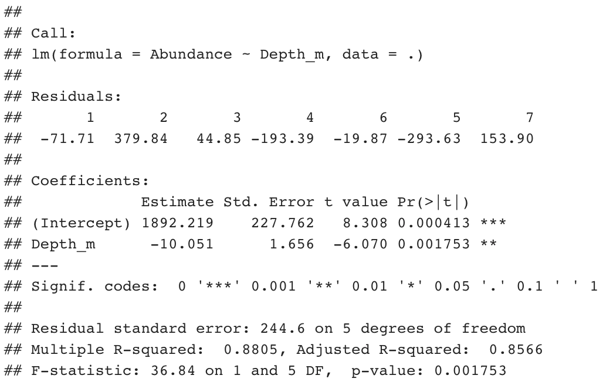
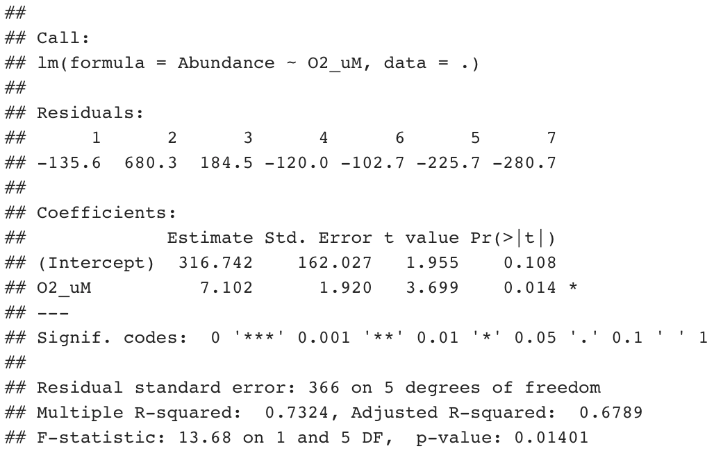
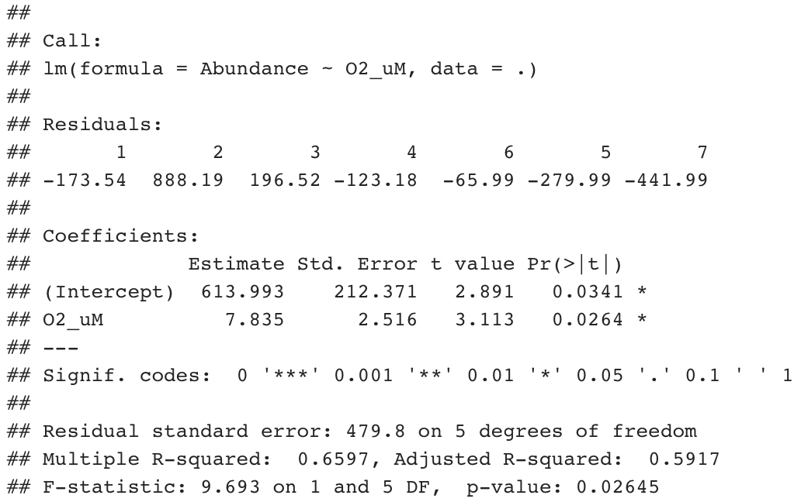

## Abstract
Saanich Inlet, a saltwater fjord, offers a unique opportunity to study changes in microbial communities throughout the water column due to the pronounced redox gradient resulting from the restricted water flow and influx of nutrients. Sampling at multiple depths throughout the inlet, biomass is collected and the V4-V5 region of the 16s rRNA is sequenced and processed using both mothur and QIIME2. Overall community structure and structure of  the family Oceanospirillaceae are then studied with changing depth and oxygen concentration. Analysis using mothur-processed data and QIIME2-processed data reveal that the abundance of  Oceanospirillaceae changes significantly with depth and oxygen concentration. More than half of the assigned OTUs for Oceanospirillaceae were significant, compared to only four significant ASVs.  Answers to the assigned questions generally displayed overlapping similarities using both pipelines with minor differences in the taxa assignments and calculation of statistical values (Chao1 and Shannon Diversity Index) across the depths. 

## Introduction 
Saanich Inlet is a saltwater fjord located off the coast of Vancouver Island. It is characterized by restricted inflow of water due to the shallow sill at the boundary with the Salish Sea, as well as the seasonal patterns of oxygen depletion, and the associated fluctuations in dissolved NO~3~^-^ and H~2~S with depth (1, 2). Nutrient input in the Saanich Inlet is largely dependent on the tidal cycles, which allow for water mixing, leading to subsequent increases in primary productivity. With limited movement of water outside the enclosed basin, organic matter generated in the euphotic zones of the inlet is quickly aerobically respired as it sinks to the bottom. This leads to the ultimate depletion of dissolved oxygen and establishment of Oxygen Minimum Zones (OMZs) prevalent in deepwater regions throughout most of the year, with the exception of late summer and fall seasons when the fjord becomes slightly oxic (3, 4). 

Due to the differences in dissolved O~2~ concentrations and the high redox potential of O~2~, the fjord experiences a whole variety of microbial metabolisms from depths of 0-250 m, with populations preferentially utilizing the strongest electron acceptor readily available at any given depth (3). This phenomenon leads to a range of oxic to dysoxic to anoxic to sulfidic environments within the basin, making the Saanich Inlet a perfect model system for studies focusing on microbially-mediated biogeochemical cycles, as well as microbial ecosystems, without the need to sample from the ocean.

In the age of high-throughput processing of environmental samples, it becomes necessary to classify community members based on a single common molecular marker, such as the 16S rRNA gene of bacteria and archaea. Downstream processing and analysis, however, offers a number of alternatives for reconstructing sample communities with an appropriate degree of representativeness. As such, individual sequences can be categorized into Operational Taxonomic Units (OTUs) or Amplicon Sequence Variants (ASVs), depending on the underlying principle. OTU-clustering involves grouping together of individual reads with a predetermined sequence similarity threshold – usually, around 97-99% – where a single OTU observation may be treated as a single event of species observation (5). Grouping of OTUs can also occur in two ways: in closed-referencing, reads that are sufficiently similar to a reference sequence collection are assigned to the corresponding taxon; while in de novo clustering sequence reads are grouped to a taxon based on the pairwise similarity (5, 6). ASVs, on the other hand, are produced through high-resolution identification down to a single nucleotide, allowing for discrimination between closely related organisms, as even slightly dissimilar sequences are considered to have come from different species rather than resulted from processing errors. Sequence reads are then grouped de novo, independent of an arbitrarily set threshold value (5). Previous studies indicate that both ASVs and OTUs can provide meaningful insight into microbial community composition with respect to ecological roles of individual members, although ASV-based analysis has the potential for greater identification sensitivity and, thus, effectiveness in inference of associated ecological patterns (5, 7, 8). In this project, we will continue to explore the capacity of OTUs and ASVs in environmental sampling analysis by comparing diversity and distribution of selected taxa across the oxygen gradient in the Saanich Inlet using both methods.

This study will focus on diversity and distribution trends of a single family within the Gammaproteobacteria clade called Oceanospirillaceae, which comprises over a dozen genera of aquatic bacteria. Oceanospirillaceae are widely distributed in marine environments and often inhabit regions of high salinity in the water column (7, 8). Cells typically possess rod or helix-shaped morphology, and their motility is supported by polar flagella (7). Majority of genera within the family are either aerobic or microaerophilic, strictly relying on oxygen-mediated respiratory processes for metabolism (8). Oceanospirillaceae are chemooranotrophs, and some members of the family are capable of degrading complex aromatic and branched hydrocarbons, including petroleum, and utilizing them as sole carbon and energy sources. They are also not known to utilize nitrate respiration (8). 

While examination of whole classes or phyla can provide robust data on abundance and diversity, we chose to narrow down the scope of our study to a single, relatively specialized family to allow for inference of ecological patterns.

In this project, we aim to analyze and compare distribution and diversity patterns of Oceanospirillaceae across the oxygen gradient of Saanich Inlet water column, using both OTU and ASV-based methods. With this, we also intend to assess the effectiveness of these methods with respect to reconstructing original community from individual sequence reads by comparing the outcomes of analyses.


## Methods
Water was regularly collected from Saanich inlet at seven depths: 10m, 100m, 120m, 135m, 150m, 165m, and 200m. Samples were analyzed for geochemical data, including oxygen, and used to extract genomic DNA. To perform DNA extractions, biomass was collected by filtering water through a 0.22μm Sterivex filter. The 16s rRNA was then sequenced at the variable 4 through 5 region (V4-V5). To generate the data, the Illumina MiSeq platform offering 2x300 base-pair technology was used. The sequences were then processed in both mothur and QIIME2, using as many similar parameters in the processing as possible to ensure consistent analysis (9). One taxon was selected for in-depth analysis, which is the family Oceanospirillaceae. It was ensured the selected taxon was present in over three samples and contained over five OTUs.

For analysis, plots were constructed and statistical methods were performed using the programming environment RStudio. The 3.4.3 version of R and the RStudio version 1.1.383 was utilized, as well as the three libraries “tidyverse”, “phyloseq”, and “magrittr”. Plots were constructed to visualize the change in diversity vs. depth, as well as oxygen concentration, changes in geochemical concentrations across depth, domain and genus abundance across depth, and changes in Oceanospirillaceae with depth and oxygen. For statistical analysis, linear models of abundance vs. depth and oxygen concentration were constructed for each OTU contained in Oceanospirillaceae. Resulting p-values were used to determine the significance of the change in abundance.

## Results     
An analysis of the sample data using both pipelines revealed nuanced changes in the microbial community as a result of variations in depth and oxygen concentration. Levels of dissolved oxygen decrease with depth, and this has an impact on species diversity. Analysis with the mothur pipeline found that the Shannon Diversity Index (SDI), which is indicative of the species diversity within the sample community, decreases with depth, as shown in Figure 1A and 1B. Analysis with mothur shows that the highest level of species diversity occurred at a depth of 100m, and the lowest level of diversity was found at 150m, with SDI values of 4.27 and 2.35, respectively. The SDI value actually increases slightly after its minimum at 150m to a value of 2.46 at 200m, though this difference is insignificant. Further, the trendline indicates a slightly higher level of species diversity at a depth of 50m than at 100m, although the high levels of uncertainty between 50m to 75m, denoted by the large grey area, render any interpolation for that depth inconclusive, as illustrated in Figure 1A. The largest changes in the SDI occurred between the depths of 100m to 150m, which corresponds to dissolved oxygen levels tapering off from 38 μM at 100m to nearly 0 μM at 150m and beyond. 

Analysis with QIIME2 revealed a similar trend in the SDI, albeit with several differences. Unlike the values obtained by mothur, the SDI values given by QIIME2 decrease sequentially, from a maximum SDI of 5.04 to a minimum SDI of 2.97, as illustrated in Figure 1B.  The key difference is at depth 200m in which the lowest SDI occurs, though with mothur analysis the lowest SDI is observed at depth 165m. The change in oxygen concentrations between the depths of 100m to 150m and the corresponding change in the SDI at these depths implies that oxygen levels have an impact on the microbial community. 

Across all seven depths, the bacteria domain has predominant abundance, followed by archaea, as shown in Figure 2. The mothur-processed data displayed three genera of family Oceanospirillacaea across the sampled depths: Balneatrix, Oleispira, and Pseudohongiella. As for the QIIME2 processed data, two different genera, Marinobacterium and Pseudospirillum were observed in addition to Balneatrix and Oleispira. According to Figure 4A and 4B, family Oceanospirillaceae was most abundant at a depth of 10m and least abundant at a depth of 200m. The general trend presented for Oceanospirillaceae is a gradual decline in abundance with increasing water depth. One exception is at a depth of 165m, where the abundance peaked above its neighbouring depths of 150m and 200m. With regards to the specific genus abundance, the highest was observed for Pseudohongiella, followed by Balneatrix, in the mothur processed data, as shown in Figure 3A. Conversely, in the QIIME processed data the highest genus abundance was observed for Pseudospirillum, followed by Balneatrix, as shown Figure 3B.

```{r setup, include=FALSE}
knitr::opts_chunk$set(echo = TRUE, fig.width=10, fig.height=10)
library(repr)
library(knitr)
library(tidyverse)
library(cowplot)
library(phyloseq)
library(magrittr)
library(dplyr)
library(ggsn)
library(sf)
```

```{r, include=FALSE}
load("mothur_phyloseq.RData")
set.seed(4832)
m.norm.mothur = rarefy_even_depth(mothur, sample.size=100000)
m.perc.mothur = transform_sample_counts(m.norm.mothur, function(x) 100 * x/sum(x))
```
```{r, include=FALSE}
m.alpha.mothur = estimate_richness(m.norm.mothur, measures = c("Chao1", "Shannon"))
m.meta.alpha.mothur = full_join(rownames_to_column(m.alpha.mothur), rownames_to_column(data.frame(m.perc.mothur@sam_data)), by = "rowname")
```
**1A.**
```{r, eval=TRUE, echo=FALSE}
m.meta.alpha.mothur
```
```{r, include=FALSE}
load("qiime2_phyloseq.RData")
set.seed(4832)
m.norm.qiime = rarefy_even_depth(qiime2, sample.size=100000)
m.perc.qiime = transform_sample_counts(m.norm.qiime, function(x) 100 * x/sum(x))
```
```{r, include=FALSE}
# Calculation
m.alpha.qiime = estimate_richness(m.norm.qiime, measures = c("Chao1", "Shannon"))
m.meta.alpha.qiime = full_join(rownames_to_column(m.alpha.qiime), rownames_to_column(data.frame(m.perc.qiime@sam_data)), by = "rowname")
```
**1B.**
```{r, eval=TRUE, echo=FALSE}
m.meta.alpha.qiime
```
```{r, include=FALSE}
plot1C = m.meta.alpha.mothur %>% 
    arrange(Depth_m) %>%
  
ggplot(aes(x=Depth_m, y=Shannon)) +
  geom_point(aes(x=Depth_m, y=Shannon)) +
  theme_grey() +
  geom_smooth(method='auto', aes(x=as.numeric(Depth_m), y=Shannon)) +
  labs(y="Shannon's diversity index", x="Depth (m)")

plot1D = m.meta.alpha.mothur %>% 
    arrange(O2_uM) %>%
  
  ggplot(aes(x=O2_uM, y=Shannon)) +
  geom_point(aes(x=O2_uM, y=Shannon)) +
  theme_grey() +
  geom_smooth(method='auto', aes(x=as.numeric(O2_uM), y=Shannon)) +
  labs(y="Shannon's diversity index", x="Oxygen (uM)")

plot1E = m.meta.alpha.qiime %>% 
  
ggplot(aes(x=Depth_m, y=Shannon)) +
  geom_point(aes(x=Depth_m, y=Shannon)) +
  theme_grey() +
  geom_smooth(method='auto', aes(x=as.numeric(Depth_m), y=Shannon)) +
  labs(y="Shannon's diversity index", x="Depth (m)")

plot1F = m.meta.alpha.qiime %>% 

  ggplot(aes(x=O2_uM, y=Shannon)) +
  geom_point(aes(x=O2_uM, y=Shannon)) +
  theme_grey() +
  geom_smooth(method='auto', aes(x=as.numeric(O2_uM), y=Shannon)) +
  labs(y="Shannon's diversity index", x="Oxygen (uM)")
```
```{r, eval=TRUE, echo=FALSE, message=FALSE, warning=FALSE, fig.width = 10, fig.height = 5}
plot_grid(plot1C, plot1D, labels=c("1C.", "1D."))
plot_grid(plot1E, plot1F, labels=c("1E.", "1F."))
```
**1G.**  
```{r, eval=TRUE, echo=FALSE, fig.width = 5, fig.height = 5}
#metadata = data.frame(mothur@sam_data)
m.meta.alpha.qiime %>% 
  arrange(Depth_m) %>% 

ggplot(aes(x = O2_uM, y = Depth_m)) +
  geom_point() +
  geom_path(aes(group = 1)) +
  scale_y_reverse(lim=c(200,10)) +
  theme_grey() +
  #options(repr.plot.width=5, repr.plot.height=3) +
  labs(y = "Depth (m)", x = "Oxygen (uM)")
```  

**Figure 1.** Chao1, Shannon Diversity Index, and five nutrient concentrations (uM) across seven depths analyzed using mothur (**A**) and QIIME2 (**B**).  Alpha diversity plots across seven depths (**C**) and oxygen concentration (**D**) using mothur. Alpha diversity plots across seven depths (**E**) and oxygen concentration (**F**) generated using QIIME2. (**G**) All measured nutrient concentrations (uM) across seven depths. 

```{r, include=FALSE}
plot2A = m.perc.mothur %>% 
plot_bar(fill="Domain") + 
  geom_bar(aes(fill=Domain), stat="identity") +
  labs(fill='Domain') +
  theme(plot.title = element_text(size=35, hjust=.5,vjust=.5,face="plain"),
        strip.text = element_text(size=12),
        axis.title.x = element_text(size=18),
        axis.title.y = element_text(size=18),
        axis.text.x = element_text(colour="grey20",size=12,angle=45,hjust=1,vjust=1),
        axis.text.y = element_text(colour="grey20",size=12),
        legend.text = element_text(size=12),
        legend.box.background = element_rect(),
        legend.box.margin = margin(6, 6, 6, 6),
        legend.position = "right")

plot2B = m.perc.qiime %>% 
plot_bar(fill="Domain") + 
  geom_bar(aes(fill=Domain), stat="identity") +
  labs(fill='Domain') +
  theme(plot.title = element_text(size=35, hjust=.5,vjust=.5,face="plain"),
        strip.text = element_text(size=12),
        axis.title.x = element_text(size=18),
        axis.title.y = element_text(size=18),
        axis.text.x = element_text(colour="grey20",size=12,angle=45,hjust=1,vjust=1),
        axis.text.y = element_text(colour="grey20",size=12),
        legend.text = element_text(size=12),
        legend.box.background = element_rect(),
        legend.box.margin = margin(6, 6, 6, 6),
        legend.position = "right")
```

```{r, eval=TRUE, echo=FALSE, fig.width = 10, fig.height = 5}
plot_grid(plot2A, plot2B, labels=c("2A.", "2B."), rel_widths=c(47.5/100, 52.5/100))
```

**Figure 2.** (**A**) The analysis of the abundance of domain taxa across depths using mothur (**B**)  The analysis of the abundance of domain taxa across depths using QIIME2.         

```{r, include=FALSE}
plot3A = m.perc.mothur %>% 
  subset_taxa(Family=="Oceanospirillaceae") %>% 
plot_bar(fill="Genus") + 
  geom_bar(aes(fill=Genus), stat="identity") +
  labs(fill="Genus") +
  theme(plot.title = element_text(size=17.5, hjust=.5,vjust=.5,face="plain"),
        axis.title.x = element_text(size=12.5),
        axis.title.y = element_text(size=12.5),
        axis.text.x = element_text(colour="grey20",size=7.5,angle=45,hjust=1,vjust=1),
        axis.text.y = element_text(colour="grey20",size=7.5),
        legend.text = element_text(size=6),
        legend.box.background = element_rect(),
        legend.box.margin = margin(6, 6, 6, 6),
        legend.position = "bottom")

plot3B = m.perc.qiime %>% 
  subset_taxa(Family=="D_4__Oceanospirillaceae") %>% 
  plot_bar(fill="Genus") + 
  geom_bar(aes(fill=Genus), stat="identity") +
  labs(fill="Genus") +
  theme(plot.title = element_text(size=17.5, hjust=.5,vjust=.5,face="plain"),
        axis.title.x = element_text(size=12.5),
        axis.title.y = element_text(size=12.5),
        axis.text.x = element_text(colour="grey20",size=7.5,angle=45,hjust=1,vjust=1),
        axis.text.y = element_text(colour="grey20",size=7.5),
        legend.text = element_text(size=6),
        legend.box.background = element_rect(),
        legend.box.margin = margin(6, 6, 6, 6),
        legend.position = "bottom")
```

```{r, eval=TRUE, echo=FALSE, message=FALSE, warning=FALSE, fig.width = 11, fig.height = 10}
plot_grid(plot3A, plot3B, labels=c("3A.", "3B."))
```

**Figure 3.** (**A**) The analysis of the abundance genus of family Oceanospirillacaea using mothur. (**B**) The analysis of the abundance of genus of family Oceanospirillacaea using QIIME2. 


Regardless of the clustering methods, the genus Balneatrix, which is the only genus of  Oceanospirillacaea that is not halophilic (1), tends to inhabit at lower depth. From the primary data, the student observes an increasing trend of salinity, which indicates that the environment becomes more inhospitable for Balneatrix as depth increases.


**Table 1.** Oxygen concentration, salinity, and water density across Saanich inlet depths  

**Depth**       | **OxygenSBE_V** | **Salinity_PSU** | **Density_q**
----------------|-----------------|------------------|--------------
Saanich, 10m    | 4.954           | 28.121           | 21.098
Saanich, 100m   | 0.872           | 30.872           | 23.933
Saanich, 120m   | 0.742           | 31.007           | 24.026
Saanich, 135m   | 0.469           | 31.088           | 24.076
Saanich, 150m   | 0.089           | 31.164           | 24.118
Saanich, 165m   | 0.069           | 31.197           | 24.138
Saanich, 200m   | 0.063           | 31.248           | 24.167

From Figure 3A and 3B, QIIME2 analysis provided one more genus than mothur. There is no previous literature that recommends the optimal targeted variable regions of 16S rRNA in distinguishing the members of Oceanospirillacaea family, so this could be a reason that classifications based on these two methods are not consistent with one another.

QIIME2 derives the biological sequences of the sample even before the introduction of amplification and sequencing errors, which allows this method to distinguish sequences that differ by as little as one nucleotide (10). QIIME2 provides higher resolution in classification of species, which may be the reason that QIIME2 was able to identify genus Marinobacterium, which mothur did not detect at all.

### **Does your taxon of interest *significantly* differ in abundance with depth and/or oxygen concentration?**

In both the mothur and QIIME2 data analyses, the calculated p-values for abundance vs. depth are 0.001753 and 0.002838, respectively. As for abundance vs. oxygen concentration, the calculated p-values are 0.01401 and 0.02645, respectively. In Figure 4A and 4B, the linear models of the abundance of Oceanospirillacaea across depth display a strong negative correlation within a narrow 95% confidence interval. In Figure 5A and 5B, the linear models of the abundance of Oceanospirillacaea across oxygen concentration display a strong positive correlation within a narrow 95% confidence interval.  All of the p-values from the linear model analysis are less than 0.05, therefore Oceanospirillacaea differs significantly in abundance with depth and oxygen concentration. 

```{r, include=FALSE}
plot4A = m.perc.mothur %>% 
  subset_taxa(Family=="Oceanospirillaceae") %>% 
  psmelt() %>% 
  group_by(Sample) %>% 
  summarize(Abundance_sum=sum(Abundance), Depth_m=mean(Depth_m)) %>% 
  
ggplot() +
  geom_point(aes(x=Depth_m, y=Abundance_sum)) +
  theme_grey() +
  labs(x = "Depth (m)", y = "Abundance (sum)") +
  geom_smooth(method='lm', aes(x=as.numeric(Depth_m), y=Abundance_sum))

plot4B = m.perc.qiime %>% 
  subset_taxa(Family=="D_4__Oceanospirillaceae") %>% 
  psmelt() %>% 
  group_by(Sample) %>% 
  summarize(Abundance_sum=sum(Abundance), Depth_m=mean(Depth_m)) %>% 
  
ggplot() +
  geom_point(aes(x=Depth_m, y=Abundance_sum)) +
  theme_grey() +
  labs(x = "Depth (m)", y = "Abundance (sum)") +
  geom_smooth(method='lm', aes(x=as.numeric(Depth_m), y=Abundance_sum)) 
```
```{r, eval=TRUE, echo=FALSE, message=FALSE, warning=FALSE, fig.width = 10, fig.height = 5}
plot_grid(plot4A, plot4B, labels=c("4A.", "4B."))
```
{width=49.7%} {width=49.7%}

```{r, include=FALSE}
m.norm.mothur %>% 
  subset_taxa(Family=="Oceanospirillaceae") %>% 
  tax_glom(taxrank = 'Family') %>%
  psmelt() %>%

  lm(Abundance ~ Depth_m, .) %>% 
  summary()

m.norm.qiime %>% 
  subset_taxa(Family=="D_4__Oceanospirillaceae") %>% 
  tax_glom(taxrank = 'Family') %>%
  psmelt() %>%

  lm(Abundance ~ Depth_m, .) %>% 
  summary()
```

**Figure 4.** Linear regression model of the abundance of Oceanospirillaceae across depth using mothur analysis (**A**) and QIIME2 analysis (**B**), with  correspondingstatistical analysis of the abundance of Oceanospirillaceae across depth below. 


```{r, include=FALSE}
plot5A = m.perc.mothur %>% 
  subset_taxa(Family=="Oceanospirillaceae") %>% 
  psmelt() %>% 
  group_by(Sample) %>% 
  summarize(Abundance_sum=sum(Abundance), O2_uM=mean(O2_uM)) %>% 
  
ggplot() +
  geom_point(aes(x=O2_uM, y=Abundance_sum)) +
  theme_grey() +
  labs(x = "Oxygen (uM)", y = "Abundance (sum)") +
  geom_smooth(method='lm', aes(x=as.numeric(O2_uM), y=Abundance_sum))

plot5B = m.perc.qiime %>% 
  subset_taxa(Family=="D_4__Oceanospirillaceae") %>% 
  psmelt() %>% 
  group_by(Sample) %>% 
  summarize(Abundance_sum=sum(Abundance), O2_uM=mean(O2_uM)) %>% 
  
ggplot() +
  geom_point(aes(x=O2_uM, y=Abundance_sum)) +
  theme_grey() +
  labs(x = "Oxygen (uM)", y = "Abundance (sum)") +
  geom_smooth(method='lm', aes(x=as.numeric(O2_uM), y=Abundance_sum))
```

```{r, eval=TRUE, echo=FALSE, message=FALSE, warning=FALSE, fig.width = 10, fig.height = 5}
plot_grid(plot5A, plot5B, labels=c("5A.", "5B."))
```

{width=49.7%} {width=49.7%}
```{r, include=FALSE}
m.norm.mothur %>% 
  subset_taxa(Family=="Oceanospirillaceae") %>% 
  tax_glom(taxrank = 'Family') %>%
  psmelt() %>%

  lm(Abundance ~ O2_uM, .) %>% 
  summary()

m.norm.qiime %>% 
  subset_taxa(Family=="D_4__Oceanospirillaceae") %>% 
  tax_glom(taxrank = 'Family') %>%
  psmelt() %>%

  lm(Abundance ~ O2_uM, .) %>% 
  summary()
```

**Figure 5.** Linear regression model of the abundance of Oceanospirillaceae across oxygen concentration using mothur analysis (**A**) and QIIME2 analysis (**B**), with corresponding statistical analysis of the abundance of Oceanospirillaceae across oxygen concentration below. 

### **Within your taxon, what is the richness (number of OTUs/ASVs)?**

Across all samples, there are 25 OTUs within family Oceanospirillaceae according to the mothur analysis as illustrated in Table 2.  For the QIIME2 analysis, there are 28 ASVs within family Oceanospirillaceae as shown in Table 2.

**Table 2.** The richness of Oceanospirillaceae across depths determined using mothur and QIIME2  

**Depth**       | **Number of taxa found, mothur** | **Number of taxa found, QIIME**
----------------|----------------------------------|--------------------------------
Saanich, 10m    | 16                               | 6
Saanich, 100m   | 12                               | 16
Saanich, 120m   | 7                                | 16
Saanich, 135m   | 6                                | 10
Saanich, 150m   | 5                                | 10
Saanich, 165m   | 6                                | 11
Saanich, 200m   | 9                                | 6
Overall richness| 25                               | 28 


### **Do the abundances of OTUs/ASVs within your taxon of interest change *significantly* with depth and/or oxygen concentration?**

Across the 25 OTUs identified within family Oceanospirillaceae using mothur, the abundance of 12 of the 25 OTUs change significantly with both depth and oxygen concentration. The significant OTUs within family Oceanospirillaceae across depth are OTU0065, OTU0327, OTU0511, OTU0675, OTU0952, OTU0979, OTU1077, OTU1349, OTU1516, OTU1685, OTU1992, and OTU3677. The general trend for the linear model of each of these OTU is a strong negative correlation that falls within a narrow 95% confidence interval as shown in Figure 6A. The p-values for each of the significant OTUs are also calculated to be less than 0.05, with all calculated p-values in Table 3. The same OTUs were significant with respect to oxygen concentration from the analysis of the p-values and the linear models in Figure 6C.

**Table 3.** p-values from linear models of abundance vs. depth and oxygen using mothur-produced data

**mothur OTU** | **Depth** | **Oxygen**
---------------|-----------|-----------
#OTU0065       | 0.01105   | 0.00003483
#OTU0084       | 0.1132    | 0.3495
#OTU0090       | 0.9653    | 0.5526
#OTU0104       | 0.7401    | 0.7596
#OTU0117       | 0.5847    | 0.954
#OTU0327       | 0.01511   | 0.0000997
#OTU0418       | 0.7895    | 0.7514
#OTU0511       | 0.01018   | 0.00003922
#OTU0675       | 0.02419   | 0.0002626
#OTU0857       | 0.2077    | 0.5905
#OTU0952       | 0.0164    | 0.0001264
#OTU0979       | 0.0164    | 0.0001264
#OTU1077       | 0.0164    | 0.0001264
#OTU1349       | 0.0164    | 0.0001264
#OTU1516       | 0.0164    | 0.0001264
#OTU1678       | 0.3893    | 0.5987
#OTU1685       | 0.0164    | 0.0001264
#OTU1730       | 0.4401    | 0.6055
#OTU1992       | 0.0164    | 0.0001264
#OTU2430       | 0.6864    | 0.9432
#OTU3469       | 0.6864    | 0.9432
#OTU3676       | 0.2077    | 0.5905
#OTU3677       | 0.0164    | 0.0164
#OTU3678       | 0.6864    | 0.9432
#OTU3783       | 0.2077    | 0.5905

As for the 28 ASVs that were identified using QIIME2, the abundance of 4 of the 28 Oceanospirillaceae ASVs change significantly with both depth and oxygen concentration. The four ASVs that change significantly with depth are ASV131, ASV213, ASV810, and ASV1414. According to Figure 7A, the general trend shown by each of the four ASVs is a strong positive correlation that falls within a narrow 95% confidence interval. Their respective p-values are also calculated to be less than 0.05, with all calculated p-values in Table 4. The ASVs that change significantly with respect to oxygen concentration are ASV131, ASV213, and ASV810. General trends shown are consistent with that of mothur data analysis according to the p-values and the linear models in Figure 7C. 

**Table 4.** p-values from linear models of abundance vs. depth and oxygen using QIIME-produced data

**QIIME ASV** | **Depth** | **Oxygen**
--------------|-----------|-----------
#Asv107       | 0.5322    | 0.5905
#Asv120       | 0.8776    | 0.5924
#Asv131       | 0.0164    | 0.0001264
#Asv213       | 0.01002   | 0.00003552
#Asv243       | 0.8       | 0.6734
#Asv417       | 0.9291    | 0.8889
#Asv476       | 0.2077    | 0.5905
#Asv668       | 0.2077    | 0.5905
#Asv810       | 0.007237  | 0.0000101
#Asv1050      | 0.9291    | 0.8889
#Asv1152      | 0.707     | 0.8377
#Asv1283      | 0.6896    | 0.7813
#Asv1352      | 0.7976    | 0.6851
#Asv1414      | 0.01526   | 0.09034
#Asv1430      | 0.2077    | 0.5905
#Asv1486      | 0.6641    | 0.8984
#Asv1490      | 0.8502    | 0.799
#Asv1570      | 0.6988    | 0.7065
#Asv1593      | 0.9291    | 0.8889
#Asv1797      | 0.2077    | 0.5905
#Asv1977      | 0.2077    | 0.5905
#Asv2036      | 0.885     | 0.7762
#Asv2097      | 0.8012    | 0.6649
#Asv2125      | 0.6864    | 0.9432
#Asv2215      | 0.6864    | 0.9432
#Asv2281      | 0.7822    | 0.3544
#Asv2297      | 0.8776    | 0.7041
#Asv2341      | 0.2077    | 0.5905

**6A.**
```{r, eval=TRUE, echo=FALSE}
m.perc.mothur %>% 
  subset_taxa(Family=="Oceanospirillaceae") %>% 
  psmelt() %>% 
  
ggplot() +
  geom_point(aes(x=Depth_m, y=Abundance)) +
  theme_grey() +
  labs(x = "Depth (m)") +
  geom_smooth(method='lm', aes(x=Depth_m, y=Abundance)) +
  facet_wrap(~OTU, scales="free_y")
```
**6B.**
```{r, eval=TRUE, echo=FALSE, fig.width = 10, fig.height = 10}
m.perc.mothur %>% 
  subset_taxa(Family=="Oceanospirillaceae") %>%
  psmelt() %>% 
  
ggplot() +
  geom_point(aes(x=Sample, y=OTU, size=Abundance, color=O2_uM)) + 
  scale_size_continuous(range = c(0,5)) +
  theme_grey() +
  theme(plot.title = element_text(size=15, hjust=.5,vjust=.5,face="plain"),
        axis.text.x = element_text(colour="grey20",size=10,angle=45,hjust=.5,vjust=.5,face="plain"),
        legend.box.background = element_rect(),
        legend.box.margin = margin(6, 6, 6, 6),
        legend.position = "right")
```
**6C.**
```{r, eval=TRUE, echo=FALSE}
m.perc.mothur %>% 
  subset_taxa(Family=="Oceanospirillaceae") %>% 
  psmelt() %>% 
  
ggplot() +
  geom_point(aes(x=O2_uM, y=Abundance)) +
  theme_grey() +
  labs(x = "Oxygen (uM)") +
  geom_smooth(method='lm', aes(x=O2_uM, y=Abundance)) +
  facet_wrap(~OTU, scales="free_y")
```
```{r, eval=TRUE, echo=FALSE, fig.width = 10, fig.height = 10}
#**6D**
#m.perc.mothur %>% 
#  subset_taxa(Family=="Oceanospirillaceae") %>%
  #psmelt() %>% 
  
#ggplot() +
 # geom_point(aes(x=O2_uM, y=OTU, size=Abundance, color=OTU)) + 
  #scale_size_continuous(range = c(0,5)) +
   # theme(plot.title = element_text(size=15, hjust=.5,vjust=.5,face="plain"),
    #    axis.text.x = element_text(colour="grey20",size=10,angle=0,hjust=.5,vjust=.5,face="plain"),
     #   legend.box.background = element_rect(),
      #  legend.box.margin = margin(6, 6, 6, 6),
       # legend.position = "right")
```

**Figure 6.** Analysis of the abundance of OTUs within family Oceanospirillaceae across depth and oxygen concentration using mothur. Linear models are represented in (**A**) and (**C**) and abundance plot is represented in (**B**). 

**7A.**
```{r, eval=TRUE, echo=FALSE}
m.perc.qiime %>% 
  subset_taxa(Family=="D_4__Oceanospirillaceae") %>% 
  psmelt() %>% 
  
ggplot() +
  geom_point(aes(x=Depth_m, y=Abundance)) +
  theme_grey() +
  labs(x = "Depth (m)") +
  geom_smooth(method='lm', aes(x=Depth_m, y=Abundance)) +
  facet_wrap(~OTU, scales="free_y")
```
**7B.**
```{r, eval=TRUE, echo=FALSE, fig.width = 10, fig.height = 10}
m.perc.qiime %>% 
  subset_taxa(Family=="D_4__Oceanospirillaceae") %>%
  psmelt() %>% 
  
ggplot() +
  geom_point(aes(x=Sample, y=OTU, size=Abundance, color=O2_uM)) + 
  scale_size_continuous(range = c(0,5)) +
  theme_grey() +
  theme(plot.title = element_text(size=15, hjust=.5,vjust=.5,face="plain"),
        axis.text.x = element_text(colour="grey20",size=10,angle=45,hjust=.5,vjust=.5,face="plain"),
        legend.box.background = element_rect(),
        legend.box.margin = margin(6, 6, 6, 6),
        legend.position = "right")
```
**7C.**
```{r, eval=TRUE, echo=FALSE}
m.perc.qiime %>% 
  subset_taxa(Family=="D_4__Oceanospirillaceae") %>% 
  psmelt() %>% 
  
ggplot() +
  geom_point(aes(x=O2_uM, y=Abundance)) +
  theme_grey() +
  labs(x = "Oxygen (uM)") +
  geom_smooth(method='lm', aes(x=O2_uM, y=Abundance)) +
  facet_wrap(~OTU, scales="free_y")
```

```{r, eval=TRUE, echo=FALSE, fig.width = 10, fig.height = 10}
#**7D**
#m.perc.qiime %>% 
#  subset_taxa(Family=="D_4__Oceanospirillaceae") %>%
#  psmelt() %>% 
  
#ggplot() +
 # geom_point(aes(x=O2_uM, y=OTU, size=Abundance, color=OTU)) + 
#  scale_size_continuous(range = c(0,5)) +
  #  theme(plot.title = element_text(size=15, hjust=.5,vjust=.5,face="plain"),
   #     axis.text.x = element_text(colour="grey20",size=10,angle=0,hjust=.5,vjust=.5,face="plain"),
    #    legend.box.background = element_rect(),
     #   legend.box.margin = margin(6, 6, 6, 6),
      #  legend.position = "right")
```

**Figure 7.** Analysis of the abundance of ASVs within family Oceanospirillaceae across depth and oxygen concentration using QIIME. Linear models are represented in (**A**) and (**C**) and abundance plot is represented in (**B**) . 

### **Are the answers to the above the same using mothur and QIIME2 processed data?**

In deducing the significance of the abundance of Oceanospirillaceae across depths and oxygen concentration, both mothur and QIIME2-processed data confirmed that Oceanospirillaceae indeed differs significantly across depths and oxygen concentration. The abundance of the OTUs and ASVs of Oceanospirillaceae were also found to be significant from analysis using each respective pipeline. Although both mothur and QIIME2 provide generally same answers to the assigned questions, differences were also observed across certain analyses. For example, in Figure 1A and 1B, the Chao1 and Shannon Diversity Index values are greater in value in the QIIME2-processed data, compared to the mothur processed data. Another prominent difference lies in the number of significant OTUs and ASVs that were assigned by each pipeline. According to Table 2, QIIME2 outputted 3 more taxa asssignments to Oceanospirillaceae than mothur. Also, in Figure 3A and 3B, there is an increase in genus diversity observed by QIIME2-processed data. Interestingly, the number of significant OTUs amounted to 12 out of 25, compared to only 4 out of 28 significant ASVs.  

## Discussion

### **If you found significant differences for your taxon across depth/oxygen, why might these be occurring (*hint* think about the accompanying geochemical data we have)?**

Using both the mothur and QIIME2 pipelines, we observed an large decrease in the abundance of Oceanospirillaceae genera in relation to depth (Fig 3A, 3B). As the oxygen concentration versus depth graph in Fig 1G indicates, oxygen concentrations decrease linearly with increasing depth to 0μM at 150m, where it remains at 0μM for further depths. This does not reflect the exponential decrease in abundance observed in Fig 3A, 3B, suggesting that Oceanospirillaceae, being obligate aerobes, may be highly sensitive to even minute changes in oxygen concentration. We identified 4 ASVs with QIIME2 that were significantly negatively correlated with depth, Asv213,  Asv131, ASV1414 and Asv810 (Fig 7A). Also, approximately half of the OTUs analyzed were found to be significantly negatively correlated with depth (Fig 6A). Importantly, Oceanospirillaceae are known to be limited in their use of available terminal electron acceptors, being able to use only oxygen [6]. Oceanospirillaceae are also not able to fix nitrogen. Therefore, it is unlikely that the observed decrease in abundance is influenced by the increasing/decreasing concentrations of molecules such as NO~2~^-^, NO~3~^-^, NH~4~^+^, H~2~S, PO~4~^3-^ and others. 

There is an obvious limitation with the data in that sample information is missing from depths in between 10m and 100m. This leaves a wide margin of statistical uncertainty when attempting to determine the alpha diversity of Oceanospirillaceae against oxygen concentration or depth, which explains the large grey areas in Fig 1C-1E. Nevertheless, we observed little abundance disparity between the readings at depth 10m and 100m, so we hypothesize that Oceanospirillaceae abundance is fairly consistent within that range, with OTUs and ASVs. Contradictory to this, however, Figure 1G shows a clear drop in oxygen concentration by more than 60% at the 50m mark. Although this decrease in oxygen concentration may not have an effect on overall abundance, there is a distinct shift in genera-specific abundance. At 10m, Pseudospirillum constitute over 90% of the population, while at depths of 100m, 120m and 135m, the abundance is divided equally between Pseudospirillum and Balneatrix. It is likely that the Balneatrix genus is less sensitive to drastic changes in oxygen concentration, although without functional analysis of sequence data, this remains unknown.

Interestingly, despite Oceanospirillaceae being strictly aerobic, both mothur and QIIME2 detected low levels of abundance at anoxic depths: 150m, 165m and 200m. Given that Saanich Inlet is a seasonally anoxic fjord, there are seasonal fluctuations in oxygen levels across all depths, where even at 200m, oxygen concentrations can range from 15μM to less than 3μM [1]. It is possible that although Figure 1G shows negligible oxygen concentrations at depths below 150m, small periodic fluxes of dissolved oxygen allow for the survival of small Oceanospirillaceae populations, although this is unlikely given the time of year. Further, since 16S rRNA-based analyses do not discriminate between the living and the dead organisms in the environmental sample, some of the abundances at greater depths could be attributed to metabolically inactive cells and dead organic matter that sank down from the near-surface waters.

### **What are the implications of potential differences in pipelines for microbial ecology research and discovery?**

With respect to the comparison between mothur and QIIME2 abundance detection, our data reflects findings in previous literature. QIIME2, with its use of a de-noising algorithm prior to sequence clustering and resulting higher sensitivity to single nucleotide differences produced 4 distinct genera: Balneatrix, Oleispira, Pseudospirillum and Marinobacterium, while Mothur only detected 3 genera: Balneatrix, Oleispira and Pseudohongiella (Fig 3A, 3B). Given the different methods in which each pipeline clusters sequence data, this variation is expected. We also observed greater diversity at the genus level with QIIME2 than with mothur. The greater resolution at this taxonomic level provided by QIIME2 highlights its potential to be used to distinguish between genetically similar bacteria. For this reason, QIIME2 could be used, with a higher degree of sensitivity, to categorize, sort and process information from large data sets, such as primary sequence data from newly sampled environments. The weakness of both pipelines, however, is that the fixed definition of bacterial “species” is largely undefined and highly subjective. This, combined with the exceedingly high degree of 16S RNA similarity at the genus level between bacteria, makes it difficult to make taxonomic conclusions from the data. Notably, both pipelines showed similar levels of abundance, indicating that either pipeline can be used to reliably determine bacterial abundance in environmental samples.

In discussing the differences between statistically significant OTUs or ASVs versus depth, we acknowledge that unless accurate functional information is obtained from the sequence data, the genus classification of Oceanospirillaceae remains uncertain. In addition to this, little is known about the proteomics of Oceanospirillaceae and their species genotypes have been largely unexplored, making it more difficult to make conclusions based on diversity and richness. However, our results indicate that QIIME2 might be more effective at determining richness, given that the Chao1 richness estimation from QIIME2 reflect the shift in genus abundance at each depth, indicating an increase in ASV richness with the increased abundance of Balneatrix at lower depths (Table 2). Although mothur detects the shift in genera abundance, it fails to detect the likely change in richness as seen in Table 2. We predict that this increase in ASVs at depths between 100m and 165m may be due to subtle nucleotide changes that correspond to homologs of metabolic genes in Balneatrix that enable them to inhabit these slightly less oxygenated depths and to influence enzyme adaptability in different environmental conditions.

It is crucial to note that the data used is severely limited and in need of sampling from depths between 10m and 100m. With a greater amount of varied sampling data, there may be greater confidence in using mothur for detailed characterization of samples at the genus level. Overall, although the analyses from both pipelines was effective, we believe that it is not fully representative of the actual environment and further tests are needed to more accurately characterize Oceanospirillaceae in Saanich Inlet. We conclude that QIIME2, with its greater sensitivity and ability to detect minute differences in specific metabolic genes of interest, makes it an effective tool in predicting abundance, diversity and richness in biogeochemically fluctuating environments, particularly when working with limited sequence data. Mothur, with its flexibility and precision, due to its use of reference sequences during alignment and cleaning would allow for more robust sample characterization, although with less coverage. Despite the variation between the pipelines in terms of diversity, genus abundance and richness, analysis of Saanich Inlet sample data using both mothur and QIIME2 lead us to conclude that there is an inverse relationship between overall abundance of Oceanospirillaceae and dissolved oxygen concentration. 

## References
1. Torres-Beltrán M, Hawley A, Capelle D, Zaikova E, Walsh D, Mueller A, Scofield M, Payne C, Pakhomova L, Kheirandish S, Finke J, Bhatia M, Shevchuk O, Gies E, Fairley D, Michiels C, Suttle C, Whitney F, Crowe S, Tortell P, Hallam S. 2017. A compendium of geochemical information from the Saanich Inlet water column. Sci Data **4**:170159.

2. Belley R, Snelgrove P, Archambault P, Juniper S. 2016. Environmental Drivers of Benthic Flux Variation and Ecosystem Functioning in Salish Sea and Northeast Pacific Sediments. PLoS One **11**(3):e0151110.

3. Grundle DS. 2007. MSc thesis. University of Victoria, Victoria, BC. 

4. Manning C, Hamme R, Bourbonnais A. 2010. Impact of deep-water renewal events on fixed nitrogen loss from seasonally-anoxic Saanich Inlet. Mar Chem **122**(1-4):1-10.

5. Callahal BJ, McMurdie PJ, Holmes SP. 2017. Exact sequence variants should replace operational taxonomic units in marker-gene data analysis. ISME J **11**:2639–2643.

6. He Y, Caporaso J, Jiang X, Sheng H, Huse S, Rideout J, Edgar R, Kopylova E, Walters W, Knight R, Zhou H. 2015. Stability of operational taxonomic units: an important but neglected property for analyzing microbial diversity. Microbiome **3**(1):20.

7. Garrity G, Bell J, Lilburn T. 2007. FAMILY I. OCEANOSPIRILLACEAE. In Brenner, D, Krieg, N, Stanley, J (ed.), Bergey's Manual® of Systematic Bacteriology: Volume 2: The Proteobacteria, Part B: The Gammaproteobacteria. Springer Science & Business Media, New York.

8. Satomi M, Fujii T. 2014. The Family Oceanospirillaceae. In Rosenberg, E, DeLong, E, Lory, S, Stackebrandt, E, Thompson, F (ed.), The Prokaryotes, 4th ed. Springer, Berlin.

9. Dill-MacFarland K. 2018. MICB425 Project 1: *mothur vs. QIIME2 Microbiome Data Analysis*. Project 1 instructions for course MICB425. University of British Columbia, Vancouver, BC.

10. Callahan, B, McMurdie, P, Holmes, S P. 2017. Exact sequence variants should replace operational taxonomic units in marker-gene data analysis. ISME J **11**:2639-2643.