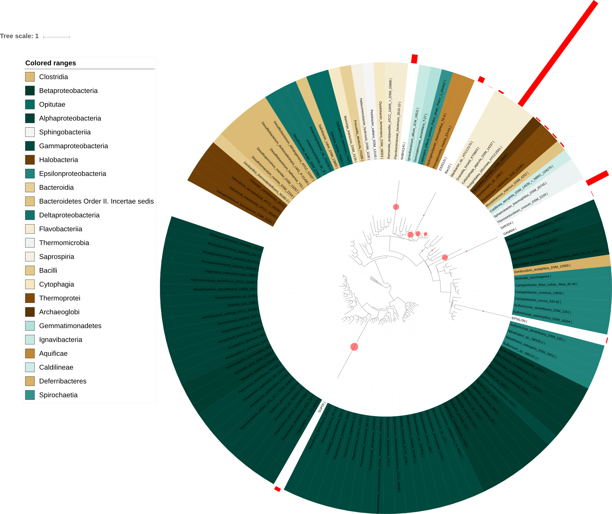
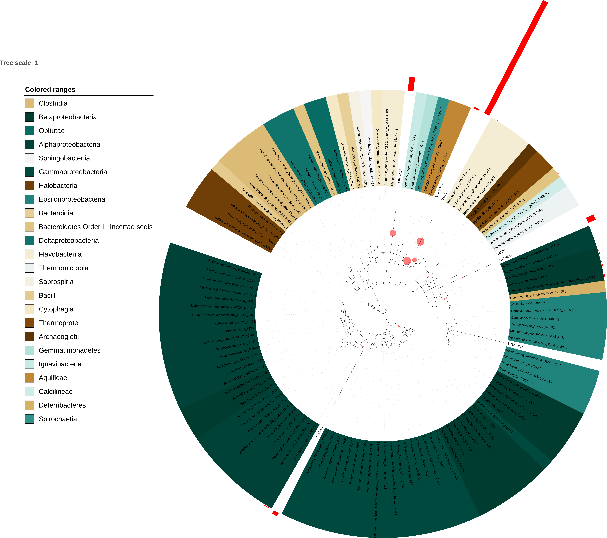
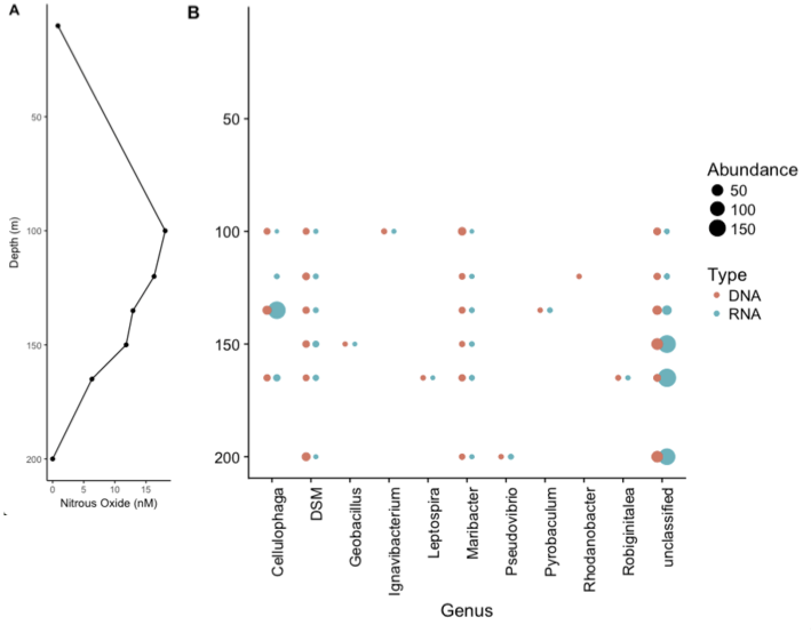

## Abstract
The saltwater fjord Saanich Inlet has a pronounced redox gradient resulting from the restricted water flow and influx of nutrients, offering a unique opportunity to study changes in microbial communities throughout the water column. Sampling at multiple depths throughout the inlet, biomass is collected and final genomes constructed using Illumina and MetaPathways. Focusing on the denitrification pathway and the gene nosZ, community structure was then studied with changing depth and nitrous oxide (N~2~O) concentration. The abundance of nosZ is found below 100m, abundance increasing with depth and decreasing N~2~O concentration. The overall pattern of nosZ expression illustrated the need for distributed metabolic pathways, particularly in variable environments like the annually oxic/anoxic Saanich Inlet.

## Introduction 
Saanich Inlet is a seasonally anoxic saltwater fjord located between the Malahat highlands and the Saanich peninsula on Vancouver Island, British Columbia. For most of the year, the fjord remains anoxic below 150m (1). However, during the late summer and early fall months, oxygenated water from the Haro Strait and Satellite Channel spill over into the deep water of Saanich Inlet, resulting in a temporary rise in dissolved oxygen concentration. With oxygen concentration being a defining factor in the microbial metabolic diversity, a wide range of diverse and niche metabolic systems have evolved within the fjord. Along with oxygen, many essential nutrient species concentrations also vary significantly with depth. These molecules include N~2~O, NO~3~^-^, SiO~2~, H~2~S, NH~4~^+^, CH~4~ and PO~4~^3-^. Spatial and temporal variation in metabolic enzymes occur as a result of microbes adapt to use the strongest available electron acceptor at each depth. Saanich Inlet has, thus, become an important environment to study microbial metabolism in oxygen minimum zones (OMZ) and biogeochemical cycling in aquatic habitats.

One of the most influential components of microbial biogeochemical engine is the nitrogen cycle. Many intermediates of the nitrogen are substrates used in microbial respiration, mostly as terminal electron acceptors. Atmospheric nitrogen gas is first oxidized into nitrate (NO~3~^-^) by nitrogen fixing organisms, converting it into organic nitrogen, which is then used and stored in organismal reservoirs in molecules such as amino acids and nitrogenous bases. Eventually, this organic nitrogen must be returned to the atmosphere as gaseous N~2~. This is achieved by the denitrification process, in which nitrate and/or nitrite are sequentially reduced by a series of nitrate reductases to form N~2~ (2). Nitrate is first reduced into nitrite (NO~2~^-^) by the enzymes NarG and NapA. Nitrite is then reduced into nitric oxide (NO) by NirK and NirS, which is subsequently reduced into nitrous oxide (N~2~O) by the NorB and NorC proteins. Finally, the nitrate reductase NosZ reduces nitrous oxide into gaseous N~2~, releasing it into the atmosphere and completing the nitrogen cycle. Notably, this process rarely occurs within a single species, but rather by different groups of organisms that catalyze specific reactions within the denitrification process. Each step in the denitrification process represents a group of microbes utilizing the appropriate nitrogen species as part of their metabolism, as these nitrogen-containing molecules are sequentially reduced. As such, denitrification genes are used as molecular markers to study non-culturable organisms in both soil and marine environmental samples (3). This project will focus on the final step of the process, the conversion of nitrous oxide to N~2~ by NosZ.

NosZ, a nitrous oxide reductase, is a modular homodimeric multicopper enzyme, first purified from gram-negative denitrifiers (4). A study by Scala & Kerkhof (1999) (5) compared 49 nosZ genes collected from Pacific and Atlantic continental shelf sediments and concluded that all 49 variants contained a highly conserved copper-binding catalytic domain. In soil, the enzyme can be found in several genera including Bradyrhizobium, Brucella, Dechloromonas, Flavobacterium, Pseudomonas, Ralstonia, and Sinorhizobium (6). However, it was found that within many of these soil genera, the bacteria possessed denitrification gene clusters but lacked nosZ (4). These bacteria thus emit nitrous oxide in denitrifying conditions. This suggests that the organisms that express nosZ are a niche group that are solely responsible for the final denitrification step. Nitrous oxide is a potent greenhouse gas that is ~300% more potent than CO~2~ in terms of global warming potential (4). Therefore, with such a specific group of organisms being responsible for the catalysis of nitrous oxide reduction into N~2~, it is essential to develop our understanding of the nosZ gene and its distribution within the anoxic environmental metagenome.

The aim of this study is to identify the distribution of nosZ across different depths and between which microbial taxa. A prior study indicates that nosZ is fairly prominent in soil samples below 18.3m, with an abundance of 5-17% relative to total 16S gene copy numbers below this depth (7). We will use metagenomic and metatranscriptomic data to assess the abundance of nosZ expression in both DNA and RNA. With this information, we hope to compare expression patterns between different taxonomic groups and describe the roles of these organisms in the nitrogen cycle. We also seek to establish any correlations between N2O concentration across depth and nosZ expression. 

## Methods
Water was regularly collected from Saanich inlet at seven depths: 10m, 100m, 120m, 135m, 150m, 165m, and 200m. Samples were used to extract genomic DNA and RNA by collecting biomass by filtering water through a 0.22μm Sterivex filter. To construct shotgun Illumina libraries, genomic DNA and cDNA, generated from the reverse transcription of RNA, were used. The Illumina HiSeq platform was then used to produce sequencing data, which were then quality controlled by the Joint Genome Institute. To construct and process final metagenomes, MetaPathways version 2.5 at UBC was used (8).

The final data were used to reconstruct the nitrogen cycle across the redox gradients in Saanich Inlet. To focus the analysis, one gene associated with denitrification, nosZ, was selected as the functional gene of interest. The analysis was done with Tree-based Sensitive and Accurate Protein Profiler (TreeSAPP), **version (X)**, using the following commands:

 - time treesapp.py -T 8 --verbose --delete \ -t D0601 -i   
 - bucket/MetaG_assemblies/SI072_LV_10m_DNA.scaffolds.fasta --rpkm -r  
 - bucket/MetaG_reads/SI072_LV_10m.anqdp.fastq -o treesapp_out_dir_10m
 - rm treesapp_out_dir_10m/RPKM_output/*.sam
 
These commands were used to run TreeSAPP on a server provided by Google Cloud, to provide commentary during runtime, to delete intermediary files, and to save files of interest in a separate location. Final phylogenetic trees were constructed using the data produced by TreeSAPP via Interactive Tree of Life (iTOL) version 4 (9). The final report and additional analyses were carried out using the programming environment RStudio, version 3.4.3 and the three libraries “tidyverse”, “phyloseq”, and “magrittr”. Linear models were constructed using abundance vs. depth and abundance vs. N~2~O concentration.

## Results 
  
**100m**  
    
**120m**  
   
**135m**  
   
**150m**  
 

**165m**  
  
**200m**  
   

**Figure 1.** Phylogenetic trees showing DNA expression of nosZ; red bars represent FPKM, and pink dots represnt phylogenetic placements

### **How does the DNA abundance of your gene of interest differ with depth?**

At a depth of 10m, the gene of interest, nosZ, is not observed. At 100m, the DNA abundance of nosZ predominates the class Flavobacteriia, specifically with species Maribacter_sp._HTCC2170 being responsible for the overall highest DNA abundance at this depth. Unclassified group SAR324, contains the second most abundant nosZ DNA, followed by group SUP05 of class Gammaproteobacteria at 100m. Interestingly, at 120m the relative DNA abundance of nosZ is found to be identical to the abundance observed at 100m. At depths 135m and 150m, unclassified group SHBH1141 has an average seven-fold increase in nosZ, while unclassified group GAMMA also has a 5-fold increase at 135m, and a 12-fold increase at 150m. On the other hand, unclassified group SAR324 has a much lower DNA abundance at 135 and 150m compared to surface depths, and unclassified group EPSILON also displays a gradual decrease in nosZ DNA abundance with an increase in depth. Another interesting observation is at 150m, where nosZ DNA is present in equally low quantities across all of the clades under the class Betaproteobaceria, Gammaproteobacteria, and Alphaproteobacteria. The highest nosZ DNA across all depths belongs to the unclassified group SHBH1141 at 200m.

According to Table 1, which illustrates all of the p-values for the different genus across depth, the only genus of significance is the unclassified genus with a p-value of 0.0002365. Also, the overall statistical analysis of the different genus across depth has a significant p-value of 0.0005024. The general trend for the DNA abundance of nosZ at the different depths is that it remains constant from 100m to 200m, gradually peaks at 150m,  drops by nearly half at 165m, and then increases to a maximum again at 200m. 
gradually peaks at 150m,  drops by nearly half at 165m, and then increases to a maximum again at 200m. 


```{r setup, include=FALSE}
knitr::opts_chunk$set(echo = TRUE, fig.width=10, fig.height=10)
library(repr)
library(knitr)
library(tidyverse)
library(cowplot)
library(phyloseq)
library(magrittr)
library(dplyr)
library(ggsn)
library(sf)
```

```{r, include=FALSE}
#load("~/Documents/MICB425_portfolio/mothur_phyloseq.RData")
load("mothur_phyloseq.RData")
metadata = data.frame(mothur@sam_data)

nosZ.RNA.10m = read_tsv("../Module_04/treesapp_out_dir_10m_MetaT/final_outputs/marker_contig_map.tsv") %>% 
  select(Tax.RNA.10 = Confident_Taxonomy, Abund.RNA.10 = Abundance, Query)

nosZ.RNA.100m = read_tsv("../Module_04/treesapp_out_dir_100m_MetaT/final_outputs/marker_contig_map.tsv") %>% 
  select(Tax.RNA.100 = Confident_Taxonomy, Abund.RNA.100 = Abundance, Query)

nosZ.RNA.120m = read_tsv("../Module_04/treesapp_out_dir_120m_MetaT/final_outputs/marker_contig_map.tsv") %>% 
    select(Tax.RNA.120 = Confident_Taxonomy, Abund.RNA.120 = Abundance, Query)

nosZ.RNA.135m = read_tsv("../Module_04/treesapp_out_dir_135m_MetaT/final_outputs/marker_contig_map.tsv") %>% 
    select(Tax.RNA.135 = Confident_Taxonomy, Abund.RNA.135 = Abundance, Query)
    
nosZ.RNA.150m = read_tsv("../Module_04/treesapp_out_dir_150m_MetaT/final_outputs/marker_contig_map.tsv") %>% 
    select(Tax.RNA.150 = Confident_Taxonomy, Abund.RNA.150 = Abundance, Query)

nosZ.RNA.165m = read_tsv("../Module_04/treesapp_out_dir_165m_MetaT/final_outputs/marker_contig_map.tsv") %>% 
    select(Tax.RNA.165 = Confident_Taxonomy, Abund.RNA.165 = Abundance, Query)

nosZ.RNA.200m = read_tsv("../Module_04/treesapp_out_dir_200m_MetaT/final_outputs/marker_contig_map.tsv") %>% 
    select(Tax.RNA.200 = Confident_Taxonomy, Abund.RNA.200 = Abundance, Query)
  
  
    
nosZ.DNA.10m = read_tsv("../Module_04/treesapp_out_dir_10m/final_outputs/marker_contig_map.tsv") %>% 
  select(Tax.DNA.10 = Confident_Taxonomy, Abund.DNA.10 = Abundance, Query)

nosZ.DNA.100m = read_tsv("../Module_04/treesapp_out_dir_100m/final_outputs/marker_contig_map.tsv") %>% 
  select(Tax.DNA.100 = Confident_Taxonomy, Abund.DNA.100 = Abundance, Query)

nosZ.DNA.120m = read_tsv("../Module_04/treesapp_out_dir_120m/final_outputs/marker_contig_map.tsv") %>% 
    select(Tax.DNA.120 = Confident_Taxonomy, Abund.DNA.120 = Abundance, Query)

nosZ.DNA.135m = read_tsv("../Module_04/treesapp_out_dir_135m/final_outputs/marker_contig_map.tsv") %>% 
    select(Tax.DNA.135 = Confident_Taxonomy, Abund.DNA.135 = Abundance, Query)
    
nosZ.DNA.150m = read_tsv("../Module_04/treesapp_out_dir_150m/final_outputs/marker_contig_map.tsv") %>% 
    select(Tax.DNA.150 = Confident_Taxonomy, Abund.DNA.150 = Abundance, Query)

nosZ.DNA.165m = read_tsv("../Module_04/treesapp_out_dir_165m/final_outputs/marker_contig_map.tsv") %>% 
    select(Tax.DNA.165 = Confident_Taxonomy, Abund.DNA.165 = Abundance, Query)

nosZ.DNA.200m = read_tsv("../Module_04/treesapp_out_dir_200m/final_outputs/marker_contig_map.tsv") %>% 
    select(Tax.DNA.200 = Confident_Taxonomy, Abund.DNA.200 = Abundance, Query)


nosZ.all = nosZ.RNA.10m %>% 
  full_join(nosZ.RNA.100m, by = "Query") %>%
  full_join(nosZ.RNA.120m, by = "Query") %>%
  full_join(nosZ.RNA.135m, by = "Query") %>%
  full_join(nosZ.RNA.150m, by = "Query") %>%
  full_join(nosZ.RNA.165m, by = "Query") %>%
  full_join(nosZ.RNA.200m, by = "Query") %>%
  full_join(nosZ.DNA.10m, by = "Query") %>%
  full_join(nosZ.DNA.100m, by = "Query") %>%
  full_join(nosZ.DNA.120m, by = "Query") %>%
  full_join(nosZ.DNA.135m, by = "Query") %>%
  full_join(nosZ.DNA.150m, by = "Query") %>%
  full_join(nosZ.DNA.165m, by = "Query") %>%
  full_join(nosZ.DNA.200m, by = "Query") %>%

  mutate(Taxonomy = ifelse(!is.na(Tax.RNA.10), Tax.RNA.10,
                    ifelse(!is.na(Tax.RNA.100), Tax.RNA.100,
                    ifelse(!is.na(Tax.RNA.120), Tax.RNA.120,
                    ifelse(!is.na(Tax.RNA.135), Tax.RNA.135,
                    ifelse(!is.na(Tax.RNA.150), Tax.RNA.150,
                    ifelse(!is.na(Tax.RNA.165), Tax.RNA.165,
                    ifelse(!is.na(Tax.RNA.200), Tax.RNA.200,
                    ifelse(!is.na(Tax.DNA.10), Tax.DNA.10,
                    ifelse(!is.na(Tax.DNA.100), Tax.DNA.100,
                    ifelse(!is.na(Tax.DNA.120), Tax.DNA.120,
                    ifelse(!is.na(Tax.DNA.135), Tax.DNA.135,
                    ifelse(!is.na(Tax.DNA.150), Tax.DNA.150,
                    ifelse(!is.na(Tax.DNA.165), Tax.DNA.165,
                    ifelse(!is.na(Tax.DNA.200), Tax.DNA.200,
                           "unclassified"))))))))))))))) %>% 

  select(-starts_with("Tax.")) %>% 
  gather("Key", "Abundance", starts_with("Abund")) %>% 
  separate(Key, c("Key","Type","Depth_m"), by = ".") %>% 
  select(Depth_m, Type, Abundance, Taxonomy, Query) %>% 
  mutate(Depth_m = as.numeric(Depth_m)) %>%
  mutate(Abundance = as.numeric(Abundance)) %>%
  separate(Taxonomy, into = c("Domain", "Phylum", "Class", "Order", "Family", "Genus", "Species"), sep="; ")
  
  nosZ.all["N2O_nM"] = nosZ.all["Depth_m"]

number_rows = nrow(nosZ.all)
 i = 1
 
 for(i in 1:number_rows){
  if (nosZ.all[i,"N2O_nM"] == 10){
    nosZ.all[i,"N2O_nM"] = 0.849
  }
 }
 
 i = 1
 
 for(i in 1:number_rows){
  if (nosZ.all[i,"N2O_nM"] == 100){
    nosZ.all[i,"N2O_nM"] = 18.087
  }
 }
 
i = 1
 
 for(i in 1:number_rows){
  if (nosZ.all[i,"N2O_nM"] == 120){
    nosZ.all[i,"N2O_nM"] = 16.304
  }
 } 
 
i = 1
 
 for(i in 1:number_rows){
  if (nosZ.all[i,"N2O_nM"] == 135){
    nosZ.all[i,"N2O_nM"] = 12.909
  }
 }
 
 i = 1
 
 for(i in 1:number_rows){
  if (nosZ.all[i,"N2O_nM"] == 150){
    nosZ.all[i,"N2O_nM"] = 11.815
  }
 }
 
 i = 1
 
 for(i in 1:number_rows){
  if (nosZ.all[i,"N2O_nM"] == 165){
    nosZ.all[i,"N2O_nM"] = 6.310
  }
 }
 
 i = 1
 
 for(i in 1:number_rows){
  if (nosZ.all[i,"N2O_nM"] == 200){
    nosZ.all[i,"N2O_nM"] = 0.000
  }
 }

nosZ.all
```

```{r plot02, eval=TRUE, echo=FALSE, message=FALSE, warning=FALSE, fig.width=6, fig.height=4}
nosZ.all %>% 
  mutate(Genus = ifelse(is.na(Genus), "unclassified", Genus)) %>% 

ggplot(aes(x = Type, y = Depth_m)) +
  geom_point(aes(size = Abundance)) +
  scale_y_reverse(lim=c(200,10)) +
  theme_classic()
```

**Figure 2.** Abundance of the nosZ gene (DNA vs. RNA) at different depths
       
### **How does the RNA abundance of your gene of interest differ with depth? Is this similar to the DNA levels?**
Similar to the DNA abundance of nosZ at 10m, there is also no nosZ RNA observed at 10m. At depths of 100m and 200m, the RNA abundance of nosZ is relatively low. Moving towards depths greater than 120m, there is a high RNA abundance of nosZ. At 100m, SUP05 of Gammaproteobacteria is responsible for the highest RNA abundance of nosZ, which differs from Maribacter_sp._HTCC2170 of Flavobacteriia being responsible for the highest DNA abundance. Also, there is also an observed difference in the RNA abundance of nosZ at 100m and 120m, with 120m being higher [Attach tree]. The individual clade of class Betaproteobacteria, Gammaproteobacteria, and Alphaproteobacteria possessed nosZ at 150m only, albeit at very low quantities as well. The abundance plot for DNA and RNA across depths reveals that there is a higher RNA abundance of nosZ than DNA at all depths greater than 120m [Figure _]. Implications for this is that the nosZ gene is expressed very frequently at deeper depths, especially with it being the last step of the nitrogen cycle and enzymes in the previous steps of the pathway may be depleted of substrates at the depths that nosZ functions at. 

**100m**  
    
**120m**  
   
**135m**  
   
**150m**  
 
**165m**  
  
**200m**  
 

**Figure 3.** Phylogenetic trees showing RNA expression of nosZ; red bars represent FPKM, and pink dots represnt phylogenetic placements

### **What taxa are responsible for your gene of interest? Are they the same with depth? With DNA versus RNA?**

According to the TreeSAP DNA analysis, the taxa found to be responsible for nosZ across depths 100m to 200m are unclassified SHBH1141, ZA3312c, Bac22, Rhodothermus_marinus_DSM_4252, GAMMA, class Flavobacteriia (Maribacter_sp._HTCC2170), and class Gammaproteobacteria ( SUP05). Other taxa responsible for nosZ DNA at some depths only include class Ignavibacteria, Gemmatimonadetes, Aquaficae, Archaeglobi, Thermoprotei, Epsilonproteobacteria, Deltaproteobacteria, Betaproteobacteria, Alphaproteobacteria, Cytophagia, Baceroidia, Saprospiria, Sphingobacteriia, and unclassified Ferroglobus_pacidus_DSM10642 and SAR324. With respect to the TreeSAP RNA analysis, the same taxas responsible for DNA were observed to be responsible for nosZ RNA across depths of 100m to 200m. One minor exception is that the uncultured strain Bac22, which contained nosZ DNA across all analyzed depths, lacked nosZ RNA at depths 100m and 200m.


```{r, eval=TRUE, echo=FALSE, message=FALSE, warning=FALSE, fig.width=10, fig.height=6}
nosZ.all %>% 
  mutate(Genus = ifelse(is.na(Genus), "unclassified", Genus)) %>%
  #filter(Type=="RNA") %>%

ggplot() +
  geom_point(aes(x=Depth_m, y=Abundance)) +
  geom_smooth(method='lm', aes(x=Depth_m, y=Abundance)) +
  theme_grey() +
  labs(x = "Depth (m)") +
  facet_wrap(~Genus, scales="free_y")

#nosZ.all %>% 
 # mutate(Genus = ifelse(is.na(Genus), "unclassified", Genus)) %>%
  #filter(Type=="DNA") %>%

#ggplot() +
 # geom_point(aes(x=Depth_m, y=Abundance)) +
  #geom_smooth(method='lm', aes(x=Depth_m, y=Abundance)) +
  #theme_grey() +
  #labs(x = "Depth (m)") +
  #facet_wrap(~Genus, scales="free_y")
```
  **Figure 4.** Abundance of Genera expressing nosZ (RNA and DNA) across depth
  
**Table 1.** p-values from linear models of abundance vs. depth

Genus |	p-value (depth) 
------|-----------------
Cellulophaga |	0.9862 
DSM |	0.4262 
Geobacillus |	- 
Ignavibacterium |	- 
Leptospira |	- 
Maribacter |	0.6306 
Pseudovibrio |	0.6306 
Pryobaculum |	0.6306 
Rhodanobacter |	0.6306 
Robiginitalea |	0.3823
unclassified |	0.0002365
*Overall* |	*0.0005024* 


### **How does the abundance of your gene of interest relate to nitrogen species in Saanich?**

Due to the lack of DNA and RNA data between the range of 0-100m, we cannot come to any conclusions about the relationship between expression of nosZ and N2O concentration within this range. At depths below 100m, N2O concentration is weakly negatively correlated with nosZ expression in terms of RNA. The overall increase in RNA expression of nosZ, as seen in Figure X, is only evident amongst unclassified prokaryotic genera. There appears to be no correlation between nosZ DNA abundance and N2O concentration at depths below 100m. Overall DNA abundance of nosZ is relatively constant between the depths of 100-200m despite decreasing N2O concentrations. As seen in Figure X, there is no discernable pattern in nosZ DNA abundance with increasing depth. However, nosZ DNA abundance is negatively correlated with N2O concentration in certain groups such as in SAR324 and EPSILON and Maribacter, while in other groups such as GAMMA and Bac22 there is a weak positive correlation. Between the various genera possessing nosZ, there appears to be an overall balancing effect on total DNA abundance from 100-200m. 

```{r, eval=TRUE, echo=FALSE, message=FALSE, warning=FALSE, fig.width=10, fig.height=6}
nosZ.all %>% 
  
ggplot() +
  geom_point(aes(x=N2O_nM, y=Abundance)) +
  geom_smooth(method='lm', aes(x=N2O_nM, y=Abundance)) +
  theme_grey() +
  labs(x = "N2O (nM)") +
  facet_wrap(~Genus, scales="free_y")
```
**Figure 5.** Abundance of Genera expressing nosZ (RNA and DNA) across N~2~O concentration

**Table 2.** p-values from linear models of abundance vs.  nitrous oxide concentration

Genus |	p-value (N~2~O)
------|----------------
Cellulophaga |	0.9122
DSM |	0.4262 
Geobacillus |	-
Ignavibacterium |	- 
Leptospira |	- 
Maribacter |	0.6724
Pseudovibrio |	0.6724
Pryobaculum |	0.6724
Rhodanobacter |	0.6724
Robiginitalea |	0.3823
unclassified |	0.0002699
*Overall* |	*0.0006377*

{width=80%}
**Figure 6.** Nitrous oxide (N~2~O) vs depth and abundance of DNA and RNA expressing nosZ for each Genus vs depth

## Discussion

### **Frame your gene of interest’s results within a broader discussion of denitrification and propose evolutionary, environmental, etc. reasoning for distributed metabolism as seen in the nitrogen cycle**

As observed in our results, the abundance of nosZ is spread across depths below 100m, with a relatively constant overall DNA abundance and increasing RNA abundance. The increased expression reflects the importance of nosZ at the final conversion step in denitrification whereby N~2~O is reduced to N~2~. Overall, RNA abundance is generally higher than DNA abundance, indicating an active expression of nosZ particularly in deeper regions of the water column. This increased expression at lower depths also corresponds to the decreasing concentration of N~2~O below 100m. This makes logical sense, as with more nitrous oxide reductase expression, more N~2~O would be consumed and reduced to N~2~, resulting in lower N~2~O concentrations.
 
Interestingly, there are opposing trends in DNA abundance between some Genera. Some genera become more abundant with depth, while others decrease with depth. This results in the overall balancing of DNA abundance across all depths showing nosZ expression. These opposing trends could suggest a shift in the nitrous oxide reduction function between the different organisms. With increasing depth, the concentration of many molecules and enzymatic substrates changes, leading to a different geochemical makeup. Some taxa are adapted to specific depths and the corresponding concentration of available compounds, and are thus more suited to perform nitrous oxide reduction at these specific depths, outcompeting those taxa that are not as well adapted. For example, the classes Betaproteobacteria, Gammaproteobacteria, and Alphaproteobacteria are only observed to have the nosZ gene at 150m, albeit at very low quantities (Figure 1 and 3, 150m Tree). The widespread distribution of metabolic enzymes has evolved to specialize within a range of depth due to the ease of horizontal gene transfer and also due to the fact that many enzyme orthologs evolved over time to maximize efficiency given a specific habitat and redox conditions (10).
 
This ability of bacteria to capitalize on niche conditions leads to the evolution of the collective habitat (ie. the Saanich Inlet water column) into an optimized production line of substrate. This phenomenon is seen in the overall denitrification pathway in Saanich Inlet. The functions involved in this production line, are distributed on an enzymatic level and also on an organismal level. This distribution scheme is a natural, and particularly a microbial, adaptation that ensures the systems in place are evolutionarily robust. Distributing these functions amongst many different taxa causes a buffering effect in the event of changing conditions. Even if some groups fail, the metabolic function will be conserved in others and the overall pathway will not be disrupted. This microbial resilience is particularly necessary for, and evolved for the purpose of, survival during events like the annual oxic/anoxic shifts of Saanich Inlet.
 
This metabolic distribution is also necessary with the variation of redox conditions throughout the water column. In deeper, increasingly anoxic environment, there are fewer strong terminal electron acceptors available due to consumption higher in the water column. Those microorganisms living deep in the water column must survive on what is available, and increase their chance of survival by sharing specialized functions among the community through horizontal gene transfer. Overall, the environmental and nutritional pressures brought about by the shifting chemical makeup of the Saanich Inlet water column has led to the diversification and distribution of these key denitrification enzymes.
 
Further elucidation of the need for distributed metabolism would require the analyses detailed in the paper to be performed throughout the seasons. This would allow the determination of the patterns of expression throughout the year, particularly between the oxic and anoxic months deep within the water column. Analyses could be used to determine any changes in the expression of denitrification genes as well as overall changes in the bacterial taxa abundance, and results could answer the question of whether less well-adapted populations die out with more specialized populations dominating during specific times of year. 
 
**Future directions**
The use of nosZ gene abundance and expression can serve as an important indicator of N~2~O emission and mitigation potentials due to the harmful effects of N~2~O. Research conducted by Sanford et al. has revealed discrepancies between nosZ expression and N~2~O emissions (11). However, further analysis has revealed the presence of uncharacterized or atypical nosZ genes that express a functional NosZ fully capable of reducing N~2~O (11). This introduces new links to the nitrogen cycle because the uncharacterized nosZ genes demonstrate that the reduction of N~2~O is not solely exclusive to denitrifying bacteria. An understanding of both denitrifier and non-denitrifiers can improve the accuracy of methods used to assess N~2~O emission and to create more practical N~2~O emission models.

## References
1.	Pierce J, He J, Dang Z, Shao V, Beskrovnaya P, Wong CK. 2018. Mothur and QIIME2 analysis of 16S rRNA of Oceanospirillaceae isolated from Saanich Inlet. MICB425. Term 2. Project 1. Team 7.

2.	Tiedje JM. 1988. Ecology of denitrification and dissimilatory nitrate reduction to ammonium, p. 179-243. In A. J. B. Zehnder (ed.), Biology of anaerobic microorganisms. in press. John Wiley & Sons, New York, N.Y. 

3.	Rich JJ, Heichen RS,Bottomley PJ, Cromack K, Myrold DD. 2003. Community composition and functioning of denitrifying bacteria from adjacent meadow and forest soils. Appl. Environ. Microbiol. **69**:5974-5982. 

4.	Henry S, Bru D, Stres B, Hallet S, Philippot L. 2006. Quantitative Detection of the nosZ Gene, Encoding Nitrous Oxide Reductase, and Comparison of the Abundances of 16S rRNA, narG, nirK, and nosZ Genes in Soils. Applied and Environmental Microbiology. **72**(8):5181–5189. 

5.	Scala DJ, Kerkhof LJ.1999. Diversity of Nitrous Oxide Reductase (nosZ) Genes in Continental Shelf Sediments. Applied and Environmental Microbiology. **65**(4):1681–1687. 

6.	Horn MA, Drake HL, Schramm A. 2006. Nitrous Oxide Reductase Genes (nosZ) of Denitrifying Microbial Populations in Soil and the Earthworm Gut Are Phylogenetically Similar. Applied and Environmental Microbiology, **72**(2):1019–1026. 

7.	Lin X, Kennedy D, Peacock A, Mckinley J, Resch CT, Fredrickson J, Konopka A. 2011. Distribution of Microbial Biomass and Potential for Anaerobic Respiration in Hanford Site 300 Area Subsurface Sediment. Applied and Environmental Microbiology. **78**(3):759-767. 

8. Dill-MacFarland K, Hallam S. 2018. MICB425 Project 2: Charting the distributed nitrogen cycle. Project 2 instructions for course MICB425. University of British Columbia, Vancouver, BC.

9. Letunic I and Bork P. 2016. Nucleic Acids. Interactive Tree Of Life (iTOL) v3: an online tool for the display and annotation of phylogenetic and other trees. Nucleic Acids Res doi: 10.1093/nar/gkr201

10. Paul G. Falkowski, Tom Fenchel, Edward F. Delong. 2008. The Microbial Engines That Drive Earth's Biogeochemical Cycles. Science. 320:1034-1039. doi: 10.1126/science.1153213. 

11. Sanford RA, Wagner DD, Wu QZ, Chee-Sanford JC, Thomas SH, Cruz-Garcia C, Rodriguez G, Massol-Deya A, Krishnani KK, Ritalahti KM, Nissen S, Konstantinidis KT, and Loffler FE. 2012. Unexpected nondenitrifier nitrous oxide reductase gene diversity and abundance in soils, P. Natl. Acad.Sci. 109:19709–19714.


